# PetLive: escopo do negócio e fluxos do produto

Este documento é a fonte única do escopo do PetLive. A **Parte A** (seções 1 a 16) descreve a visão, o que será construído e as regras. A **Parte B** (seções 17 a 27) organiza o produto para desenvolvimento: papéis, navegação, fluxos, estados, dados, notificações, backend e ordem de construção.

| Recurso | Link |
| --- | --- |
| Protótipo (102 telas e páginas, separadas por fase no canvas) | https://claude.ai/artifact/UFhxFUGwCYokbjPKCXDqKK |
| Imagens das telas | [prototipo/imagens](prototipo/imagens/README.md) |
| Plano de criação | https://claude.ai/code/artifact/871f3a23-4e21-4456-861f-b630c089235f |
| Board de tarefas (194 tasks) | https://github.com/users/CodaxiKing/projects/5 |

Itens entre colchetes, como `[valor]` ou `[x]%`, ainda não foram decididos.

## Fases

O produto é entregue em fases. **Só a Fase 1 está em desenvolvimento agora.** Tudo que é marketplace (lojas, pedidos, entrega, pagamentos) fica na **Fase 3**, separado e para depois.

| Fase | Foco | O que entra | Situação |
| --- | --- | --- | --- |
| **1** | **Pet e lugares próximos** | Conta, pets, saúde, lembretes, remédios e mapa de clínicas, petshops, creches e hotelzinhos já cadastrados no Google Maps, com telefone, fotos e rota | **Agora** |
| 2 | Premium e operação | Premium, carteira em PDF, QR da coleira, página pública do QR, **eventos pet no mapa**, site e painel admin básico | Depois da Fase 1 |
| 3 | Marketplace (parte separada) | Lojas no PetLive, produtos, serviços com agenda, pedidos, entrega, pagamentos, chat, cupons, avaliações, painel do lojista e admin das lojas | Futuro, não é para agora |
| 4 | Rede social | Perfil público, posts e feed | Futuro |
| 5 | Social e mapa | Check-ins, selo de vacina, pets perdidos | Futuro |

Cada seção deste documento indica a fase a que se aplica. Onde não houver indicação, vale desde a Fase 1. Os nomes de rota, tabela e função da Parte B são **propostas de partida**: podem mudar na implementação, mas o comportamento descrito deve ser mantido.

---

# Parte A: escopo

## 1. Visão

**PetLive** é um aplicativo que organiza a saúde do pet e ajuda o tutor a encontrar clínicas, petshops, creches e hotelzinhos perto dele.

Em uma frase: a carteira de saúde do pet, com lembretes e um mapa de lugares pet. Depois, na Fase 3, ele pode virar um marketplace de produtos e serviços.

### Problema

- Tutores perdem datas de vacina, vermífugo e remédio e não têm o histórico à mão na consulta.
- Não é simples saber onde há clínica 24h, banho e tosa ou petshop por perto.
- *(Fase 3)* Lojas e clínicas pequenas não têm uma forma simples de receber pedidos e agendamentos.

### Proposta de valor

- **Tutor:** saúde do pet em um só lugar, lembretes que avisam e lugares pet por perto, com telefone, fotos e rota a poucos toques.
- **Diferencial:** o app sabe o que o pet precisa. Vacina vencendo leva às clínicas por perto.
- ***(Fase 3)* Lojista:** vitrine, agenda, entrega e recebimento sem montar sistema próprio.

### Escopo geográfico e idioma

- Lançamento no **Rio de Janeiro**.
- Português do Brasil.
- Cães e gatos no MVP. Outras espécies ficam para depois.

---

## 2. Públicos

| Público | Quem é | O que precisa |
| --- | --- | --- |
| Tutor | Dono de cão ou gato | Carteira de saúde, lembretes, mapa, reservas, pedidos e entrega |
| Lojista *(Fase 3)* | Petshop, clínica veterinária, banho e tosa, creche, hotel, passeador | Vitrine, agenda, solicitações, entregas, estoque, recebimentos |
| Equipe da loja *(Fase 3)* | Gerente, atendente, tosador, passeador | Parte das telas do lojista, conforme a função |
| Quem acha um pet | Qualquer pessoa que escaneia o QR da coleira | Contato rápido com o tutor, sem instalar o app |
| Equipe PetLive *(Fase 2)* | Admin, financeiro, suporte, moderação, marketing | Monitorar assinaturas, avaliações dos apps, usuários, privacidade e sistema. Na Fase 3, também lojas e pedidos |

---

## 3. Produtos

| Produto | Plataforma | Quem usa |
| --- | --- | --- |
| App do tutor | React Native com Expo (celular) | Tutor |
| App do lojista *(Fase 3)* | Celular (PWA ou nativo, a decidir) | Lojista, equipe e passeador |
| Painel do lojista *(Fase 3)* | Web, no computador | Lojista e equipe |
| Painel admin *(Fase 2, ampliado na Fase 3)* | Web, no computador | Equipe PetLive |
| Site do PetLive *(Fase 2)* | Web | Tutores e, na Fase 3, lojistas novos |
| Página pública do QR *(Fase 2)* | Web | Quem encontra um pet |
| Backend | Supabase | Todos |

---

## 4. Funcionalidades por módulo

### 4.1 App do tutor

**Conta e perfil**
- Boas-vindas, criar conta e entrar (e-mail e Google), aceite de termos e LGPD.
- Perfil do tutor, excluir conta e exportar dados.

**Pets**
- Cadastro com foto, espécie, raça e nascimento. Lista Meus pets e tela do pet.
- Vários pets (limite no plano grátis).

**Saúde**
- Registrar vacinas com data aplicada e próxima dose, com calendário sugerido por espécie e idade.
- Peso com gráfico, consultas e anexos (foto do cartão e exames, no Premium).

**Lembretes e remédios**
- Lembretes de vacina, vermífugo, consulta, banho e tosa e outros personalizados.
- Remédios com dose, frequência, horários e duração, com confirmação a cada dose.
- Notificações push e tela de Avisos (por tipo, horário e Não perturbe).

**Lugares por perto (Fase 1)**
- Mapa do Google com **clínicas veterinárias, petshops, creches, hotelzinhos, banho e tosa e clínicas 24h** já cadastrados no Google Maps.
- Filtros por tipo e busca. Pins por tipo e lugar selecionado.
- Ao tocar em um lugar: **fotos do Google, telefone, endereço, horário, site e nota**, com os botões **Ligar**, **WhatsApp** (quando o número aceitar) e **Traçar rota**.
- Salvar lugares favoritos.
- Atalho: vacina vencendo leva às clínicas próximas.
- Fonte e regras na seção 5.15.

**Eventos pet (Fase 2)**
- Aba **Eventos** no mapa, ao lado de **Lugares**: pins de eventos com filtros Hoje e Esta semana e por tipo (adoção, vacinação, passeio, encontro).
- Ficha do evento com data e horário, local, organizador, vagas, preço e descrição. Botão **Eu vou** com lembrete.
- Qualquer pessoa pode **criar evento**, que passa por análise antes de aparecer (seção 5.16).

**Compartilhar e segurança (Fase 2, Premium)**
- Carteira em PDF para o veterinário, QR Code da coleira, acesso compartilhado com a família.

**Loja e serviços (marketplace, Fase 3)**
- Vitrine de produtos, detalhe do produto, solicitação e acompanhamento do pedido.
- Produtos com receita: aparecem só para consulta, sem solicitação nem pagamento no app.
- Serviços: banho e tosa, passeio, creche e hotelzinho, cada um com a sua reserva (seção 6).
- **Entrega ou retirada** com endereço, taxa e prazo da loja, e acompanhamento da entrega com código.
- **Cupom de desconto** no pagamento.
- Pagamento por Pix no app ou pagar na loja.
- **Chat com a loja** a partir de um pedido ou reserva.
- **Avaliar** a loja e o serviço depois do atendimento.
- Passeio ao vivo: trajeto, fotos e resumo com avaliação.

### 4.2 App do lojista (celular), Fase 3

- Cadastro da loja em 5 passos: dados, endereço e contato, o que oferece, serviços, publicar.
- Painel com indicadores, solicitações e agenda de hoje.
- Solicitações: aceitar, recusar, responder, marcar pronto e concluir.
- Catálogo e cadastro de produto (foto, código de barras, preço, estoque, tipo de venda).
- Configuração de cada serviço, horários de atendimento, folgas e confirmação automática ou manual.
- Agenda do dia e da semana.
- **Entrega e retirada:** liga e desliga cada opção, taxa, raio, pedido mínimo, frete grátis e prazo.
- Visão do passeador: iniciar e encerrar passeio, GPS, fotos e registros.
- Configurações da loja.

### 4.3 Painel do lojista (computador), Fase 3

- Solicitações com lista e detalhe, aceite e resposta.
- Catálogo em tabela, cadastro e edição de produto, importação por planilha.
- Serviços, agenda semanal, recebimentos e configurações.
- **Entrega e retirada (configuração):** modo de taxa fixa, por bairro ou por distância, tabela de bairros, raio, mínimo, frete grátis, prazo, quem entrega e horário.
- **Entregas:** fila do dia com entregador e status até a casa do tutor.
- **Mensagens** com os tutores, ligadas ao pedido.
- **Estoque** com mínimo, alerta e pausa automática do produto.
- **Promoções e cupons** da loja.
- **Avaliações da loja** com resposta pública.
- **Relatórios** de vendas, agenda e clientes.
- **Equipe da loja** com funções e permissões.

### 4.4 Painel admin (computador), Fases 2 e 3

Uso interno da equipe PetLive, com login e verificação em duas etapas. A coluna **Fase** diz quando cada área entra.

| Área | O que faz | Fase |
| --- | --- | --- |
| Visão geral | Assinantes Premium, receita, tutores, lojas e alertas do dia | 2 |
| Relatórios | Funil até o Premium, retenção e bairros | 2 |
| Assinaturas | Quem paga, em teste, com falha ou cancelou, e motivos de cancelamento | 2 |
| Planos e cupons | Preço do Premium, teste grátis, cupons e comissão das lojas | 2 |
| Pedidos e disputas | Todos os pedidos, estornos e conflitos entre tutor e loja | 3 |
| Financeiro | Receita por origem, comissões e repasses às lojas | 3 |
| Avaliações dos apps | Notas e comentários do Google Play e da App Store, com resposta | 2 |
| Usuários e pets | Busca de tutor, ficha e ações de suporte | 2 |
| Lojistas | Aprovação de cadastro e análise de documentos | 3 |
| Suporte | Fila de chamados, prioridade e respostas prontas | 2 |
| Moderação | Denúncias, anúncios e pets encontrados | 3 |
| Eventos | Aprovar eventos enviados, cadastrar eventos do PetLive e tratar denúncias | 2 |
| Campanhas | Push e e-mail por público, com agendamento | 2 |
| Conteúdo mestre | Calendário de vacinas, raças e categorias | 2 |
| Integrações | Estado do Play Console, App Store Connect, Pix, Supabase, Sentry e push | 2 |
| Sistema | Versões do app, erros e recursos ligados | 2 |
| Privacidade e LGPD | Pedidos de exportar ou apagar dados e regras de retenção | 2 |
| Equipe | Pessoas, funções, permissões e registro de ações | 2 |

### 4.5 Site e página pública (Fase 2)

- Site para tutores e, na Fase 3, página para lojistas.
- Página pública do QR: nome do pet, contato do tutor e envio de localização, só com o que o tutor permitiu.

---

## 5. Regras de negócio

Vigência por fase: **5.7 e 5.15 valem desde a Fase 1**. **5.6, 5.13 e 5.16 valem na Fase 2.** **5.1 a 5.5, 5.8 a 5.12 e 5.14 valem só na Fase 3** (marketplace) e ficam registradas aqui para não se perderem.

### 5.1 O que a loja oferece

A loja escolhe **produtos**, **serviços** ou **os dois**. Isso define o que aparece na vitrine e na agenda.

### 5.2 Produtos

- Tipos de venda por produto:
  - **Pelo app:** o tutor solicita e paga por Pix ou na loja.
  - **Só no local, com receita:** aparece com preço e estoque, mas não pode ser solicitado nem pago pelo app. A loja define a mensagem ao tutor e se pede a receita na retirada.
  - **Oculto:** só para controle da loja.
- Medicamentos veterinários seguem regras próprias de venda. No início, a vitrine começa por ração, acessórios e serviços.

### 5.3 Solicitações

- Fluxo de status na seção 20.1.
- A loja tem um prazo de resposta configurável. Sem resposta, o tutor é avisado.
- Retirada na loja ou entrega feita pela própria loja (regras na seção 5.8).

### 5.4 Pagamentos

| Etapa | Pagamento |
| --- | --- |
| Etapa 1 | Na loja, fora do app |
| Etapa 2 | Pix pelo app via Asaas, com confirmação automática, repasse à loja por split e comissão `[x]%` |
| Etapa 3 | Entrega integrada e assinatura recorrente de ração |

A comissão incide só sobre pagamentos feitos pelo app. Vitrine e agenda são gratuitas.

### 5.5 Cancelamento e confirmação

- Cancelamento grátis até um prazo definido pela loja (exemplo: 2 horas antes).
- A loja escolhe entre confirmação automática e manual dos agendamentos.

### 5.6 QR da coleira (Fase 2)

- O tutor escolhe o que aparece ao escanear: nome e foto, telefone e alergias.
- Quem acha o pet pode enviar a localização, só se tocar no botão.
- O telefone do tutor só aparece se o tutor tiver liberado esse campo.

### 5.7 Aviso de saúde

O PetLive organiza informações e não substitui o atendimento veterinário. Esse aviso aparece no app e no site.

### 5.8 Entrega e retirada (Fase 3)

- A loja liga ou desliga **retirada** e **entrega** de forma independente. Uma das duas precisa estar ligada para a loja vender produtos.
- **Retirada:** prazo para separar o pedido, horário de retirada e aviso ao tutor.
- **Entrega pela loja:** a loja escolhe o modo da taxa.

| Modo | Como a taxa é calculada |
| --- | --- |
| Fixa | Um valor único dentro do raio |
| Por bairro | Valor e prazo por bairro, com liga e desliga por bairro |
| Por distância | Valor por faixa de km a partir da loja, até o raio máximo |

- Outras regras da entrega: **raio máximo**, **pedido mínimo**, **frete grátis acima de** `[valor]`, **prazo estimado**, **quem entrega** (equipe da loja) e **horário das entregas**.
- Endereço fora do raio, ou em bairro desligado, só permite retirada. O app mostra o motivo.
- O tutor vê a taxa e o prazo **antes** de pagar. O valor da taxa fica gravado no pedido e não muda depois.
- A entrega gera um **código de 4 dígitos** que o tutor passa ao entregador. Só com o código a entrega vira "entregue".
- A taxa de entrega **não entra na base da comissão**: ela fica inteira com a loja.
- Entrega integrada com logística própria fica na etapa 3.

### 5.9 Cupons (Fase 3 para lojas, Fase 2 para o Premium)

- Cupom da **loja** (criado no painel do lojista) vale só naquela loja. Cupom do **PetLive** (criado no admin) vale em qualquer loja ou no Premium.
- Tipos: percentual, valor fixo e dias de Premium grátis.
- Campos: código, valor, vale para (produtos, serviços ou ambos), limite de usos, validade e valor mínimo.
- Um cupom por pedido. O cupom **nunca reduz a taxa de entrega**, e não existe cupom de frete grátis. O frete grátis só vem da regra "frete grátis acima de" da loja.
- Quem paga o desconto: cupom da loja sai da loja e cupom do PetLive sai do PetLive. O repasse considera isso.

### 5.10 Estoque

- Estoque por produto, com **mínimo** de aviso.
- A baixa acontece quando o pedido é **confirmado** pela loja. Cancelamento devolve ao estoque.
- Quando chega a zero e a opção "esconder do app" está ligada, o produto sai da vitrine sozinho.
- Produto sem estoque nunca pode ser confirmado.

### 5.11 Avaliações

- Só quem teve um pedido ou reserva **concluído** pode avaliar, uma vez por pedido.
- Nota de 1 a 5, tags (atendimento, pontualidade, preço, cuidado com o pet, limpeza), texto e foto opcionais.
- A loja pode responder publicamente, uma vez. Denúncias vão para a moderação do admin.
- A nota da loja é a média das avaliações dos últimos 12 meses.

### 5.12 Chat

- Uma conversa por pedido ou reserva, entre o tutor e a loja. Qualquer pessoa da equipe com permissão responde.
- Mensagens de texto e respostas rápidas. O chat fecha 7 dias após a conclusão do pedido.
- Trocar contato por fora do app é desencorajado no texto da tela, mas não é bloqueado.

### 5.13 Premium e assinaturas (Fase 2)

- Teste grátis de `[7]` dias para quem nunca assinou. Cobrança avisada `[2]` dias antes.
- Planos mensal e anual, pagos por Pix ou cartão pelo Asaas.
- **A validar:** a Apple e o Google costumam exigir a compra da própria loja para recursos digitais vendidos dentro do app, e essas regras mudaram no Brasil. Confirmar a política vigente antes de lançar o Premium. A regra vale só para o Premium: pedidos de produtos e serviços físicos não são afetados.
- Falha de cobrança: novas tentativas por `[3]` dias. Sem sucesso, o plano volta a Grátis no fim do período já pago.
- Cancelar mantém o Premium até o fim do período pago.
- Pets além do limite do plano grátis ficam **somente leitura**, sem serem apagados.

### 5.14 Disputas e estornos (Fase 3)

- O tutor pode abrir disputa até `[x]` dias depois do pedido pago pelo app.
- A loja responde em até `[48]` horas. Depois disso, a equipe PetLive decide.
- Decisões possíveis: estornar ao tutor, dar razão à loja ou pedir mais informações. O estorno é feito pelo Pix e desconta do próximo repasse da loja.

### 5.15 Lugares pet por perto (Fase 1)

- **Fonte:** Google Maps Platform, com a Places API (New). O app mostra lugares que **já existem no Google Maps**; o PetLive não cadastra lugares nesta fase.
- **Categorias:** clínicas veterinárias e petshops (têm tipo próprio no Google), e creches, hotelzinhos, banho e tosa e clínicas 24 h (encontrados por busca de texto, porque o Google não tem um tipo próprio para eles). Por isso essas categorias podem ter resultados menos precisos, e a ficha avisa "informação do Google, pode estar desatualizada".
- **Lista e mapa:** o mapa é o do Google (conteúdo do Google deve aparecer em mapa do Google). A busca por proximidade pede só os campos básicos: nome, posição, tipo, nota e se está aberto.
- **Ficha do lugar:** só ao tocar no lugar o app pede o detalhe: telefone, endereço, horário, site, nota, avaliações e **fotos**. Mostrar até `[5]` fotos, carregadas sob demanda, com a atribuição exigida pelo Google.
- **Ligar** abre o discador do celular. **WhatsApp** só aparece para número de celular. **Traçar rota** abre o app de mapas do aparelho.
- **O que o PetLive guarda:** só o `place_id` do Google (favoritos e, na Fase 3, o vínculo de uma loja com o lugar). Nome, telefone, fotos e horários são buscados na hora e não são copiados para o banco. Cache curto no aparelho só dentro do que os termos do Google permitem `[conferir na implementação]`.
- **Chamadas ao Google passam pelo backend** (funções `places-nearby`, `place-details` e `place-photo`), nunca direto do app. Assim a chave fica protegida, há limite de chamadas por usuário por dia e é possível controlar o custo.
- **Custo:** o Google cobra por chamada e por tipo de dado (telefone e fotos custam mais que o básico). Regras para segurar o custo: pedir só os campos necessários, detalhe só ao tocar, limite diário por usuário, alerta de orçamento no Google Cloud e chave com restrições.
- **Termos e preços do Google mudam.** Conferir os valores e as regras de uso na hora de implementar, antes de lançar.
- **Fase 3:** a loja que se cadastrar pode "assumir" o lugar pelo `place_id`, com verificação do dono.

### 5.16 Eventos pet (Fase 2)

- **O que é:** um encontro ou ação com data, horário e local, mostrado no mapa. Exemplos: feira de adoção, vacinação ou castração gratuita, passeio coletivo, encontro de raça e palestra.
- **Tipos:** adoção, vacinação ou castração, passeio, encontro, palestra e outros.
- **Quem cria:** o PetLive, pelo painel admin, e qualquer usuário logado pelo app.
- **Análise antes de publicar:** todo evento enviado por usuário fica **em análise** e só aparece depois de aprovado pela moderação, em até 1 dia útil. Eventos do PetLive e de organizadores **verificados** publicam direto.
- **Limite:** até `[3]` eventos enviados por pessoa por mês. Quem tiver eventos recusados com frequência perde a publicação sem análise.
- **Dados do evento:** título, tipo, data, horário de início e fim, local, descrição, foto, entrada (gratuita ou paga) e vagas opcionais.
- **Local:** um lugar do Google (guarda só o `place_id`, como na seção 5.15) ou um ponto marcado no mapa (latitude e longitude, que são dados do PetLive). Os pins de evento são nossos, sem a restrição de exibição dos dados do Google.
- **Entrada paga:** o app mostra o valor e um link externo do organizador. **O PetLive não vende ingresso nem cobra dentro do app.**
- **Eu vou:** o usuário confirma presença e pode receber lembrete (1 dia antes e 2 horas antes). O app mostra só a **quantidade** de confirmados, nunca a lista de pessoas. Com vagas esgotadas, o botão vira "Lista de espera" ou fica desativado `[a definir]`.
- **Mudança ou cancelamento:** o organizador pode editar ou cancelar. Quem confirmou presença recebe aviso. Mudar data, horário ou local de um evento publicado volta a análise.
- **Fim do evento:** depois do horário de fim, o evento sai do mapa e fica no histórico do organizador.
- **Denúncia:** qualquer usuário pode denunciar um evento. Com `[3]` denúncias o evento é ocultado até a moderação decidir.
- **Segurança:** o texto da tela lembra de que o evento é de responsabilidade do organizador, e o app não divulga telefone nem endereço de casa de pessoas. Eventos devem ser em local público ou em estabelecimento.
- **Notificações:** "evento perto de você" só para quem permitiu e dentro do raio escolhido em Avisos.

---

## 6. Modelos de reserva por serviço (Fase 3)

Cada serviço usa uma forma de reserva, configurada pela loja.

| Serviço | Modelo | A loja configura | O tutor escolhe |
| --- | --- | --- | --- |
| Banho e tosa, consulta, vacinação | Por horário | Duração, vagas por horário, profissionais, intervalo | Dia e horário livre |
| Passeador | Passeio | Preço de 30 e 60 min, raio, pets por passeio, dias e janela, trajeto e fotos | Duração, dia, horário e endereço |
| Creche pet | Por dia | Dia inteiro e meio período, entrada e retirada, vagas por dia, pacotes mensais | Dias, período e pacote |
| Hotelzinho pet | Diárias | Preço por porte, vagas por dia, check-in e check-out, extras, vacinas em dia | Entrada, saída e extras |

**Horários livres** são calculados no servidor: horários da loja, menos folgas, menos reservas já feitas até o limite de vagas, respeitando a duração e o intervalo do serviço.

---

## 7. Dados (modelo inicial)

Resumo. O modelo completo, com campos, está na seção 21.

**Tutor e pets:** `profiles`, `pets`, `vaccinations`, `dewormings`, `weights`, `visits`, `medications`, `reminders`, `push_tokens`.

**Lugares (Fase 1):** `saved_places` (favoritos, só com o `place_id` do Google) e `places_usage` (controle de chamadas por usuário).

**Marketplace (Fase 3):** `stores`, `store_members`, `products`, `services`, `store_hours`, `time_off`, `requests`, `request_items`, `request_events`, `payments`, `deliveries`, `delivery_zones`, `coupons`, `reviews`, `conversations`, `messages`, `lodging_rates`, `daycare_plans`, `walk_rules`.

**Eventos (Fase 2):** `events`, `event_rsvps`, `event_reports`.

**Plataforma (Fase 2):** `subscriptions`, `plans`, `disputes`, `support_tickets`, `campaigns`, `lgpd_requests`, `admin_members`, `audit_log`, `app_reviews`, `content_*`.

Campos de destaque:
- `stores.oferece`: produtos, serviços ou ambos.
- `services.modelo`: por horário, passeio, por dia ou diárias.
- `products.venda`: `app`, `local_com_receita` ou `oculto`. Produtos `local_com_receita` não aceitam `requests` nem `payments`.
- `requests`: `starts_at`, `ends_at` e, nas diárias, `checkin` e `checkout`.

Acesso protegido por regras de linha (RLS) no Supabase: cada tutor só vê os dados dos seus pets.

---

## 8. Stack

| Camada | Tecnologia |
| --- | --- |
| App do tutor | React Native, Expo, TypeScript, Expo Router |
| Mapa | Google Maps no app (`react-native-maps` com provedor Google) |
| Dados de lugares | Google Places API (New): busca por proximidade, detalhe, fotos |
| Endereço e distância (Fase 3) | Geocodificação do Google ou equivalente `[a definir]` |
| Backend | Supabase: Auth, Postgres, Storage, Realtime, Edge Functions e cron |
| Notificações | expo-notifications (FCM e APNs) |
| Build e deploy | EAS Build e EAS Update |
| Erros | Sentry |
| Pagamentos (Fase 3, etapa 2) | **Asaas**: Pix, cartão, cobrança recorrente, split e subcontas das lojas |
| Painéis e site | Web em React `[framework a definir]` |

---

## 9. Roadmap

| Fase | Entrega | Prioridade no board |
| --- | --- | --- |
| 0 | Descoberta: wireframes, stack, cidade | Concluída |
| **1** | **MVP: conta, pets, saúde, lembretes, remédios e lugares pet por perto (Google), Início** | **P0 e P1** |
| 2 | Premium (PDF, QR da coleira, anexos, família), página pública do QR, eventos pet no mapa, site, painel admin básico | P2 |
| 3 | **Marketplace**, parte separada e futura: etapa 1 (lojas, vitrine, solicitação, agenda, entrega e retirada, chat, estoque, cupons, avaliações), etapa 2 (Pix, passeio ao vivo, repasse, disputas), etapa 3 (entrega integrada, assinatura de ração) | P3 |
| 4 | Rede social: perfil público, posts, feed (depois de validar a retenção) | Fora do board por enquanto |
| 5 | Social e mapa: check-ins, selo de vacina, pets perdidos | Fora do board por enquanto |

**Gate 1:** a Fase 3 (marketplace) só começa depois que a Fase 1 estiver no ar e provar retenção com tutores reais.
**Gate 2:** a rede social (Fase 4) só começa depois que o beta provar retenção.

### Prioridades (campo Priority do board)

| Prioridade | Significado |
| --- | --- |
| P0 | Máxima: caminho crítico da Fase 1 |
| P1 | Resto da Fase 1 |
| P2 | Fase 2: Premium, página do QR, site e admin básico |
| P3 | Fase 3: todo o marketplace (parte separada, para depois) |

O board tem também o campo **Fase** (1, 2 ou 3), para filtrar e agrupar.

---

## 10. Monetização

- **Grátis:** 1 pet, lembretes básicos, mapa, solicitações e reservas.
- **Premium (tutor):** vários pets, PDF para o veterinário, anexos, acesso para a família, QR da coleira. Preço `[valor]` mensal e `[valor]` anual.
- **Lojista (Fase 3):** vitrine e agenda gratuitas. Comissão `[x]%` sobre pagamentos pelo app.
- **Depois:** destaque no mapa, cupons patrocinados e afiliados (ração, antipulgas).
- **Fase 1:** sem receita. O custo a vigiar é o do Google Maps Platform (seção 5.15).

---

## 11. Riscos e como tratar

| Risco | Mitigação |
| --- | --- |
| Baixa retenção (app de lembrete é usado em picos) | Notificações úteis, mapa e serviços como motivo extra, rede social depois |
| Poucas lojas no começo (Fase 3) | Convidar 3 a 5 lojas e clínicas do Rio direto; solicitação também por WhatsApp |
| Custo do Google Maps Platform cresce com o uso | Campos mínimos, detalhe só ao tocar, limite por usuário, alerta de orçamento e chamadas só pelo backend |
| Termos do Google limitam guardar e exibir dados dos lugares | Guardar só o `place_id`, mostrar em mapa do Google com atribuição e rever os termos antes de lançar |
| Creches e hotelzinhos mal classificados no Google | Busca por texto, aviso "pode estar desatualizado" e, na Fase 3, a loja assume o lugar |
| Loja não responde e o tutor desiste | Prazo de resposta visível e sugestão de outra loja |
| Lugares sem telefone ou fotos no Google | Mostrar o que existir e esconder o botão que não tiver dado; na Fase 3, o dono assume o perfil |
| LGPD (dados do tutor, localização, fotos de exames) | Consentimento explícito, exclusão e exportação de dados, RLS no banco |
| Responsabilidade médica | Aviso fixo de que o app não substitui o veterinário |
| Produtos regulados | Não listar medicamentos controlados no início; produtos com receita só para consulta |
| Pagamento, repasse e nota fiscal | Asaas com split e subcontas; definir o responsável fiscal antes da etapa 2 |
| Premium dentro do app e regras da Apple e do Google | Validar a política vigente antes de fechar o fluxo do Premium (seção 5.13); se exigirem compra na loja do app, usar o pagamento delas só para o Premium |
| Dependência de um único provedor de pagamento | Backend fala com o Asaas por uma camada única (seção 23.1), para trocar de provedor mexendo em um lugar só |
| Suporte e disputas | Histórico de status, chat com a loja, fila de suporte e política de cancelamento |
| Entrega com problema (endereço, atraso) | Código de entrega, prazo mostrado antes de pagar e disputa pelo admin |
| Evento falso, golpe ou encontro inseguro (Fase 2) | Análise antes de publicar, organizador verificado, limite por pessoa, denúncia com ocultação automática e sem cobrança dentro do app |
| Acesso indevido ao painel admin | Verificação em duas etapas, funções com permissões mínimas e registro de ações |
| Escopo crescer demais | Entregar por fases e validar antes de avançar |

---

## 12. LGPD e privacidade

- Aceite de termos e consentimento no cadastro.
- Localização só com permissão e, no QR, só se a pessoa tocar no botão.
- O tutor controla o que aparece na página pública do QR.
- Exclusão de conta e exportação de dados, com prazo legal de até 15 dias e fila no admin.
- Fotos de exames e dados de saúde com acesso restrito ao tutor e a quem ele compartilhar.
- A equipe PetLive só vê dados de saúde de um pet com autorização do tutor, e cada acesso fica no registro de ações.

---

## 13. Fora do escopo por enquanto

- **Todo o marketplace (Fase 3):** lojas no PetLive, pedidos, serviços com agenda, entrega, pagamentos, chat e cupons de loja, apps e painéis do lojista.
- Cadastro próprio de lugares: nesta fase os lugares vêm do Google.
- Outras espécies além de cães e gatos.
- Telemedicina e triagem por IA.
- Venda de medicamentos veterinários controlados pelo app.
- Entrega integrada com logística própria (só na etapa 3).
- App nativo do lojista (começa como PWA ou celular simples; a decidir).
- Rede social (fases 3 e 4).
- Telas de Avisos da loja (ainda sem desenho).

---

## 14. Métricas de sucesso

- Retenção do tutor no beta (gate da rede social).
- Tutores ativos por semana e lembretes confirmados.
- Conversão de grátis para Premium e churn mensal.
- Eventos publicados por semana, confirmações de presença por evento e tempo de análise (Fase 2).
- Nota média nas lojas de apps e tempo de resposta às avaliações.
- Lojas ativas e tempo médio de resposta a solicitações.
- Reservas e solicitações por loja, e participação das entregas.
- Participação do Pix no total de pedidos (etapa 2).

---

## 15. Decisões

### Confirmadas

| Decisão | Onde vale |
| --- | --- |
| Um cupom por pedido, e o cupom nunca reduz a taxa de entrega | 5.9 |
| A taxa de entrega não entra na base da comissão | 5.8 |
| Só avalia quem teve o pedido ou reserva concluído, uma vez por pedido | 5.11 |
| O chat fecha 7 dias depois do pedido concluído | 5.12 |
| Cancelar o Premium mantém o plano até o fim do período pago | 5.13 |
| A entrega só vira "entregue" com o código de 4 dígitos informado pelo tutor | 5.8 e 20.3 |
| No plano grátis, pets além do primeiro ficam só em leitura, sem serem apagados | 5.13 |
| Provedor de pagamento: Asaas (Pix, cartão, recorrência, split e subcontas) | 5.4, 8, 23 |

### Em aberto

- Nome do domínio e endereço da página pública do QR.
- Percentual de comissão `[x]%`, depois de conferir as taxas atuais do Asaas.
- Como cobrar o Premium dentro do app: pagamento do Asaas ou compra pela loja do app (seção 5.13).
- Preço do Premium `[valor]`.
- App do lojista como PWA ou nativo.
- Framework web dos painéis e do site.
- Quem é o responsável fiscal nas vendas pelo app.
- Prazo para abrir disputa e prazo de resposta da loja (Fase 3).
- **Fase 1:** teto mensal de gasto com o Google Maps Platform e limite diário de chamadas por usuário.
- **Fase 2:** limite de eventos por pessoa por mês (hoje `[3]`), regra de lista de espera e quem pode ser "organizador verificado".
- **Fase 1:** quantas fotos por lugar (hoje `[5]`) e se a busca de creches e hotelzinhos usa texto livre ou lista de termos fixa.

---

## 16. Glossário

| Termo | Significado |
| --- | --- |
| Tutor | Dono do pet, usuário do app |
| Lojista | Loja, clínica ou prestador que vende ou atende pelo PetLive |
| Solicitação *(Fase 3)* | Pedido de produto ou reserva de serviço feito pelo tutor |
| `place_id` | Identificador de um lugar no Google, o único dado do Google que o PetLive guarda |
| Venda com receita | Produto listado só para consulta, com compra apenas na loja |
| Código de entrega | Número de 4 dígitos que o tutor passa ao entregador |
| Conteúdo mestre | Calendário de vacinas, raças e categorias mantidos pelo admin |
| RLS | Regras de acesso por linha no banco de dados |
| E1, E2, E3 | Etapas 1, 2 e 3 do marketplace |

---

# Parte B: produto para desenvolvimento

## 17. Papéis e permissões

### 17.1 Papéis

| Papel | Onde atua | Observação |
| --- | --- | --- |
| `anon` | Página pública do QR e site | Sem login |
| `tutor` | App do tutor | Plano `free` ou `premium` |
| `store_owner` | App e painel do lojista | Dono da loja, acesso total |
| `store_manager` | App e painel do lojista | Tudo, menos recebimentos e dados do dono |
| `store_staff` | App e painel do lojista | Atendente, tosador e passeador, conforme a função |
| `admin_super` | Painel admin | Acesso total |
| `admin_finance` | Painel admin | Financeiro, repasses, planos e cupons |
| `admin_support` | Painel admin | Usuários e suporte |
| `admin_moderation` | Painel admin | Moderação, lojistas, avaliações |
| `admin_marketing` | Painel admin | Campanhas e respostas às avaliações |
| `admin_readonly` | Painel admin | Só leitura |

Na **Fase 1** só existe o papel `tutor` (plano `free`). Os papéis `admin_*` entram na **Fase 2** e os papéis de loja, na **Fase 3**.

Um usuário pode ser tutor e também membro de uma loja *(Fase 3)*. A conta é uma só; o app mostra o **modo lojista** quando há vínculo em `store_members`.

### 17.2 Permissões do lojista (Fase 3)

| Ação | Dono | Gerente | Atendente | Tosador | Passeador |
| --- | --- | --- | --- | --- | --- |
| Aceitar e recusar pedidos | Sim | Sim | Sim | Não | Não |
| Ver agenda | Sim | Sim | Sim | Sim | Sim |
| Iniciar passeio | Sim | Sim | Não | Não | Sim |
| Editar catálogo e estoque | Sim | Sim | Não | Não | Não |
| Configurar entrega e horários | Sim | Sim | Não | Não | Não |
| Responder avaliações e chat | Sim | Sim | Sim | Não | Não |
| Ver recebimentos e chave Pix | Sim | Não | Não | Não | Não |
| Gerenciar equipe | Sim | Não | Não | Não | Não |

### 17.3 Permissões do admin (Fases 2 e 3)

| Ação | Super | Financeiro | Suporte | Moderação | Marketing | Leitura |
| --- | --- | --- | --- | --- | --- | --- |
| Ver usuários e pets | Sim | Não | Sim | Sim | Não | Sim |
| Suspender conta | Sim | Não | Não | Sim | Não | Não |
| Ver financeiro e repasses | Sim | Sim | Não | Não | Não | Sim |
| Estornar e decidir disputa | Sim | Sim | Não | Não | Não | Não |
| Aprovar loja | Sim | Não | Não | Sim | Não | Não |
| Enviar campanha | Sim | Não | Não | Não | Sim | Não |
| Aprovar e publicar eventos | Sim | Não | Não | Sim | Sim | Não |
| Responder avaliações dos apps | Sim | Não | Sim | Não | Sim | Não |
| Editar conteúdo mestre e planos | Sim | Sim | Não | Não | Não | Não |
| Ver dados de saúde de um pet | Sim | Não | Sim, com autorização do tutor | Não | Não | Não |
| Gerenciar equipe admin | Sim | Não | Não | Não | Não | Não |

Toda ação do admin que altera dados ou lê dados de saúde grava uma linha em `audit_log`.

---

## 18. Mapa de navegação e telas

A coluna **Fase** diz quando a tela entra. No canvas do protótipo, as telas também estão agrupadas por fase.

Cada linha liga a tela do protótipo (arquivo `prototipo/<nome>.dc.html` e imagem em `prototipo/imagens`) à rota sugerida e aos dados que ela usa. As rotas seguem o Expo Router no app e a estrutura de pastas equivalente na web.

### 18.1 App do tutor (telas 1 a 18 na Fase 1; 19 a 21 e 43 a 45 na Fase 2; 22 a 42 na Fase 3)

Navegação por abas: **Início**, **Pets**, **Mapa**, **Lembretes** e **Perfil**. A loja abre a partir do Mapa, do Início e da ficha do lugar.

| Tela | Protótipo | Rota | Dados | Fase |
| --- | --- | --- | --- | --- |
| Boas-vindas | `Welcome` | `/(auth)/welcome` | Nenhum | 1 |
| Criar conta e entrar | `Login` | `/(auth)/criar-conta`, `/(auth)/entrar` | `auth.users`, `profiles` | 1 |
| Cadastro do pet | `Main` | `/pets/novo` | `pets` | 1 |
| Início | `Inicio` | `/(tabs)/inicio` | Próximas vacinas e doses, lugares próximos | 1 |
| Meus pets | `MeusPets` | `/(tabs)/pets` | `pets` | 1 |
| Pet, vacinas | `Pet` | `/pets/[id]` | `pets`, `vaccinations`, `weights`, `visits` | 1 |
| Registrar vacina | `Vacina` | `/pets/[id]/vacinas/nova` | `vaccinations`, `content_vaccines` | 1 |
| Peso | `Peso` | `/pets/[id]/peso` | `weights` | 1 |
| Consultas | `Consultas` | `/pets/[id]/consultas` | `visits`, anexos | 1 |
| Lembretes | `Lembretes` | `/(tabs)/lembretes` | `reminders`, `medications` | 1 |
| Novo lembrete | `NovoLembrete` | `/lembretes/novo` | `reminders` | 1 |
| Novo remédio | `Remedio` | `/lembretes/remedio` | `medications` | 1 |
| Medicamentos | `Medicamentos` | `/pets/[id]/medicamentos` | `medications`, doses confirmadas | 1 |
| Lembrete personalizado | `Lembrete` | `/lembretes/[id]` | `reminders` | 1 |
| Avisos | `Notificacoes` | `/avisos` | Preferências de notificação | 1 |
| Mapa | `Mapa` | `/(tabs)/mapa` | Google Places via `places-nearby`, `saved_places` | 1 |
| Eventos no mapa | `EventosMapa` | `/(tabs)/mapa?aba=eventos` | `events`, `event_rsvps` | 2 |
| Evento | `Evento` | `/eventos/[id]` | `events`, `event_rsvps` | 2 |
| Criar evento | `EventoNovo` | `/eventos/novo` | `events` | 2 |
| Ficha do lugar | `Lugar` | `/lugares/[id]` (id = `place_id`) | Google Places via `place-details` e `place-photo`, `saved_places` | 1 |
| Perfil do tutor | `Perfil` | `/(tabs)/perfil` | `profiles`, `subscriptions` | 1 |
| Premium | `Premium` | `/premium` | `plans`, `subscriptions`, cupom | 2 |
| Carteira em PDF | `Compartilhar` | `/pets/[id]/carteira` | Gera PDF no servidor | 2 |
| QR da coleira | `QR` | `/pets/[id]/qr` | `pet_qr_settings` | 2 |
| Loja | `Loja` | `/lojas/[id]` | `stores`, `products` | 3 |
| Produto | `Produto` | `/lojas/[id]/produtos/[pid]` | `products` | 3 |
| Produto com receita | `ProdutoReceita` | mesma rota do produto, variante `venda=local_com_receita` | `products` (só leitura) | 3 |
| Solicitação | `Solicitar` | `/solicitar` | Rascunho de `requests` | 3 |
| Entrega ou retirada | `Entrega` | `/solicitar/entrega` | `delivery_zones`, taxa calculada | 3 |
| Cupom de desconto | `Cupom` | `/pagamento/cupom` | `coupons` | 3 |
| Pagamento | `Pagamento` | `/pagamento` | `requests`, `payments` | 3 |
| Pagar com Pix | `PagamentoPix` | `/pagamento/pix` | `payments` | 3 |
| Pagamento confirmado | `PagamentoOk` | `/pagamento/ok` | `payments` | 3 |
| Acompanhar solicitação | `Pedido` | `/pedidos/[id]` | `requests`, `request_events` | 3 |
| Acompanhar entrega | `EntregaAcompanhar` | `/pedidos/[id]/entrega` | `deliveries` (Realtime) | 3 |
| Chat com a loja | `Chat` | `/conversas/[id]` | `conversations`, `messages` (Realtime) | 3 |
| Avaliar loja e serviço | `Avaliar` | `/avaliar/[pedidoId]` | `reviews` | 3 |
| Serviços da loja | `Servicos` | `/lojas/[id]/servicos` | `services` | 3 |
| Agendar horário | `Agendar` | `/agendar/[sid]` | Horários livres (função), `requests` | 3 |
| Horário reservado | `Agendado` | `/reservas/[id]` | `requests` | 3 |
| Reservar hotelzinho | `AgendarHotel` | `/agendar/hotel/[sid]` | `lodging_rates`, `requests` | 3 |
| Agendar passeio | `AgendarPasseio` | `/agendar/passeio/[sid]` | `walk_rules`, `requests` | 3 |
| Reservar creche | `AgendarCreche` | `/agendar/creche/[sid]` | `daycare_plans`, `requests` | 3 |
| Passeio ao vivo | `PasseioAoVivo` | `/passeios/[id]/ao-vivo` | `walks`, `walk_points` (Realtime) | 3 |
| Passeio concluído | `PasseioResumo` | `/passeios/[id]` | `walks`, fotos, avaliação | 3 |

### 18.2 App do lojista (celular), Fase 3

Navegação por abas: **Painel**, **Solicitações**, **Catálogo**, **Agenda** e **Configurações**. Passeador vê só **Passeio de hoje** e **Agenda**.

| Tela | Protótipo | Rota | Dados | Fase |
| --- | --- | --- | --- | --- |
| Cadastro, dados da loja | `LojaCadastro1` | `/loja/cadastro/1` | `stores` (rascunho) | 3 |
| Cadastro, endereço e contato | `LojaCadastro2` | `/loja/cadastro/2` | `stores` | 3 |
| O que a loja oferece | `LojaTipo` | `/loja/config/oferece` | `stores.oferece` | 3 |
| Escolher serviços | `LojaServicos` | `/loja/config/servicos` | `services` | 3 |
| Hotelzinho pet | `ServicoHotel` | `/loja/servicos/hotel` | `services`, `lodging_rates` | 3 |
| Passeador | `ServicoPasseio` | `/loja/servicos/passeio` | `services`, `walk_rules` | 3 |
| Creche pet | `ServicoCreche` | `/loja/servicos/creche` | `services`, `daycare_plans` | 3 |
| Publicar loja | `LojaPublicar` | `/loja/cadastro/publicar` | `stores.status` | 3 |
| Painel | `Painel` | `/loja/(tabs)/painel` | Indicadores | 3 |
| Solicitações | `Pedidos` | `/loja/(tabs)/solicitacoes` | `requests` | 3 |
| Catálogo | `Catalogo` | `/loja/(tabs)/catalogo` | `products` | 3 |
| Cadastrar produto | `NovoProdutoMobile` | `/loja/produtos/novo` | `products` | 3 |
| Agenda | `Agenda` | `/loja/(tabs)/agenda` | `requests` por dia | 3 |
| Editar serviço | `ServicoEditar` | `/loja/servicos/[id]` | `services` | 3 |
| Horários de atendimento | `Horarios` | `/loja/config/horarios` | `store_hours`, `time_off` | 3 |
| Configurações da loja | `ConfigLoja` | `/loja/(tabs)/config` | `stores` | 3 |
| Entrega e retirada | `LojaEntrega` | `/loja/config/entrega` | `stores`, `delivery_zones` | 3 |
| Passeio de hoje | `PasseioIniciar` | `/loja/passeios/hoje` | `walks`, `walk_points` | 3 |

### 18.3 Painel do lojista (computador), Fase 3

Menu lateral: **Solicitações**, **Entregas**, **Mensagens**, **Catálogo**, **Estoque**, **Agenda**, **Promoções**, **Avaliações**, **Relatórios**, **Recebimentos**, **Equipe**, **Configurações**.

| Tela | Protótipo | Rota | Dados | Fase |
| --- | --- | --- | --- | --- |
| Solicitações e aceite | `WebSolicitacoes` | `/painel/solicitacoes` | `requests` | 3 |
| Entregas | `WebEntregas` | `/painel/entregas` | `deliveries` | 3 |
| Mensagens | `WebMensagens` | `/painel/mensagens` | `conversations`, `messages` | 3 |
| Catálogo | `WebCatalogo` | `/painel/catalogo` | `products` | 3 |
| Produto com receita | `WebProduto` | `/painel/catalogo/[id]` | `products` | 3 |
| Cadastrar produto | `WebNovoProduto` | `/painel/catalogo/novo` | `products` | 3 |
| Estoque | `WebEstoque` | `/painel/estoque` | `products.stock` | 3 |
| Agenda | `WebAgenda` | `/painel/agenda` | `requests` | 3 |
| Serviços da loja | `WebServicos` | `/painel/servicos` | `services` | 3 |
| Promoções e cupons | `WebPromocoes` | `/painel/promocoes` | `coupons` | 3 |
| Avaliações da loja | `WebAvaliacoes` | `/painel/avaliacoes` | `reviews` | 3 |
| Relatórios | `WebRelatorios` | `/painel/relatorios` | Consultas agregadas | 3 |
| Recebimentos | `WebRecebimentos` | `/painel/recebimentos` | `payments`, repasses | 3 |
| Equipe da loja | `WebEquipe` | `/painel/equipe` | `store_members` | 3 |
| Perfil e contato | `WebConfigLoja` | `/painel/config/perfil` | `stores` | 3 |
| Retirada, entrega e pagamentos | `WebConfigOperacao` | `/painel/config/operacao` | `stores` | 3 |
| Entrega e retirada (configuração) | `WebEntrega` | `/painel/config/entrega` | `stores`, `delivery_zones` | 3 |

### 18.4 Painel admin, Fases 2 e 3

Menu lateral agrupa as 17 áreas. O login é a única tela sem menu.

| Tela | Protótipo | Rota | Dados | Fase |
| --- | --- | --- | --- | --- |
| Entrar com verificação | `AdminLogin` | `/admin/entrar` | `auth` com 2FA | 2 |
| Visão geral | `AdminVisao` | `/admin` | Indicadores agregados | 2 |
| Relatórios | `AdminRelatorios` | `/admin/relatorios` | Funil, retenção | 2 |
| Assinaturas | `AdminAssinaturas` | `/admin/assinaturas` | `subscriptions` | 2 |
| Planos e cupons | `AdminPlanos` | `/admin/planos` | `plans`, `coupons` | 2 |
| Pedidos e disputas | `AdminPedidos` | `/admin/pedidos` | `requests`, `disputes` | 3 |
| Financeiro | `AdminFinanceiro` | `/admin/financeiro` | `payments`, `payouts` | 3 |
| Avaliações dos apps | `AdminAvaliacoes` | `/admin/avaliacoes` | `app_reviews` | 2 |
| Usuários e pets | `AdminUsuarios` | `/admin/usuarios` | `profiles`, `pets` | 2 |
| Lojistas | `AdminLojistas` | `/admin/lojistas` | `stores`, documentos | 3 |
| Suporte | `AdminSuporte` | `/admin/suporte` | `support_tickets` | 2 |
| Moderação | `AdminModeracao` | `/admin/moderacao` | `reports` | 3 |
| Eventos | `AdminEventos` | `/admin/eventos` | `events`, `event_reports` | 2 |
| Campanhas | `AdminCampanhas` | `/admin/campanhas` | `campaigns` | 2 |
| Conteúdo mestre | `AdminConteudo` | `/admin/conteudo` | `content_*` | 2 |
| Integrações | `AdminIntegracoes` | `/admin/integracoes` | `integrations` | 2 |
| Sistema | `AdminSistema` | `/admin/sistema` | `app_versions`, `feature_flags` | 2 |
| Privacidade e LGPD | `AdminLGPD` | `/admin/lgpd` | `lgpd_requests` | 2 |
| Equipe | `AdminEquipe` | `/admin/equipe` | `admin_members`, `audit_log` | 2 |

### 18.5 Site e página pública, Fases 2 e 3

| Página | Protótipo | Rota | Dados | Fase |
| --- | --- | --- | --- | --- |
| Página inicial | `SitePetLive` | `/` | Estática | 2 |
| Para lojistas | `SiteLojistas` | `/lojistas` | Estática, formulário de interesse | 3 |
| Pet encontrado | `Encontrado` | `/p/[codigo]` | `pet_qr_settings` via função pública | 2 |

---

## 19. Fluxos principais

Os diagramas usam Mermaid e aparecem direto no GitHub. Cada nó é uma tela ou uma ação do sistema.

### 19.1 Primeiro acesso do tutor (Fase 1)

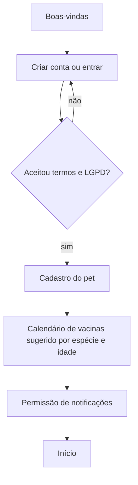
```mermaid
flowchart TD
  A[Boas-vindas] --> B[Criar conta ou entrar]
  B --> C{Aceitou termos e LGPD?}
  C -- não --> B
  C -- sim --> D[Cadastro do pet]
  D --> E[Calendário de vacinas sugerido por espécie e idade]
  E --> F[Permissão de notificações]
  F --> G[Início]
```

### 19.2 Saúde, lembrete e clínica (Fase 1)

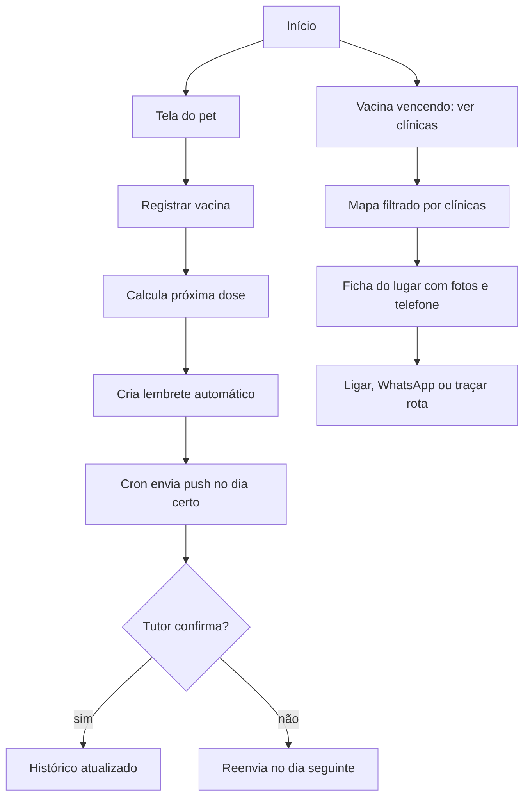
```mermaid
flowchart TD
  I[Início] --> P[Tela do pet]
  P --> V[Registrar vacina]
  V --> N[Calcula próxima dose]
  N --> L[Cria lembrete automático]
  L --> T[Cron envia push no dia certo]
  T --> W{Tutor confirma?}
  W -- sim --> H[Histórico atualizado]
  W -- não --> R[Reenvia no dia seguinte]
  I --> M[Vacina vencendo: ver clínicas]
  M --> Mapa[Mapa filtrado por clínicas]
  Mapa --> Lugar[Ficha do lugar com fotos e telefone]
  Lugar --> S[Ligar, WhatsApp ou traçar rota]
```

### 19.3 Remédio com doses (Fase 1)

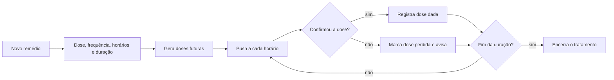
```mermaid
flowchart LR
  A[Novo remédio] --> B[Dose, frequência, horários e duração]
  B --> C[Gera doses futuras]
  C --> D[Push a cada horário]
  D --> E{Confirmou a dose?}
  E -- sim --> F[Registra dose dada]
  E -- não --> G[Marca dose perdida e avisa]
  F --> H{Fim da duração?}
  G --> H
  H -- não --> D
  H -- sim --> I[Encerra o tratamento]
```

### 19.4 Compra de produto (retirada ou entrega) (Fase 3)

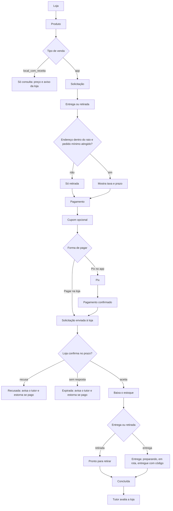
```mermaid
flowchart TD
  L[Loja] --> P[Produto]
  P --> Q{Tipo de venda}
  Q -- local_com_receita --> R[Só consulta: preço e aviso da loja]
  Q -- app --> S[Solicitação]
  S --> E[Entrega ou retirada]
  E --> Z{Endereço dentro do raio e pedido mínimo atingido?}
  Z -- não --> RET[Só retirada]
  Z -- sim --> TX[Mostra taxa e prazo]
  RET --> PG
  TX --> PG[Pagamento]
  PG --> CP[Cupom opcional]
  CP --> M{Forma de pagar}
  M -- Pix no app --> PX[Pix]
  M -- Pagar na loja --> ENV
  PX --> OK[Pagamento confirmado]
  OK --> ENV[Solicitação enviada à loja]
  ENV --> A{Loja confirma no prazo?}
  A -- recusa --> X[Recusada: avisa o tutor e estorna se pago]
  A -- sem resposta --> EXP[Expirada: avisa o tutor e estorna se pago]
  A -- aceita --> BX[Baixa o estoque]
  BX --> K{Entrega ou retirada}
  K -- retirada --> PR[Pronto para retirar]
  K -- entrega --> D[Entrega: preparando, em rota, entregue com código]
  PR --> C[Concluída]
  D --> C
  C --> AV[Tutor avalia a loja]
```

### 19.5 Reserva de serviço (banho e tosa, consulta, vacinação) (Fase 3)

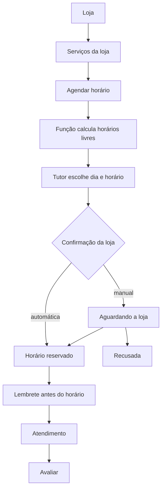
```mermaid
flowchart TD
  L[Loja] --> S[Serviços da loja]
  S --> A[Agendar horário]
  A --> F[Função calcula horários livres]
  F --> E[Tutor escolhe dia e horário]
  E --> C{Confirmação da loja}
  C -- automática --> OK[Horário reservado]
  C -- manual --> W[Aguardando a loja]
  W --> OK
  W --> NO[Recusada]
  OK --> LM[Lembrete antes do horário]
  LM --> D[Atendimento]
  D --> AV[Avaliar]
```

### 19.6 Passeio, creche e hotelzinho (Fase 3)

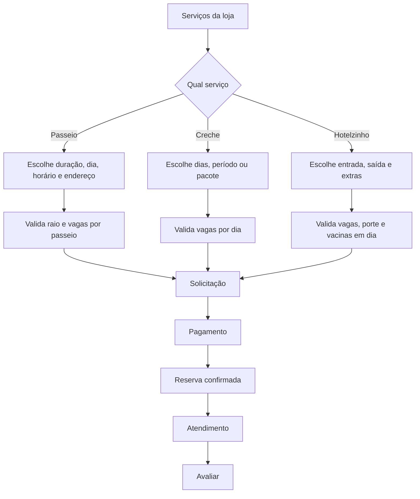
```mermaid
flowchart TD
  S[Serviços da loja] --> T{Qual serviço}
  T -- Passeio --> P[Escolhe duração, dia, horário e endereço]
  T -- Creche --> C[Escolhe dias, período ou pacote]
  T -- Hotelzinho --> H[Escolhe entrada, saída e extras]
  P --> V1[Valida raio e vagas por passeio]
  C --> V2[Valida vagas por dia]
  H --> V3[Valida vagas, porte e vacinas em dia]
  V1 --> R[Solicitação]
  V2 --> R
  V3 --> R
  R --> PG[Pagamento]
  PG --> OK[Reserva confirmada]
  OK --> AT[Atendimento]
  AT --> AV[Avaliar]
```

### 19.7 Passeio ao vivo (Fase 3)

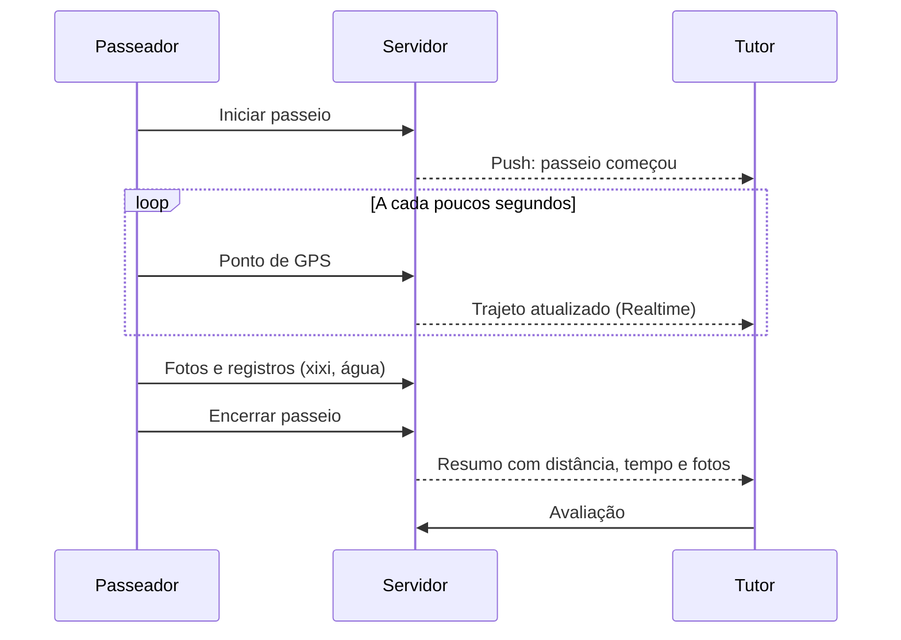
```mermaid
sequenceDiagram
  participant Passeador
  participant Servidor
  participant Tutor
  Passeador->>Servidor: Iniciar passeio
  Servidor-->>Tutor: Push: passeio começou
  loop A cada poucos segundos
    Passeador->>Servidor: Ponto de GPS
    Servidor-->>Tutor: Trajeto atualizado (Realtime)
  end
  Passeador->>Servidor: Fotos e registros (xixi, água)
  Passeador->>Servidor: Encerrar passeio
  Servidor-->>Tutor: Resumo com distância, tempo e fotos
  Tutor->>Servidor: Avaliação
```

### 19.8 Entrega (Fase 3)

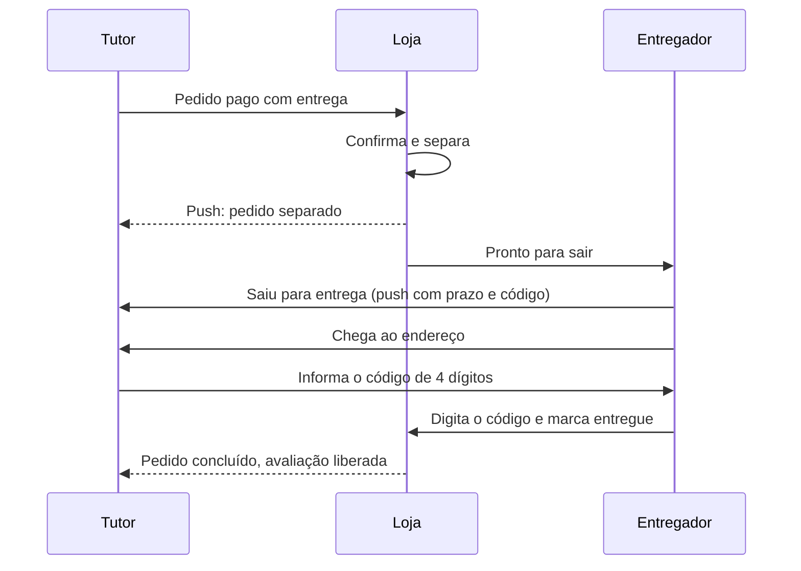
```mermaid
sequenceDiagram
  participant Tutor
  participant Loja
  participant Entregador
  Tutor->>Loja: Pedido pago com entrega
  Loja->>Loja: Confirma e separa
  Loja-->>Tutor: Push: pedido separado
  Loja->>Entregador: Pronto para sair
  Entregador->>Tutor: Saiu para entrega (push com prazo e código)
  Entregador->>Tutor: Chega ao endereço
  Tutor->>Entregador: Informa o código de 4 dígitos
  Entregador->>Loja: Digita o código e marca entregue
  Loja-->>Tutor: Pedido concluído, avaliação liberada
```

### 19.9 Cadastro e publicação da loja (Fase 3)

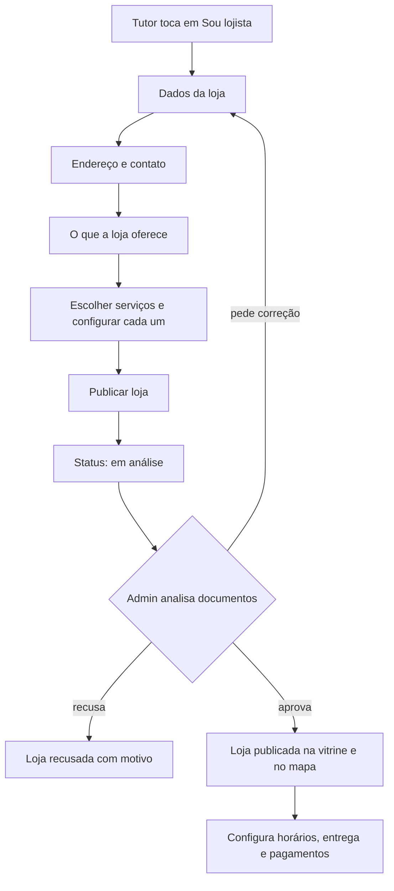
```mermaid
flowchart TD
  A[Tutor toca em Sou lojista] --> B[Dados da loja]
  B --> C[Endereço e contato]
  C --> D[O que a loja oferece]
  D --> E[Escolher serviços e configurar cada um]
  E --> F[Publicar loja]
  F --> G[Status: em análise]
  G --> H{Admin analisa documentos}
  H -- pede correção --> B
  H -- recusa --> X[Loja recusada com motivo]
  H -- aprova --> I[Loja publicada na vitrine e no mapa]
  I --> J[Configura horários, entrega e pagamentos]
```

### 19.10 Dia a dia do lojista (Fase 3)

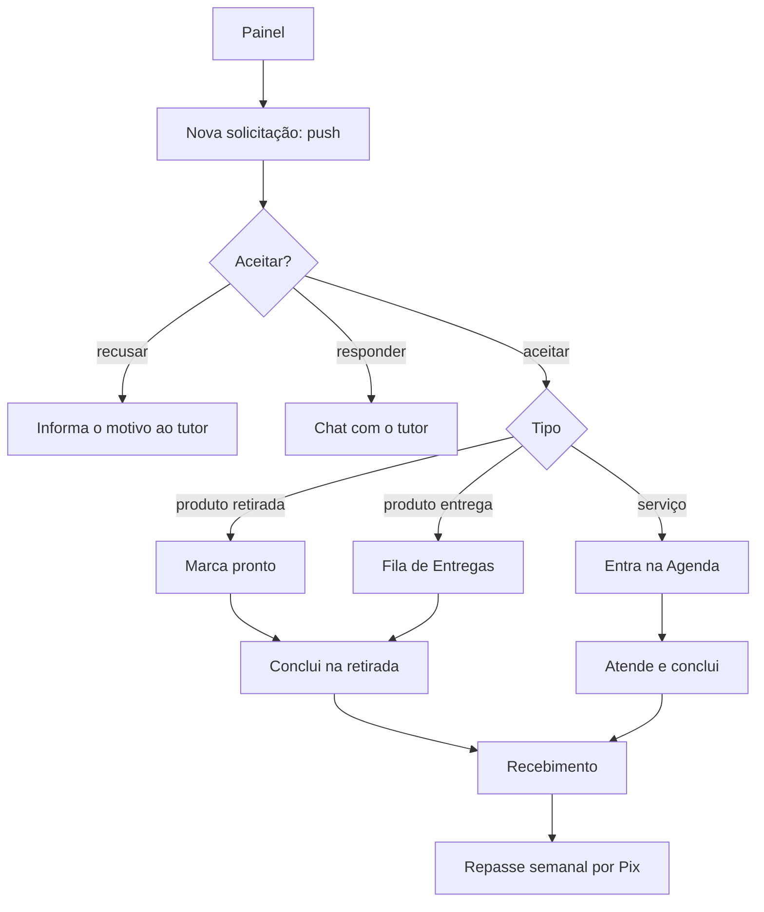
```mermaid
flowchart TD
  P[Painel] --> S[Nova solicitação: push]
  S --> A{Aceitar?}
  A -- recusar --> R[Informa o motivo ao tutor]
  A -- responder --> C[Chat com o tutor]
  A -- aceitar --> E{Tipo}
  E -- produto retirada --> PR[Marca pronto]
  E -- produto entrega --> EN[Fila de Entregas]
  E -- serviço --> AG[Entra na Agenda]
  PR --> CO[Conclui na retirada]
  EN --> CO
  AG --> AT[Atende e conclui]
  CO --> RC[Recebimento]
  AT --> RC
  RC --> RP[Repasse semanal por Pix]
```

### 19.11 Premium (Fase 2)

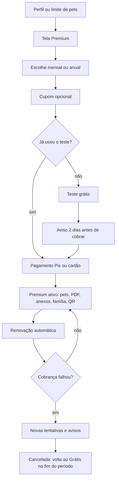
```mermaid
flowchart TD
  P[Perfil ou limite de pets] --> PR[Tela Premium]
  PR --> PL[Escolhe mensal ou anual]
  PL --> CP[Cupom opcional]
  CP --> T{Já usou o teste?}
  T -- não --> TG[Teste grátis]
  T -- sim --> PX[Pagamento Pix ou cartão]
  TG --> AV[Aviso 2 dias antes de cobrar]
  AV --> PX
  PX --> OK[Premium ativo: pets, PDF, anexos, família, QR]
  OK --> RN[Renovação automática]
  RN --> F{Cobrança falhou?}
  F -- sim --> RT[Novas tentativas e avisos]
  RT --> CA[Cancelada: volta ao Grátis no fim do período]
  F -- não --> OK
```

### 19.12 QR da coleira: pet encontrado (Fase 2)

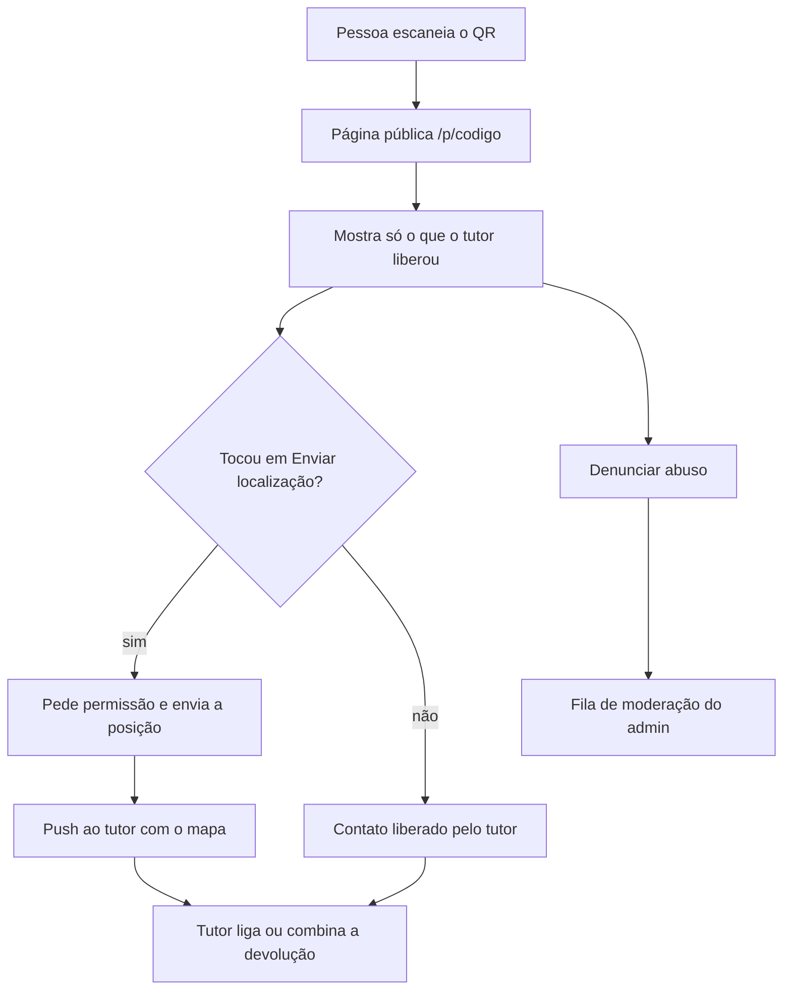
```mermaid
flowchart TD
  A[Pessoa escaneia o QR] --> B[Página pública /p/codigo]
  B --> C[Mostra só o que o tutor liberou]
  C --> D{Tocou em Enviar localização?}
  D -- sim --> E[Pede permissão e envia a posição]
  E --> F[Push ao tutor com o mapa]
  D -- não --> G[Contato liberado pelo tutor]
  F --> H[Tutor liga ou combina a devolução]
  G --> H
  C --> I[Denunciar abuso]
  I --> J[Fila de moderação do admin]
```

### 19.13 Avaliação (Fase 3)

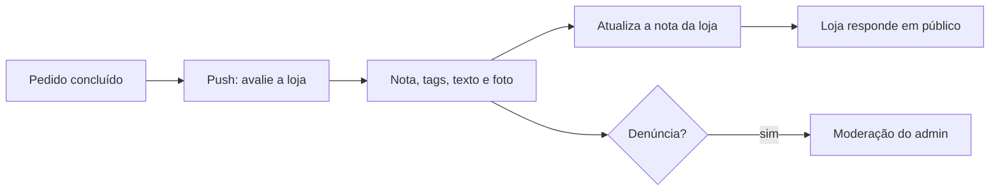
```mermaid
flowchart LR
  A[Pedido concluído] --> B[Push: avalie a loja]
  B --> C[Nota, tags, texto e foto]
  C --> D[Atualiza a nota da loja]
  D --> E[Loja responde em público]
  C --> F{Denúncia?}
  F -- sim --> G[Moderação do admin]
```

### 19.14 Admin: aprovação de loja, disputa e avaliações dos apps (Fases 2 e 3)

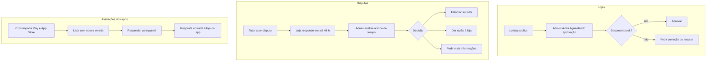
```mermaid
flowchart TD
  subgraph LJ["Lojas"]
    L1[Lojista publica] --> L2[Admin vê fila Aguardando aprovação]
    L2 --> L3{Documentos ok?}
    L3 -- sim --> L4[Aprovar]
    L3 -- não --> L5[Pedir correção ou recusar]
  end
  subgraph DS["Disputas"]
    D1[Tutor abre disputa] --> D2[Loja responde em até 48 h]
    D2 --> D3[Admin analisa a linha do tempo]
    D3 --> D4{Decisão}
    D4 --> D5[Estornar ao tutor]
    D4 --> D6[Dar razão à loja]
    D4 --> D7[Pedir mais informações]
  end
  subgraph AP["Avaliações dos apps"]
    A1[Cron importa Play e App Store] --> A2[Lista com nota e versão]
    A2 --> A3[Responder pelo painel]
    A3 --> A4[Resposta enviada à loja do app]
  end
```

### 19.15 Admin: suporte e privacidade (Fase 2)

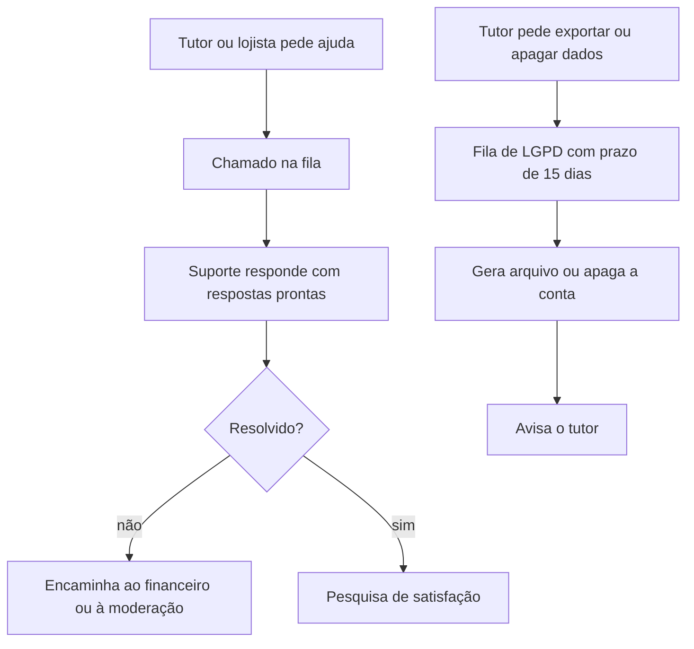
```mermaid
flowchart TD
  T[Tutor ou lojista pede ajuda] --> C[Chamado na fila]
  C --> R[Suporte responde com respostas prontas]
  R --> S{Resolvido?}
  S -- não --> E[Encaminha ao financeiro ou à moderação]
  S -- sim --> F[Pesquisa de satisfação]
  U[Tutor pede exportar ou apagar dados] --> Q[Fila de LGPD com prazo de 15 dias]
  Q --> X[Gera arquivo ou apaga a conta]
  X --> Y[Avisa o tutor]
```

### 19.16 Lugares pet por perto (Fase 1)

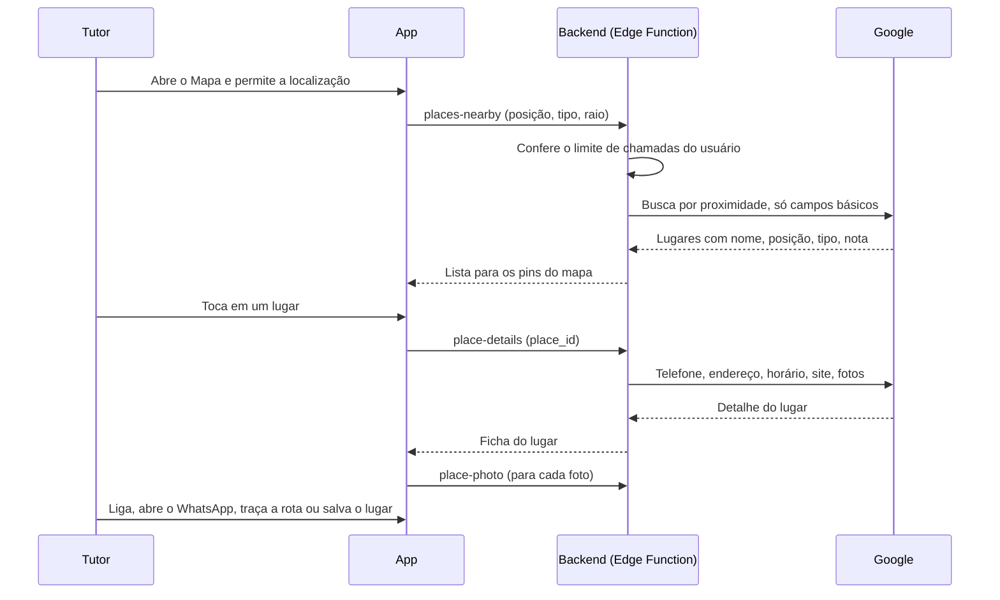
```mermaid
sequenceDiagram
  participant Tutor
  participant App
  participant Backend as Backend (Edge Function)
  participant Google
  Tutor->>App: Abre o Mapa e permite a localização
  App->>Backend: places-nearby (posição, tipo, raio)
  Backend->>Backend: Confere o limite de chamadas do usuário
  Backend->>Google: Busca por proximidade, só campos básicos
  Google-->>Backend: Lugares com nome, posição, tipo, nota
  Backend-->>App: Lista para os pins do mapa
  Tutor->>App: Toca em um lugar
  App->>Backend: place-details (place_id)
  Backend->>Google: Telefone, endereço, horário, site, fotos
  Google-->>Backend: Detalhe do lugar
  Backend-->>App: Ficha do lugar
  App->>Backend: place-photo (para cada foto)
  Tutor->>App: Liga, abre o WhatsApp, traça a rota ou salva o lugar
```

### 19.17 Eventos pet (Fase 2)

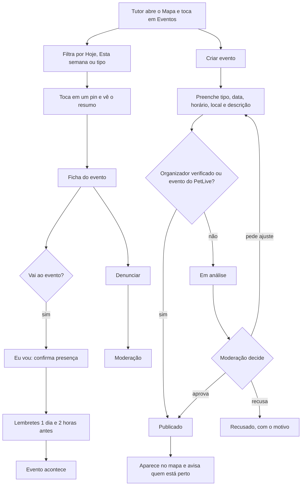
```mermaid
flowchart TD
  A[Tutor abre o Mapa e toca em Eventos] --> B[Filtra por Hoje, Esta semana ou tipo]
  B --> C[Toca em um pin e vê o resumo]
  C --> D[Ficha do evento]
  D --> E{Vai ao evento?}
  E -- sim --> F[Eu vou: confirma presença]
  F --> G[Lembretes 1 dia e 2 horas antes]
  G --> H[Evento acontece]
  D --> I[Denunciar]
  I --> J[Moderação]
  A --> K[Criar evento]
  K --> L[Preenche tipo, data, horário, local e descrição]
  L --> M{Organizador verificado ou evento do PetLive?}
  M -- sim --> N[Publicado]
  M -- não --> O[Em análise]
  O --> P{Moderação decide}
  P -- aprova --> N
  P -- pede ajuste --> L
  P -- recusa --> Q[Recusado, com o motivo]
  N --> R[Aparece no mapa e avisa quem está perto]
```

---

## 20. Máquinas de estado

Cada mudança de estado grava uma linha em `request_events` (ou na tabela de eventos equivalente), com quem mudou, quando e o motivo. Estados em `snake_case` no banco, com texto em português na tela.

### 20.1 Solicitação (`requests`), Fase 3

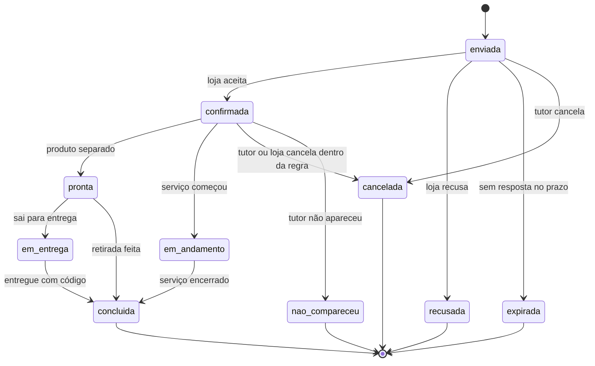
```mermaid
stateDiagram-v2
  [*] --> enviada
  enviada --> confirmada: loja aceita
  enviada --> recusada: loja recusa
  enviada --> expirada: sem resposta no prazo
  enviada --> cancelada: tutor cancela
  confirmada --> pronta: produto separado
  confirmada --> em_andamento: serviço começou
  confirmada --> cancelada: tutor ou loja cancela dentro da regra
  confirmada --> nao_compareceu: tutor não apareceu
  pronta --> em_entrega: sai para entrega
  pronta --> concluida: retirada feita
  em_entrega --> concluida: entregue com código
  em_andamento --> concluida: serviço encerrado
  concluida --> [*]
  recusada --> [*]
  expirada --> [*]
  cancelada --> [*]
  nao_compareceu --> [*]
```

### 20.2 Pagamento (`payments`), Fase 3

`pendente` → `pago` → (`estornado` | `repassado`). Se o Pix passar da validade, `pendente` vira `expirado`. Pagar na loja não cria `payments` no app. Pedido recusado, expirado ou cancelado com pagamento `pago` gera estorno automático.

### 20.3 Entrega (`deliveries`), Fase 3

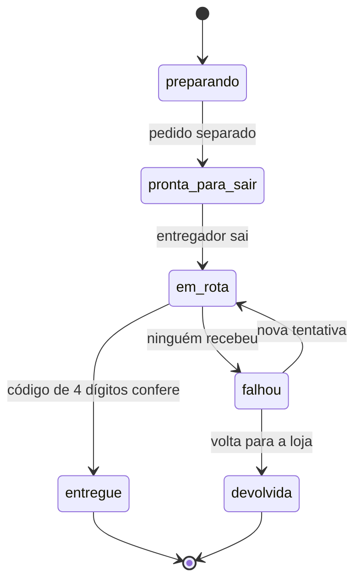
```mermaid
stateDiagram-v2
  [*] --> preparando
  preparando --> pronta_para_sair: pedido separado
  pronta_para_sair --> em_rota: entregador sai
  em_rota --> entregue: código de 4 dígitos confere
  em_rota --> falhou: ninguém recebeu
  falhou --> em_rota: nova tentativa
  falhou --> devolvida: volta para a loja
  entregue --> [*]
  devolvida --> [*]
```

### 20.4 Assinatura Premium (`subscriptions`), Fase 2

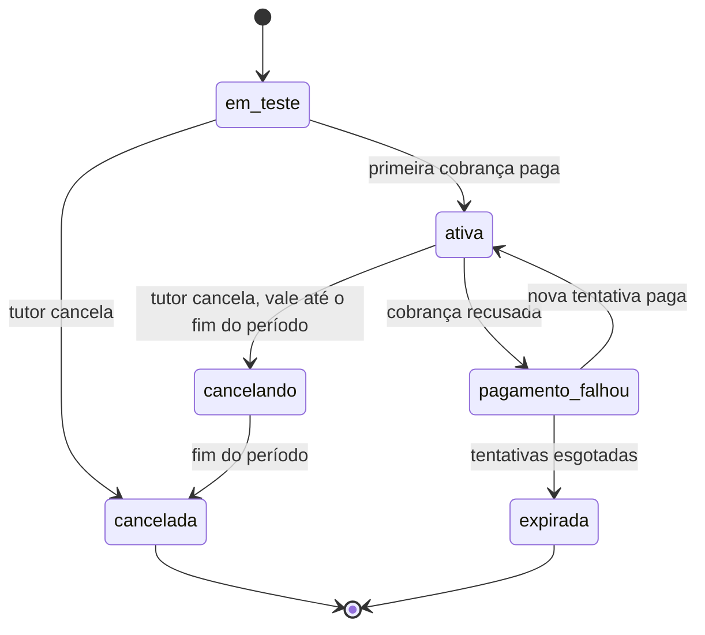
```mermaid
stateDiagram-v2
  [*] --> em_teste
  em_teste --> ativa: primeira cobrança paga
  em_teste --> cancelada: tutor cancela
  ativa --> pagamento_falhou: cobrança recusada
  pagamento_falhou --> ativa: nova tentativa paga
  pagamento_falhou --> expirada: tentativas esgotadas
  ativa --> cancelando: tutor cancela, vale até o fim do período
  cancelando --> cancelada: fim do período
  cancelada --> [*]
  expirada --> [*]
```

### 20.5 Loja (`stores.status`), Fase 3

`rascunho` → `em_analise` → (`aprovada` | `correcao_pedida` | `recusada`). `correcao_pedida` volta para `em_analise` quando o lojista reenvia. `aprovada` pode ficar `suspensa` por ação do admin e voltar. Além do status, a loja tem o interruptor **aberta ou fechada**, que o próprio lojista liga e desliga e só afeta pedidos novos.

### 20.6 Disputa (`disputes`), Fase 3

`aberta` → `resposta_da_loja` → `em_analise` → `resolvida`, com o resultado `estorno`, `a_favor_da_loja` ou `acordo`. Se a loja não responde no prazo, vai direto para `em_analise`.

### 20.7 Passeio (`walks`), Fase 3

`agendado` → `iniciado` → `em_andamento` (recebe pontos de GPS) → `encerrado` → `avaliado`. Um passeio `agendado` que ninguém inicia até `[30]` minutos depois do horário vira `perdido` e avisa a loja e o tutor.

### 20.8 Cupom (`coupons`), Fase 3

`agendado` → `ativo` → (`esgotado` | `encerrado`). O banco confere limite de usos e validade na hora de aplicar, nunca só o app.

### 20.9 Chamado de suporte (`support_tickets`), Fase 2

`aberto` → `em_atendimento` → `aguardando_usuario` → `resolvido`. O tutor responder reabre o chamado.

### 20.10 Pedido de privacidade (`lgpd_requests`), Fase 2

`novo` → `aguardando_confirmacao` (apagar conta exige confirmar por e-mail) → `em_andamento` → `concluido`. O campo `due_at` guarda o prazo de 15 dias.

### 20.11 Evento (`events`), Fase 2

```mermaid
stateDiagram-v2
  [*] --> rascunho
  rascunho --> em_analise: usuário envia
  rascunho --> publicado: evento do PetLive ou organizador verificado
  em_analise --> publicado: moderação aprova
  em_analise --> ajuste_pedido: moderação pede ajuste
  ajuste_pedido --> em_analise: organizador reenvia
  em_analise --> recusado: moderação recusa
  publicado --> em_analise: mudou data, horário ou local
  publicado --> oculto: denúncias acima do limite
  oculto --> publicado: moderação mantém
  oculto --> recusado: moderação remove
  publicado --> cancelado: organizador cancela
  publicado --> encerrado: passou o horário de fim
  encerrado --> [*]
  cancelado --> [*]
  recusado --> [*]
```

---

## 21. Modelo de dados completo

Convenções: `id uuid` em todas as tabelas, `created_at` e `updated_at`, soft delete (`deleted_at`) onde houver histórico. Valores em reais ficam em centavos (`*_cents integer`). Datas em UTC, exibidas no fuso de São Paulo.

### 21.1 Tutor, pets e saúde (Fase 1; QR na Fase 2)

| Tabela | Campos principais |
| --- | --- |
| `profiles` | `user_id`, `name`, `phone`, `city`, `plan` (`free`/`premium`), `onboarded_at`, `terms_version`, `terms_accepted_at` |
| `pets` | `owner_id`, `name`, `species` (`dog`/`cat`), `breed_id`, `birth_date`, `sex`, `weight_kg`, `photo_url`, `allergies` |
| `pet_members` | `pet_id`, `user_id`, `role` (`owner`/`family`), usado pelo acesso da família |
| `vaccinations` | `pet_id`, `vaccine_id`, `applied_at`, `next_due_at`, `vet_name`, `batch`, `attachment_url` |
| `dewormings` | `pet_id`, `product`, `applied_at`, `next_due_at` |
| `weights` | `pet_id`, `kg`, `measured_at` |
| `visits` | `pet_id`, `date`, `reason`, `vet_name`, `notes`, `attachments` |
| `medications` | `pet_id`, `name`, `dose`, `every_hours`, `times[]`, `starts_at`, `ends_at`, `active` |
| `medication_doses` | `medication_id`, `scheduled_at`, `status` (`pendente`/`dada`/`perdida`), `confirmed_at` |
| `reminders` | `pet_id`, `type`, `title`, `due_at`, `repeat_rule`, `status`, `source` (`manual`/`vacina`/`remedio`/`reserva`) |
| `push_tokens` | `user_id`, `token`, `platform`, `last_seen_at` |
| `notification_prefs` | `user_id`, `type`, `enabled`, `quiet_from`, `quiet_to` |
| `pet_qr_settings` | `pet_id`, `code` (único, curto), `show_photo`, `show_phone`, `show_allergies`, `active` |
| `qr_scans` | `pet_id`, `scanned_at`, `lat`, `lng` (só se a pessoa enviou), `ip_hash` |

### 21.2 Lugares e conteúdo mestre (Fase 1)

| Tabela | Campos principais |
| --- | --- |
| `saved_places` | `user_id`, `google_place_id`, `label` (opcional), `saved_at`. Só o `place_id` do Google é guardado |
| `places_usage` | `user_id`, `day`, `nearby_calls`, `detail_calls`, `photo_calls`, para o limite diário por usuário |
| `content_vaccines` | `name`, `species`, `first_dose_days`, `booster_rule`, `mandatory`, `text`, `version` |
| `content_breeds` | `species`, `name` |
| `content_categories` | `name`, `parent_id`, `sort` |
| `content_versions` | `version`, `published_at`, `published_by` |

### 21.2b Eventos (Fase 2)

| Tabela | Campos principais |
| --- | --- |
| `events` | `organizer_id`, `official` (do PetLive), `type` (`adocao`/`vacinacao`/`passeio`/`encontro`/`palestra`/`outro`), `title`, `description`, `photo_url`, `starts_at`, `ends_at`, `google_place_id` ou `geom` (ponto no mapa), `address_text`, `price_type` (`gratis`/`pago`), `price_text`, `external_url`, `capacity`, `status`, `reject_reason`, `reports_count`, `published_at` |
| `event_rsvps` | `event_id`, `user_id`, `remind`, `created_at`. Um por usuário por evento |
| `event_reports` | `event_id`, `reporter_id`, `reason`, `status`, `handled_by` |
| `organizers` | `user_id`, `verified`, `verified_by`, `events_approved`, `events_refused` |

Regras do banco: um usuário só confirma presença uma vez; não passa do limite de eventos enviados por mês; evento com `status` diferente de `publicado` só é visível ao organizador e à moderação; a contagem de confirmados é pública e a lista, não.

### 21.3 Lojas e catálogo (Fase 3)

| Tabela | Campos principais |
| --- | --- |
| `stores` | `name`, `kind`, `oferece` (`produtos`/`servicos`/`ambos`), `status`, `is_open`, `address`, `geom`, `phone`, `cnpj`, `pix_key`, `response_deadline_min`, `auto_confirm`, `cancel_until_min`, `rating_avg`, `rating_count`, `pickup_enabled`, `pickup_prepare_min`, `pickup_hours`, `delivery_enabled`, `delivery_mode` (`fixa`/`bairro`/`distancia`), `delivery_fee_cents`, `delivery_radius_km`, `delivery_min_order_cents`, `delivery_free_over_cents`, `delivery_eta_min`, `delivery_eta_max`, `delivery_hours` |
| `store_members` | `store_id`, `user_id`, `role` (`owner`/`manager`/`staff`), `function` (`atendente`/`tosador`/`passeador`), `active` |
| `store_documents` | `store_id`, `type`, `file_url`, `status` |
| `store_hours` | `store_id`, `weekday`, `opens`, `closes` |
| `time_off` | `store_id`, `starts_at`, `ends_at`, `reason` |
| `delivery_zones` | `store_id`, `neighborhood`, `fee_cents`, `eta_min`, `eta_max`, `active` |
| `delivery_bands` | `store_id`, `from_km`, `to_km`, `fee_cents` (modo por distância) |
| `products` | `store_id`, `name`, `category_id`, `price_cents`, `photo_url`, `barcode`, `venda` (`app`/`local_com_receita`/`oculto`), `receita_msg`, `stock`, `stock_min`, `hide_when_zero`, `active` |
| `services` | `store_id`, `name`, `modelo` (`horario`/`passeio`/`dia`/`diarias`), `duration_min`, `capacity`, `buffer_min`, `price_cents`, `active` |
| `lodging_rates` | `service_id`, `size` (`pequeno`/`medio`/`grande`), `night_cents`, `extras` (jsonb), `requires_vaccines` |
| `daycare_plans` | `service_id`, `period` (`dia`/`meio`), `price_cents`, `package_days`, `package_cents` |
| `walk_rules` | `service_id`, `price_30_cents`, `price_60_cents`, `radius_km`, `max_pets`, `weekdays`, `window` |

### 21.4 Pedidos, entrega, pagamento e relacionamento (Fase 3)

| Tabela | Campos principais |
| --- | --- |
| `requests` | `user_id`, `store_id`, `kind` (`produto`/`servico`), `status`, `fulfillment` (`retirada`/`entrega`), `starts_at`, `ends_at`, `checkin`, `checkout`, `pet_id`, `subtotal_cents`, `delivery_fee_cents`, `discount_cents`, `total_cents`, `coupon_id`, `pay_method` (`pix_app`/`na_loja`), `message`, `responded_at`, `address_id` |
| `request_items` | `request_id`, `product_id` ou `service_id`, `qty`, `unit_cents` |
| `request_events` | `request_id`, `from_status`, `to_status`, `actor_id`, `reason`, `at` |
| `addresses` | `user_id`, `label`, `street`, `number`, `complement`, `neighborhood`, `city`, `geom`, `note` |
| `deliveries` | `request_id`, `status`, `courier_id`, `code`, `eta_at`, `left_at`, `delivered_at`, `fail_reason` |
| `payments` | `request_id` ou `subscription_id`, `provider_id`, `method`, `amount_cents`, `status`, `paid_at`, `expires_at`, `pix_payload`, `commission_cents` |
| `payouts` | `store_id`, `period_from`, `period_to`, `amount_cents`, `status` (`agendado`/`pago`/`falhou`), `paid_at` |
| `coupons` | `scope` (`loja`/`plataforma`), `store_id`, `code`, `type` (`percentual`/`valor`/`dias_premium`), `value`, `applies_to`, `min_cents`, `max_uses`, `used`, `starts_at`, `ends_at`, `status` |
| `coupon_uses` | `coupon_id`, `user_id`, `request_id` ou `subscription_id`, `at` |
| `reviews` | `request_id` (único), `store_id`, `user_id`, `rating`, `tags[]`, `text`, `photo_url`, `reply_text`, `replied_at`, `hidden` |
| `conversations` | `request_id` (único), `store_id`, `user_id`, `closed_at` |
| `messages` | `conversation_id`, `sender_id`, `body`, `read_at`, `at` |
| `walks` | `request_id`, `walker_id`, `status`, `started_at`, `ended_at`, `distance_m`, `summary` |
| `walk_points` | `walk_id`, `geom`, `at` |
| `walk_events` | `walk_id`, `type` (`foto`/`xixi`/`coco`/`agua`), `media_url`, `at` |

### 21.5 Plataforma e admin (Fase 2; `disputes`, `reports` de lojas e `payouts`, Fase 3)

| Tabela | Campos principais |
| --- | --- |
| `plans` | `code`, `name`, `price_cents`, `period` (`mensal`/`anual`), `trial_days`, `active` |
| `subscriptions` | `user_id`, `plan_id`, `status`, `started_at`, `renews_at`, `cancel_at`, `cancel_reason`, `trial_ends_at`, `retry_count` |
| `disputes` | `request_id`, `opened_by`, `reason`, `status`, `store_reply`, `decision`, `decided_by`, `decided_at` |
| `reports` | `kind` (`avaliacao`/`anuncio`/`pet_encontrado`), `target_id`, `reporter_id`, `reason`, `priority`, `status`, `handled_by` |
| `support_tickets` | `requester_id`, `requester_type`, `subject`, `priority`, `status`, `assignee_id`, `app_version`, `platform` |
| `support_messages` | `ticket_id`, `sender_id`, `body`, `at` |
| `canned_replies` | `title`, `body` |
| `campaigns` | `title`, `body`, `audience` (jsonb), `channel`, `send_at`, `status`, `sent`, `opened`, `clicked` |
| `lgpd_requests` | `user_id`, `type` (`exportar`/`apagar`/`corrigir`), `status`, `due_at`, `done_at` |
| `admin_members` | `user_id`, `role`, `active`, `last_seen_at` |
| `audit_log` | `actor_id`, `action`, `target_type`, `target_id`, `meta`, `at` |
| `app_reviews` | `platform` (`play`/`app_store`), `external_id`, `rating`, `author`, `text`, `app_version`, `at`, `reply_text`, `replied_at` |
| `integrations` | `provider`, `status`, `last_sync_at`, `expires_at`, `config` (criptografado) |
| `app_versions` | `platform`, `version`, `min_supported`, `released_at` |
| `feature_flags` | `key`, `enabled`, `rollout_pct` |

### 21.6 Regras de acesso (RLS) por tabela

Na Fase 1 só valem as linhas do tutor e do anônimo. As de loja entram na Fase 3 e as de admin, na Fase 2.

| Quem | Pode |
| --- | --- |
| Tutor | Ler e escrever os próprios `pets`, saúde, lembretes, `addresses`, `requests`, `reviews`, `messages` e `subscriptions`. Ler `stores` e `products` publicados |
| Família | Ler e escrever nos pets em que consta em `pet_members`, sem acesso a pagamentos |
| Lojista | Ler e escrever dados da própria loja e `requests`, `deliveries`, `conversations` e `reviews` dela, conforme a função em `store_members` |
| Anônimo | Nada direto. A página `/p/[codigo]` chama uma função pública que devolve só os campos liberados |
| Admin | Acesso por função em `admin_members`, via funções seguras. Toda leitura de dado de saúde exige autorização do tutor e grava `audit_log` |

Regras que o banco precisa garantir, não só o app:
- `requests` de produto `local_com_receita` são rejeitadas.
- `reviews` só para `requests` com status `concluida` do próprio usuário, uma por pedido.
- `coupon_uses` respeita limite de usos e validade em uma única transação.
- Estoque nunca fica negativo.
- Um horário nunca passa do limite de vagas do serviço.

---

## 22. Notificações

Na **Fase 1** valem só os eventos de saúde: vacina, vermífugo, remédio e dose perdida. Premium e QR entram na Fase 2. Pedidos, entrega, chat, repasse, loja e disputa são da Fase 3.

Canal: **push** (P), **e-mail** (E) ou **na tela de Avisos** (A). O tutor controla tipo e horário em Avisos. Mensagens de segurança e de pagamento ignoram o Não perturbe.

| Evento | Quem recebe | Canal |
| --- | --- | --- |
| Vacina ou vermífugo vencendo (7 e 1 dia) | Tutor | P, A |
| Hora do remédio | Tutor | P |
| Dose perdida | Tutor | P, A |
| Nova solicitação | Lojista e equipe com permissão | P |
| Solicitação confirmada, recusada ou expirada | Tutor | P, A |
| Pedido pronto para retirar | Tutor | P |
| Saiu para entrega, com prazo e código | Tutor | P |
| Entrega concluída e pedido de avaliação | Tutor | P |
| Mensagem nova no chat | Tutor ou loja | P |
| Lembrete de reserva (24 h e 2 h antes) | Tutor e loja | P |
| Passeio iniciado e encerrado | Tutor | P |
| Pagamento confirmado, falhou ou expirou | Tutor e loja | P, E |
| Estorno feito | Tutor e loja | P, E |
| Repasse enviado ou com falha | Loja | E |
| Premium: teste acabando, renovação, falha | Tutor | P, E |
| Pet encontrado: localização enviada | Tutor | P |
| Loja aprovada, correção pedida ou recusada | Lojista | P, E |
| Disputa aberta e decisão | Tutor e loja | P, E |
| Avaliação nova | Loja | P |
| Nota baixa de app sem resposta | Equipe admin | A no painel |
| Pedido de exportar ou apagar dados | Equipe admin | A no painel |
| Campanha | Público escolhido | P, E |
| Evento aprovado, recusado ou com ajuste pedido (Fase 2) | Organizador | P, A |
| Evento perto de você (Fase 2) | Quem permitiu, dentro do raio | P |
| Lembrete de evento (1 dia e 2 horas) (Fase 2) | Quem confirmou presença | P |
| Evento mudou ou foi cancelado (Fase 2) | Quem confirmou presença | P |
| Evento denunciado ou novo em análise (Fase 2) | Equipe de moderação | A no painel |

---

## 23. Backend: funções, jobs e integrações

### 23.1 Edge Functions

**Fase 1:** `places-nearby`, `place-details` e `place-photo`. **Fase 2:** `create-pix-charge` e `pix-webhook` para o Premium, `public-qr`, `qr-location`, `export-pet-card`, `lgpd-*`, `send-campaign` e `reply-app-review`. **Fase 3:** as demais, ligadas a pedidos, entrega, cupons e repasse.

Todas as funções de pagamento (`create-pix-charge`, `pix-webhook`, `refund` e o repasse semanal) falam com o Asaas por **uma camada única** (`payments/provider`), com a mesma interface para qualquer provedor. Nenhuma tela nem outra função chama o Asaas direto.

| Função | O que faz |
| --- | --- |
| `places-nearby` | Busca lugares pet por proximidade no Google, só campos básicos, com limite por usuário |
| `place-details` | Devolve telefone, endereço, horário, site, nota e referências de fotos de um `place_id` |
| `place-photo` | Entrega uma foto do Google ao app, sob demanda |
| `events-nearby` | Lista eventos publicados por proximidade, data e tipo (Fase 2) |
| `create-event` | Valida o limite mensal e decide se vai para análise ou publica direto (Fase 2) |
| `rsvp-event` | Confirma ou cancela presença e atualiza a contagem (Fase 2) |
| `free-slots` | Calcula horários livres de um serviço em um dia |
| `quote-delivery` | Valida endereço no raio e devolve taxa, prazo e motivo de bloqueio |
| `create-request` | Cria a solicitação checando estoque, mínimo, horário e cupom em uma transação |
| `apply-coupon` | Valida e reserva o uso do cupom |
| `create-pix-charge` | Gera a cobrança Pix de pedido ou assinatura |
| `pix-webhook` | Recebe a confirmação, marca `pago` e avisa as partes |
| `refund` | Estorna um pagamento e ajusta o repasse |
| `public-qr` | Devolve os campos liberados do pet, com limite de acessos por IP |
| `qr-location` | Recebe a localização e avisa o tutor |
| `export-pet-card` | Gera o PDF da carteira de saúde |
| `lgpd-export` e `lgpd-delete` | Geram o arquivo do tutor e apagam a conta |
| `send-campaign` | Dispara a campanha por push e e-mail |
| `reply-app-review` | Responde avaliação nas lojas de apps |

### 23.2 Cron e jobs

| Job | Frequência | O que faz |
| --- | --- | --- |
| `send-reminders` | A cada minuto | Envia push de lembretes e doses vencendo |
| `mark-missed-doses` | Hora em hora | Marca doses perdidas |
| `expire-requests` | A cada 5 min | Expira solicitações sem resposta e estorna se pago |
| `expire-pix` | A cada 5 min | Expira Pix vencido |
| `close-chats` | Diário | Fecha conversas 7 dias após a conclusão (Fase 3) |
| `event-reminders` | A cada 15 min | Envia lembretes de 1 dia e 2 horas antes do evento (Fase 2) |
| `close-events` | A cada hora | Marca como encerrado o evento que passou do fim e tira do mapa (Fase 2) |
| `subscription-billing` | Diário | Avisa renovação, cobra e faz novas tentativas |
| `weekly-payout` | Semanal | Calcula e envia o repasse por Pix |
| `sync-app-reviews` | A cada hora | Importa avaliações do Play e da App Store |
| `cleanup` | Diário | Remove tokens inválidos e arquivos soltos |

### 23.3 Tempo real (Supabase Realtime)

Chat (`messages`), status da entrega (`deliveries`), trajeto do passeio (`walk_points`) e status da solicitação (`requests`). Cada canal respeita a mesma RLS das tabelas.

### 23.4 Integrações externas

| Integração | Uso | Observação |
| --- | --- | --- |
| Asaas | Cobrança por Pix e cartão, assinatura do Premium, webhook, split e subcontas das lojas, repasse e estorno | Obrigatório antes da etapa 2. Contas e chaves de teste (sandbox) no desenvolvimento |
| Google Play Developer API | Importar e responder avaliações (Fase 2) | Credencial guardada em `integrations` |
| App Store Connect API | Importar e responder avaliações | Chave tem validade: o admin avisa antes de expirar |
| FCM e APNs | Push | Via expo-notifications |
| Google Maps Platform | Mapa, busca de lugares, detalhe e fotos (Places API New) | Fase 1. Chave restrita, chamadas só pelo backend, orçamento com alerta, termos e preços a conferir |
| Sentry | Erros dos apps e painéis | |
| Provedor de e-mail `[a definir]` | Recibos, recuperação de senha, campanhas | |

---

## 24. Critérios de pronto por módulo

Um módulo só é considerado pronto quando cumpre todos os itens abaixo.

- Telas iguais ao protótipo em textos, estados vazios e de erro.
- Regras da seção 5 aplicadas **no banco ou na função**, não só na tela.
- RLS testada com ao menos um usuário de cada papel e um usuário sem permissão.
- Notificações do módulo enviadas conforme a seção 22.
- Estados da seção 20 respeitados e registrados em eventos.
- Funciona sem rede quando for leitura de saúde do pet (cache local) e mostra erro claro quando for escrita.
- Acessível: texto com contraste, alvos de toque de 44 px e rótulos em ícones.
- Sentry ligado e eventos de uso medindo as métricas da seção 14.
- Teste automatizado do fluxo principal (E2E) e dos cálculos (horários livres, taxa de entrega, cupom, comissão).

---

## 25. Ordem de construção

Cada bloco depende dos anteriores. **Só a Fase 1 está em desenvolvimento agora.**

| Bloco | O que entrega | Depende de | Fase | Prioridade |
| --- | --- | --- | --- | --- |
| 0. Base | Repositório, Expo, Supabase, tema, autenticação, RLS base, Sentry, EAS | Nada | 1 | P0 |
| 1. Pets e saúde | Cadastro do pet, vacinas, peso, consultas, calendário sugerido | 0 | 1 | P0 e P1 |
| 2. Lembretes e remédios | Lembretes, doses, push, tela de Avisos | 1 | 1 | P0 e P1 |
| 3. Lugares por perto | Projeto Google Cloud e chave, funções de lugares, mapa do Google, filtros, ficha com telefone e fotos, ligar, WhatsApp, rota, favoritos, controle de custo | 0 | 1 | P1 |
| 4. Início e perfil | Início com próximas vacinas e lugares, perfil, termos, excluir conta | 1, 2, 3 | 1 | P0 e P1 |
| **Gate 1** | Fase 1 no ar para teste com tutores reais e retenção medida | 4 | | |
| 5. Premium | Assinatura, PDF, anexos, família, QR da coleira | 1, pagamento | 2 | P2 |
| 6. Página do QR e site | Página pública `/p/[codigo]` e site | 5 | 2 | P2 |
| 6b. Eventos no mapa | Aba Eventos, ficha, criar evento, Eu vou, lembretes, denúncia e análise no admin | 3, 7 | 2 | P2 |
| 7. Admin básico | Login com 2FA, visão geral, usuários, assinaturas, planos, conteúdo mestre, avaliações dos apps, suporte, campanhas, integrações, sistema, LGPD, equipe | 0, 5 | 2 | P2 |
| 8. Marketplace, etapa 1 | Cadastro e aprovação de lojas, catálogo, vitrine, solicitação, agenda, retirada, entrega, chat, estoque, cupons, avaliações | Gate 1, 7 | 3 | P3 |
| 9. Marketplace, etapa 2 | Pix no app, repasse, estorno, disputas, financeiro e pedidos no admin, passeio ao vivo | 8 | 3 | P3 |
| 10. Serviços avançados | Creche e hotelzinho com reserva | 8, 9 | 3 | P3 |
| 11. Painel do lojista | Todas as telas do computador | 8 | 3 | P3 |
| 12. Operação das lojas no admin | Lojistas, moderação das lojas | 7, 8 | 3 | P3 |
| 13. Rede social | Perfil público, posts, feed | Retenção provada | 4 | Fora do board |

Regra prática: **nenhum bloco da Fase 3 começa antes de o Gate 1 passar.** O marketplace é uma parte separada e só entra depois de validar retenção com tutores reais.

---

## 26. Contas de teste e dados de exemplo

Para desenvolver e testar sem dados reais:
- **Fase 1:** seed com 1 tutor com 2 pets (cão e gato), vacinas e lembretes de exemplo, e lugares favoritos. Para lugares, usar a chave de **desenvolvimento** do Google com orçamento baixo.
- **Fases 2 e 3:** 1 tutor Premium, 1 usuário de cada função do admin, 1 loja de produtos, 1 loja de serviços, 1 loja com os dois e 1 passeador.
- Conteúdo mestre com o calendário de vacinas de cães e gatos e 20 raças.
- Cupons de exemplo (percentual, valor fixo e Premium grátis).
- Lojas de teste com entrega por bairro, por distância e só retirada.
- Asaas em modo de teste (sandbox). Nenhuma cobrança real em desenvolvimento.

---

## 27. Perguntas que a equipe de desenvolvimento deve resolver cedo

**Para a Fase 1 (agora):**

1. Criar o projeto no Google Cloud, ativar a Places API (New) e o Maps SDK, restringir as chaves por app e definir o **orçamento mensal com alerta**.
2. Definir o limite diário de chamadas por usuário e quantas fotos mostrar por lugar.
3. Conferir os termos e os preços atuais do Google Maps Platform, principalmente o que pode ser guardado e como exibir a atribuição.
4. Definir os termos de busca para creches, hotelzinhos e banho e tosa.

**Para as Fases 2 e 3 (depois):**

1. Provedor de e-mail (afeta os blocos 5 e 8). O de pagamento já está escolhido: Asaas.
2. App do lojista como PWA ou nativo (Fase 3; afeta os blocos 8 e 11 e o passeio ao vivo, que precisa de GPS em segundo plano).
3. Framework web dos painéis e do site (um só projeto web com áreas separadas ou projetos distintos).
4. Como o entregador usa o sistema: acesso próprio com função `staff` ou só a equipe da loja digitando o código.
5. Política da Apple e do Google para o Premium: pode-se cobrar pelo Asaas dentro do app ou é preciso usar a compra da loja do app? Isso muda o preço e o bloco 5 (Premium).
6. Onde ficam os arquivos de saúde e como serão criptografados.
