# PetLive: escopo do negócio e fluxos do produto

Este documento é a fonte única do escopo do PetLive. A **Parte A** (seções 1 a 16) descreve a visão, o que será construído e as regras. A **Parte B** (seções 17 a 27) organiza o produto para desenvolvimento: papéis, navegação, fluxos, estados, dados, notificações, backend e ordem de construção.

| Recurso | Link |
| --- | --- |
| Protótipo (181 telas e páginas, separadas por fase no canvas, com a paleta de cores) | https://claude.ai/artifact/UFhxFUGwCYokbjPKCXDqKK |
| Imagens das telas | [prototipo/imagens](prototipo/imagens/README.md) |
| Plano de criação | https://claude.ai/code/artifact/871f3a23-4e21-4456-861f-b630c089235f |
| Board de tarefas (194 tasks) | https://github.com/users/CodaxiKing/projects/5 |

Itens entre colchetes, como `[valor]` ou `[x]%`, ainda não foram decididos.

## Fases

O produto é entregue em fases. **Só a Fase 1 está em desenvolvimento agora.** Tudo que é marketplace (lojas, pedidos, entrega, pagamentos) fica na **Fase 3**, separado e para depois.

| Fase | Foco | O que entra | Situação |
| --- | --- | --- | --- |
| **1** | **Pet, lugares e emergência** | Conta, pets, saúde, lembretes, remédios e rotina de cuidados; mapa de clínicas, petshops, creches, hotelzinhos e lugares pet friendly do Google Maps, com telefone, fotos e rota; **SOS com clínica 24 h e primeiros socorros sem internet**; calculadoras; botão **Feito** direto na notificação da dose | **Agora** |
| 2 | Premium e operação | Premium, carteira em PDF, QR da coleira, página pública do QR, **eventos pet no mapa**, **ler cartão de vacina por foto**, **adoção**, **cuidador temporário**, **linha do tempo**, **checklist de viagem**, **selos de cuidado**, **passeios com GPS**, **despesas do pet**, **modo fogos e trovão**, **widget da tela inicial**, **cartão do pet para compartilhar**, **ficha de emergência por link**, **modo memorial**, **pet sênior com escala de qualidade de vida**, site e painel admin básico | Depois da Fase 1 |
| 3 | Marketplace (parte separada) | Lojas no PetLive, produtos, serviços com agenda, pedidos, entrega, pagamentos, chat, cupons, avaliações, painel do lojista, admin das lojas e **agendar consulta direto na clínica**, **SOS com pré-chegada na clínica** e **álbum impresso do ano do pet** | Futuro, não é para agora |
| 4 | Rede social | Comunidade, perfil público do pet, posts, seguir e feed | Futuro |
| 5 | Social e mapa | **Pet perdido com alerta por perto e reconhecimento do pet por foto**, **plano e seguro pet com parceiros**, check-ins | Futuro |

Cada seção deste documento indica a fase a que se aplica. Onde não houver indicação, vale desde a Fase 1.

## Índice

**Parte A: escopo**

| Seção | Assunto |
| --- | --- |
| 1 a 3 | Visão, públicos e produtos |
| 4 | Funcionalidades por módulo (tutor, lojista, admin, site) |
| 5 | Regras de negócio, com a fase de cada uma (5.1 a 5.45) |
| 6 | Modelos de reserva por serviço (Fase 3) |
| 7 e 8 | Dados (resumo) e stack |
| 9 e 10 | Roadmap por fase e monetização, com o que é grátis e o que é Premium |
| 11 a 14 | Riscos, LGPD e privacidade, fora do escopo e métricas |
| 15 e 16 | Decisões e glossário |

**Parte B: para desenvolvimento**

| Seção | Assunto |
| --- | --- |
| 17 | Papéis e permissões |
| 18 | Mapa de telas e rotas (todas as telas do protótipo) |
| 19 e 20 | Fluxos e máquinas de estado |
| 21 | Modelo de dados completo e regras de acesso |
| 22 e 23 | Notificações e backend (funções, jobs, integrações) |
| 24 a 27 | Critérios de pronto, ordem de construção, dados de teste e perguntas iniciais |
| 28 | **Índice de funcionalidades por fase**, ligando regra, telas, dados e funções | Os nomes de rota, tabela e função da Parte B são **propostas de partida**: podem mudar na implementação, mas o comportamento descrito deve ser mantido.

---

# Parte A: escopo

## 1. Visão

**PetLive** é um aplicativo que organiza a saúde do pet e ajuda o tutor a encontrar clínicas, petshops, creches e hotelzinhos perto dele.

Em uma frase: a carteira de saúde do pet, com lembretes e um mapa de lugares pet. Depois, na Fase 3, ele pode virar um marketplace de produtos e serviços.

### Problema

- Tutores perdem datas de vacina, vermífugo e remédio e não têm o histórico à mão na consulta.
- Não é simples saber onde há clínica 24h, banho e tosa ou petshop por perto.
- *(Fase 3)* Lojas e clínicas pequenas não têm uma forma simples de receber pedidos e agendamentos.

### Proposta de valor

- **Tutor:** saúde do pet em um só lugar, lembretes que avisam e lugares pet por perto, com telefone, fotos e rota a poucos toques.
- **Diferencial:** o app sabe o que o pet precisa. Vacina vencendo leva às clínicas por perto.
- ***(Fase 3)* Lojista:** vitrine, agenda, entrega e recebimento sem montar sistema próprio.

### Escopo geográfico e idioma

- Lançamento no **Rio de Janeiro**.
- Português do Brasil.
- Cães e gatos no MVP. Outras espécies ficam para depois.

---

## 2. Públicos

| Público | Quem é | O que precisa |
| --- | --- | --- |
| Tutor | Dono de cão ou gato | Carteira de saúde, lembretes, mapa, reservas, pedidos e entrega |
| Lojista *(Fase 3)* | Petshop, clínica veterinária, banho e tosa, creche, hotel, passeador | Vitrine, agenda, solicitações, entregas, estoque, recebimentos |
| ONG ou abrigo *(Fase 2)* | Organização verificada que cadastra pets para adoção | Cadastrar pets, receber interesse e marcar como adotado |
| Cuidador temporário *(Fase 2)* | Babá, familiar ou hotelzinho convidado pelo tutor | Ver, por prazo limitado, só o que o tutor liberou |
| Equipe da loja *(Fase 3)* | Gerente, atendente, tosador, passeador | Parte das telas do lojista, conforme a função |
| Quem acha um pet | Qualquer pessoa que escaneia o QR da coleira | Contato rápido com o tutor, sem instalar o app |
| Equipe PetLive *(Fase 2)* | Admin, financeiro, suporte, moderação, marketing | Monitorar assinaturas, avaliações dos apps, usuários, privacidade e sistema. Na Fase 3, também lojas e pedidos |

---

## 3. Produtos

| Produto | Plataforma | Quem usa |
| --- | --- | --- |
| App do tutor | React Native com Expo (celular) | Tutor |
| App do lojista *(Fase 3)* | Celular (PWA ou nativo, a decidir) | Lojista, equipe e passeador |
| Painel do lojista *(Fase 3)* | Web, no computador | Lojista e equipe |
| Painel admin *(Fase 2, ampliado na Fase 3)* | Web, no computador | Equipe PetLive |
| Site do PetLive *(Fase 2)* | Web | Tutores e, na Fase 3, lojistas novos |
| Página pública do QR *(Fase 2)* | Web | Quem encontra um pet |
| Backend | Supabase | Todos |

---

## 4. Funcionalidades por módulo

### 4.1 App do tutor

**Conta e perfil**
- Boas-vindas, criar conta e entrar (e-mail e Google), aceite de termos e LGPD.
- Perfil do tutor com **Editar perfil** (foto, nome, celular, cidade e senha), excluir conta e exportar dados.

**Pets**
- Cadastro com foto, espécie, raça e nascimento. Lista Meus pets e tela do pet.
- Vários pets (limite no plano grátis).

**Saúde**
- Registrar vacinas com data aplicada e próxima dose, com calendário sugerido por espécie e idade.
- Peso com gráfico, consultas e anexos (foto do cartão e exames, no Premium).

**Lembretes e remédios**
- Lembretes de vacina, vermífugo, consulta, banho e tosa e outros personalizados.
- Remédios com dose, frequência, horários e duração, com confirmação a cada dose.
- Notificações push e tela de Avisos (por tipo, horário e Não perturbe).

**Lugares por perto (Fase 1)**
- Mapa do Google com **clínicas veterinárias, petshops, creches, hotelzinhos, banho e tosa, clínicas 24h e lugares pet friendly** já cadastrados no Google Maps.
- Filtros por tipo e busca. Pins por tipo e lugar selecionado.
- Ao tocar em um lugar: **fotos do Google, telefone, endereço, horário, site e nota**, com os botões **Ligar**, **WhatsApp** (quando o número aceitar) e **Traçar rota**.
- Salvar lugares favoritos.
- Atalho: vacina vencendo leva às clínicas próximas.
- Fonte e regras na seção 5.15.

**Emergência (Fase 1)**
- Botão **SOS** no Início e no Mapa: mostra a **clínica 24 h mais perto**, aberta agora, com ligar e rota.
- **Primeiros socorros:** passo a passo para engasgo, golpe de calor, convulsão, sangramento, picada ou mordida e atropelamento ou queda. **Funciona sem internet.**
- **O que intoxica o pet:** lista de alimentos e produtos perigosos (chocolate, uva e passas, cebola e alho, xilitol, abacate, lírio para gatos), com o nível de risco e o que fazer. **Funciona sem internet.**
- Atalho para ligar para o veterinário do pet.

**Ferramentas e rotina (Fase 1)**
- **Calculadoras:** idade do pet em anos humanos, porção diária de ração e peso ideal.
- **Rotina de cuidados:** lembretes de antipulgas mensal, vermífugo, banho, escovar os dentes e aniversário do pet.
- **Pet friendly no mapa:** parques, praias, restaurantes e hotéis que aceitam pets (dados do Google, seção 5.19).
- **Botão Feito na notificação:** confirmar a dose ou o lembrete sem abrir o app (seção 5.34).

**Cuidados e memórias (Fase 2)**
- **Ler o cartão de vacina por foto** (Premium): o app lê as vacinas da imagem, o tutor revisa e só então salva.
- **Cuidador temporário:** acesso com prazo para uma babá ou hotelzinho ver vacinas, remédios e contatos.
- **Linha do tempo do pet:** marcos e fotos, como primeira vacina e aniversário.
- **Checklist de viagem:** documentos, atestado e regras das companhias aéreas.
- **Selos de cuidado:** "vacinas em dia" e outros, sem ranking nem pontos.
- **Passeios com GPS:** o tutor registra o passeio (distância, tempo e trajeto) e acompanha o histórico (seção 5.31).
- **Despesas do pet:** gastos com ração, veterinário, banho e remédios, com gráfico por mês (seção 5.32).
- **Fogos e trovão:** aviso antes de datas com fogos, dicas para acalmar o pet e lembrete de manter o pet em casa (seção 5.33).
- **Widget e atalhos:** próxima vacina ou remédio na tela inicial e atalhos no ícone do app (seção 5.34).
- **Cartão do pet:** imagem com foto, nome e selos para compartilhar nas redes (seção 5.35).
- **Ficha de emergência por link:** alergias, remédios, vacinas e peso em um link ou QR temporário para mandar à clínica (seção 5.37). Dá para enviar direto da ficha da clínica no mapa, pelo WhatsApp.
- **Modo memorial:** quando o pet parte, os lembretes param e a linha do tempo vira uma lembrança (seção 5.39).
- **Pet sênior:** rotina adaptada à idade e escala de qualidade de vida para conversar com o veterinário (seção 5.40).

**Adoção (Fase 2)**
- ONGs verificadas cadastram pets para adoção. O tutor navega, favorita e toca em "Tenho interesse". Liga com as feiras de adoção dos eventos.

**Mais adiante**
- **Comunidade** e perfil público do pet (Fase 4). **Pet perdido** com alerta por perto e **reconhecimento do pet por foto**, e **plano e seguro pet** com parceiros (Fase 5).

**Eventos pet (Fase 2)**
- Aba **Eventos** no mapa, ao lado de **Lugares**: pins de eventos com filtros Hoje e Esta semana e por tipo (adoção, vacinação, passeio, encontro).
- Ficha do evento com data e horário, local, organizador, vagas, preço e descrição. Botão **Eu vou** com lembrete.
- Qualquer pessoa pode **criar evento**, que passa por análise antes de aparecer (seção 5.16).

**Compartilhar e segurança (Fase 2, Premium)**
- Carteira em PDF para o veterinário, QR Code da coleira e **guarda compartilhada** (dividir os cuidados de um ou mais pets com outra conta).

**Loja e serviços (marketplace, Fase 3)**
- Vitrine de produtos, detalhe do produto, solicitação e acompanhamento do pedido.
- Produtos com receita: aparecem só para consulta, sem solicitação nem pagamento no app.
- Serviços: banho e tosa, passeio, creche e hotelzinho, cada um com a sua reserva (seção 6).
- **Agendar consulta direto na clínica** que está no PetLive, com horários livres (seção 5.36).
- **SOS com pré-chegada:** o tutor toca em "Estou a caminho" e a clínica 24 h recebe a ficha do pet e o tempo de chegada (seção 5.37).
- **Álbum impresso do ano do pet,** montado a partir da linha do tempo (seção 5.41).
- **Entrega ou retirada** com endereço, taxa e prazo da loja, e acompanhamento da entrega com código.
- **Cupom de desconto** no pagamento.
- Pagamento por Pix no app ou pagar na loja.
- **Chat com a loja** a partir de um pedido ou reserva.
- **Avaliar** a loja e o serviço depois do atendimento.
- Passeio ao vivo: trajeto, fotos e resumo com avaliação.

### 4.2 App do lojista (celular), Fase 3

- Cadastro da loja em 5 passos: dados, endereço e contato, o que oferece, serviços, publicar.
- Painel com indicadores, solicitações e agenda de hoje.
- Solicitações: aceitar, recusar, responder, marcar pronto e concluir.
- Catálogo e cadastro de produto (foto, código de barras, preço, estoque, tipo de venda).
- Configuração de cada serviço, horários de atendimento, folgas e confirmação automática ou manual.
- Agenda do dia e da semana.
- **Entrega e retirada:** liga e desliga cada opção, taxa, raio, pedido mínimo, frete grátis e prazo.
- Visão do passeador: iniciar e encerrar passeio, GPS, fotos e registros.
- Configurações da loja.

### 4.3 Painel do lojista (computador), Fase 3

- Solicitações com lista e detalhe, aceite e resposta.
- Catálogo em tabela, cadastro e edição de produto, importação por planilha.
- Serviços, agenda semanal, recebimentos e configurações.
- **Entrega e retirada (configuração):** modo de taxa fixa, por bairro ou por distância, tabela de bairros, raio, mínimo, frete grátis, prazo, quem entrega e horário.
- **Entregas:** fila do dia com entregador e status até a casa do tutor.
- **Emergências a caminho** (clínicas 24 h): pets que estão vindo, com a ficha antes da chegada (seção 5.37).
- **Mensagens** com os tutores, ligadas ao pedido.
- **Estoque** com mínimo, alerta e pausa automática do produto.
- **Promoções e cupons** da loja.
- **Avaliações da loja** com resposta pública.
- **Relatórios** de vendas, agenda e clientes.
- **Equipe da loja** com funções e permissões.

### 4.4 Painel admin (computador), Fases 2 e 3

Uso interno da equipe PetLive, com login e verificação em duas etapas. A coluna **Fase** diz quando cada área entra.

| Área | O que faz | Fase |
| --- | --- | --- |
| Visão geral | Assinantes Premium, receita, tutores, lojas e alertas do dia | 2 |
| Relatórios | Funil até o Premium, retenção e bairros | 2 |
| Assinaturas | Quem paga, em teste, com falha ou cancelou, e motivos de cancelamento | 2 |
| Planos e cupons | Preço do Premium, teste grátis, cupons e comissão das lojas | 2 |
| Pedidos e disputas | Todos os pedidos, estornos e conflitos entre tutor e loja | 3 |
| Financeiro | Receita por origem, comissões e repasses às lojas | 3 |
| Avaliações dos apps | Notas e comentários do Google Play e da App Store, com resposta | 2 |
| Usuários e pets | Busca de tutor, ficha e ações de suporte | 2 |
| Lojistas | Aprovação de cadastro e análise de documentos | 3 |
| Suporte | Fila de chamados, prioridade e respostas prontas | 2 |
| Moderação | Denúncias, anúncios e pets encontrados | 3 |
| Eventos | Aprovar eventos enviados, cadastrar eventos do PetLive e tratar denúncias | 2 |
| Adoção e ONGs | Aprovar ONGs, analisar documentos e moderar pets para adoção | 2 |
| Campanhas | Push e e-mail por público, com agendamento | 2 |
| Conteúdo mestre | Calendário de vacinas, raças e categorias, **conteúdo de primeiros socorros e intoxicação, tabelas das calculadoras, datas com fogos, selos, regras de viagem, tabela de idade sênior, itens da escala de qualidade de vida e recursos de apoio ao luto** | 2 |
| Integrações | Estado do Play Console, App Store Connect, Pix, Supabase, Sentry e push | 2 |
| Sistema | Versões do app, erros e recursos ligados | 2 |
| Privacidade e LGPD | Pedidos de exportar ou apagar dados e regras de retenção | 2 |
| Equipe | Pessoas, funções, permissões e registro de ações | 2 |

### 4.5 Site e página pública (Fase 2)

- Site para tutores e, na Fase 3, página para lojistas.
- Página pública do QR: nome do pet, contato do tutor e envio de localização, só com o que o tutor permitiu.

---

## 5. Regras de negócio

Vigência por fase: **5.7, 5.15 e 5.17 a 5.21 valem desde a Fase 1**. **5.6, 5.13, 5.16 e 5.22 a 5.27 valem na Fase 2.** **5.31 a 5.35 valem na Fase 2, exceto a ação Feito de 5.34, que vale desde a Fase 1.** **5.36 vale na Fase 3.** **5.37 vale em duas partes: a ficha por link na Fase 2 e o "Estou a caminho" na Fase 3.** **5.39 e 5.40 valem na Fase 2, 5.41 na Fase 3 e 5.38 na Fase 5.** **5.28 vale na Fase 4 e 5.29 e 5.30, na Fase 5.** **5.1 a 5.5, 5.8 a 5.12 e 5.14 valem só na Fase 3** (marketplace) e ficam registradas aqui para não se perderem.

### 5.1 O que a loja oferece

A loja escolhe **produtos**, **serviços** ou **os dois**. Isso define o que aparece na vitrine e na agenda.

### 5.2 Produtos

- Tipos de venda por produto:
  - **Pelo app:** o tutor solicita e paga por Pix ou na loja.
  - **Só no local, com receita:** aparece com preço e estoque, mas não pode ser solicitado nem pago pelo app. A loja define a mensagem ao tutor e se pede a receita na retirada.
  - **Oculto:** só para controle da loja.
- Medicamentos veterinários seguem regras próprias de venda. No início, a vitrine começa por ração, acessórios e serviços.

### 5.3 Solicitações

- Fluxo de status na seção 20.1.
- A loja tem um prazo de resposta configurável. Sem resposta, o tutor é avisado.
- Retirada na loja ou entrega feita pela própria loja (regras na seção 5.8).

### 5.4 Pagamentos

| Etapa | Pagamento |
| --- | --- |
| Etapa 1 | Na loja, fora do app |
| Etapa 2 | Pix pelo app via Asaas, com confirmação automática, repasse à loja por split e comissão `[x]%` |
| Etapa 3 | Entrega integrada e assinatura recorrente de ração |

A comissão incide só sobre pagamentos feitos pelo app. Vitrine e agenda são gratuitas.

### 5.5 Cancelamento e confirmação

- Cancelamento grátis até um prazo definido pela loja (exemplo: 2 horas antes).
- A loja escolhe entre confirmação automática e manual dos agendamentos.

### 5.6 QR da coleira (Fase 2)

- O tutor escolhe o que aparece ao escanear: nome e foto, telefone e alergias.
- Quem acha o pet pode enviar a localização, só se tocar no botão.
- O telefone do tutor só aparece se o tutor tiver liberado esse campo.

### 5.7 Aviso de saúde

> **Termos, permissões e privacidade (telas 97 a 99, Fase 1):** no primeiro acesso o tutor aceita os **termos** e a **política de privacidade** (obrigatórios) e escolhe, separado, localização e dicas (opcionais). Depois o app pede **avisos** e **localização ao usar**; câmera e fotos só na hora de usar. Em **Privacidade e dados** o tutor muda os consentimentos, vê quem acessa os dados do pet (cuidadores, fichas ativas), **exporta os dados** (até 15 dias) e **exclui a conta** (dados removidos em `[30]` dias).

O PetLive organiza informações e não substitui o atendimento veterinário. Esse aviso aparece no app e no site.

### 5.8 Entrega e retirada (Fase 3)

- A loja liga ou desliga **retirada** e **entrega** de forma independente. Uma das duas precisa estar ligada para a loja vender produtos.
- **Retirada:** prazo para separar o pedido, horário de retirada e aviso ao tutor.
- **Entrega pela loja:** a loja escolhe o modo da taxa.

| Modo | Como a taxa é calculada |
| --- | --- |
| Fixa | Um valor único dentro do raio |
| Por bairro | Valor e prazo por bairro, com liga e desliga por bairro |
| Por distância | Valor por faixa de km a partir da loja, até o raio máximo |

- Outras regras da entrega: **raio máximo**, **pedido mínimo**, **frete grátis acima de** `[valor]`, **prazo estimado**, **quem entrega** (equipe da loja) e **horário das entregas**.
- Endereço fora do raio, ou em bairro desligado, só permite retirada. O app mostra o motivo.
- O tutor vê a taxa e o prazo **antes** de pagar. O valor da taxa fica gravado no pedido e não muda depois.
- A entrega gera um **código de 4 dígitos** que o tutor passa ao entregador. Só com o código a entrega vira "entregue".
- A taxa de entrega **não entra na base da comissão**: ela fica inteira com a loja.
- Entrega integrada com logística própria fica na etapa 3.

### 5.9 Cupons (Fase 3 para lojas, Fase 2 para o Premium)

- Cupom da **loja** (criado no painel do lojista) vale só naquela loja. Cupom do **PetLive** (criado no admin) vale em qualquer loja ou no Premium.
- Tipos: percentual, valor fixo e dias de Premium grátis.
- Campos: código, valor, vale para (produtos, serviços ou ambos), limite de usos, validade e valor mínimo.
- Um cupom por pedido. O cupom **nunca reduz a taxa de entrega**, e não existe cupom de frete grátis. O frete grátis só vem da regra "frete grátis acima de" da loja.
- Quem paga o desconto: cupom da loja sai da loja e cupom do PetLive sai do PetLive. O repasse considera isso.

### 5.10 Estoque

- Estoque por produto, com **mínimo** de aviso.
- A baixa acontece quando o pedido é **confirmado** pela loja. Cancelamento devolve ao estoque.
- Quando chega a zero e a opção "esconder do app" está ligada, o produto sai da vitrine sozinho.
- Produto sem estoque nunca pode ser confirmado.

### 5.11 Avaliações

- Só quem teve um pedido ou reserva **concluído** pode avaliar, uma vez por pedido.
- Nota de 1 a 5, tags (atendimento, pontualidade, preço, cuidado com o pet, limpeza), texto e foto opcionais.
- A loja pode responder publicamente, uma vez. Denúncias vão para a moderação do admin.
- A nota da loja é a média das avaliações dos últimos 12 meses.

### 5.12 Chat

- Uma conversa por pedido ou reserva, entre o tutor e a loja. Qualquer pessoa da equipe com permissão responde.
- Mensagens de texto e respostas rápidas. O chat fecha 7 dias após a conclusão do pedido.
- Trocar contato por fora do app é desencorajado no texto da tela, mas não é bloqueado.

### 5.13 Premium e assinaturas (Fase 2)

> **Minha assinatura (tela 100):** mostra o plano, a renovação, a forma de pagamento, **mudar para mensal**, **atualizar pagamento** e **cancelar**. Ao cancelar, o app diz que o Premium vale até o fim do período pago e o que muda depois.

- Teste grátis de `[7]` dias para quem nunca assinou. Cobrança avisada `[2]` dias antes.
- Planos mensal e anual, pagos por Pix ou cartão pelo Asaas.
- **A validar:** a Apple e o Google costumam exigir a compra da própria loja para recursos digitais vendidos dentro do app, e essas regras mudaram no Brasil. Confirmar a política vigente antes de lançar o Premium. A regra vale só para o Premium: pedidos de produtos e serviços físicos não são afetados.
- Falha de cobrança: novas tentativas por `[3]` dias. Sem sucesso, o plano volta a Grátis no fim do período já pago.
- Cancelar mantém o Premium até o fim do período pago.
- Pets além do limite do plano grátis ficam **somente leitura**, sem serem apagados.
- **Acesso da família:** primeira versão da **guarda compartilhada** (5.45). Hoje o tutor Premium compartilha cada pet com o e-mail de uma conta PetLive existente. O acesso começa na hora e pode ser revogado pelo tutor. A família pode ler e atualizar o pet, saúde e lembretes ligados a ele; não pode apagar o pet, transferir sua propriedade, gerenciar outros familiares nem acessar o perfil e pagamentos do tutor. Se o Premium do tutor acabar, o acesso familiar fica suspenso e volta quando o plano for reativado.
- O que é grátis e o que é Premium, recurso por recurso, está na tabela da seção 10 (proposta a validar).

### 5.14 Disputas e estornos (Fase 3)

- O tutor pode abrir disputa até `[x]` dias depois do pedido pago pelo app.
- A loja responde em até `[48]` horas. Depois disso, a equipe PetLive decide.
- Decisões possíveis: estornar ao tutor, dar razão à loja ou pedir mais informações. O estorno é feito pelo Pix e desconta do próximo repasse da loja.

### 5.15 Lugares pet por perto (Fase 1)

- **Fonte:** Google Maps Platform, com a Places API (New). O app mostra lugares que **já existem no Google Maps**; o PetLive não cadastra lugares nesta fase.
- **Categorias:** clínicas veterinárias e petshops (têm tipo próprio no Google), e creches, hotelzinhos, banho e tosa e clínicas 24 h (encontrados por busca de texto, porque o Google não tem um tipo próprio para eles). Por isso essas categorias podem ter resultados menos precisos, e a ficha avisa "informação do Google, pode estar desatualizada".
- **Lista e mapa:** o mapa é o do Google (conteúdo do Google deve aparecer em mapa do Google). A busca por proximidade pede só os campos básicos: nome, posição, tipo, nota e se está aberto.
- **Ficha do lugar:** só ao tocar no lugar o app pede o detalhe: telefone, endereço, horário, site, nota, avaliações e **fotos**. Mostrar até `[5]` fotos, carregadas sob demanda, com a atribuição exigida pelo Google.
- **Ligar** abre o discador do celular. **WhatsApp** só aparece para número de celular. **Traçar rota** abre a folha **Traçar rota com** (telas `RotaApps` e `RotaSemApps`), que lista **só os apps de mapa instalados** no aparelho: **Google Maps** e **Waze** no Android e no iPhone, e **Apple Maps** também no iPhone. O app confere quais estão instalados antes de mostrar a lista (no Android, pela declaração de pacotes consultáveis; no iPhone, pelos esquemas `comgooglemaps://`, `waze://` e `maps://`). O tutor escolhe um app e o destino já vai preenchido (coordenadas e `place_id` do Google). Se só houver um app instalado, a folha ainda aparece, para o tutor confirmar. **Se não houver nenhum**, a folha mostra só **Abrir no navegador**, que abre a rota do Google Maps no site. A rota nunca é desenhada dentro do PetLive, então não há custo da Directions API.
- **O que o PetLive guarda:** só o `place_id` do Google (favoritos e, na Fase 3, o vínculo de uma loja com o lugar). Nome, telefone, fotos e horários são buscados na hora e não são copiados para o banco. Cache curto no aparelho só dentro do que os termos do Google permitem `[conferir na implementação]`.
- **Chamadas ao Google passam pelo backend** (funções `places-nearby`, `place-details` e `place-photo`), nunca direto do app. Assim a chave fica protegida, há limite de chamadas por usuário por dia e é possível controlar o custo.
- **Custo:** o Google cobra por chamada e por tipo de dado (telefone e fotos custam mais que o básico). Regras para segurar o custo: pedir só os campos necessários, detalhe só ao tocar, limite diário por usuário, alerta de orçamento no Google Cloud e chave com restrições.
- **Termos e preços do Google mudam.** Conferir os valores e as regras de uso na hora de implementar, antes de lançar.
- **Fase 3:** a loja que se cadastrar pode "assumir" o lugar pelo `place_id`, com verificação do dono.

### 5.16 Eventos pet (Fase 2)

> **Meus eventos (tela 96):** o organizador vê seus eventos com o estado (em análise, publicado com a contagem de confirmados, recusado com o motivo, encerrado), pode **editar** ou **cancelar**. Mudar data, horário ou local de um evento publicado volta à análise.

- **O que é:** um encontro ou ação com data, horário e local, mostrado no mapa. Exemplos: feira de adoção, vacinação ou castração gratuita, passeio coletivo, encontro de raça e palestra.
- **Tipos:** adoção, vacinação ou castração, passeio, encontro, palestra e outros.
- **Quem cria:** o PetLive, pelo painel admin, e qualquer usuário logado pelo app.
- **Análise antes de publicar:** todo evento enviado por usuário fica **em análise** e só aparece depois de aprovado pela moderação, em até 1 dia útil. Eventos do PetLive e de organizadores **verificados** publicam direto.
- **Limite:** até `[3]` eventos enviados por pessoa por mês. Quem tiver eventos recusados com frequência perde a publicação sem análise.
- **Dados do evento:** título, tipo, data, horário de início e fim, local, descrição, foto, entrada (gratuita ou paga) e vagas opcionais.
- **Local:** um lugar do Google (guarda só o `place_id`, como na seção 5.15) ou um ponto marcado no mapa (latitude e longitude, que são dados do PetLive). Os pins de evento são nossos, sem a restrição de exibição dos dados do Google.
- **Entrada paga:** o app mostra o valor e um link externo do organizador. **O PetLive não vende ingresso nem cobra dentro do app.**
- **Eu vou:** o usuário confirma presença e pode receber lembrete (1 dia antes e 2 horas antes). O app mostra só a **quantidade** de confirmados, nunca a lista de pessoas. Com vagas esgotadas, o botão vira "Lista de espera" ou fica desativado `[a definir]`.
- **Mudança ou cancelamento:** o organizador pode editar ou cancelar. Quem confirmou presença recebe aviso. Mudar data, horário ou local de um evento publicado volta a análise.
- **Fim do evento:** depois do horário de fim, o evento sai do mapa e fica no histórico do organizador.
- **Denúncia:** qualquer usuário pode denunciar um evento. Com `[3]` denúncias o evento é ocultado até a moderação decidir.
- **Segurança:** o texto da tela lembra de que o evento é de responsabilidade do organizador, e o app não divulga telefone nem endereço de casa de pessoas. Eventos devem ser em local público ou em estabelecimento.
- **Notificações:** "evento perto de você" só para quem permitiu e dentro do raio escolhido em Avisos.

### 5.17 SOS e clínica 24 h (Fase 1)

- O botão **SOS** fica no Início e no Mapa e leva a uma tela só com o essencial: a clínica 24 h mais perto, o guia de primeiros socorros, a lista do que intoxica e o telefone do veterinário do pet.
- **Clínica 24 h mais perto:** a função `nearest-emergency` usa a busca de lugares (seção 5.15), filtra clínicas veterinárias **abertas agora** e que indicam atendimento 24 horas, e ordena pela distância. Se nenhuma estiver confirmada como 24 h, mostra as clínicas abertas mais perto, com o aviso "confirme por telefone".
- **Sem internet ou sem sinal:** o app mostra a **última clínica 24 h consultada**, o guia de primeiros socorros, a lista de tóxicos e o telefone do veterinário do pet, tudo guardado no aparelho.
- **Sem permissão de localização:** o app pede a localização na hora e, se negada, deixa digitar o bairro.
- O app **não faz diagnóstico nem dá dose de remédio**. Toda tela de emergência lembra de ir à clínica.
- Acessível com uma mão e em poucos toques: ligar fica sempre à vista.

### 5.18 Primeiros socorros e intoxicação, offline (Fase 1)

- O conteúdo vem do **conteúdo mestre** (admin) e é baixado para o aparelho como um **pacote versionado**, atualizado em segundo plano quando houver internet.
- **Revisão veterinária obrigatória** antes de publicar ou alterar. Cada item guarda quem revisou e quando, e a data aparece na tela.
- **Primeiros socorros:** situações (engasgo, golpe de calor, convulsão, sangramento, picada ou mordida, atropelamento ou queda). Cada uma tem de 3 a 6 passos curtos, em ordem, e termina com "vá à clínica".
- **Intoxicação:** lista pesquisável de alimentos e produtos, com nível de risco (**Perigoso** ou **Cuidado**), sintomas comuns e o que fazer. Mostra também que a gravidade depende da quantidade e do peso do pet.
- Cada item tem o botão de ligar para a clínica 24 h mais perto.
- O conteúdo não cita doses, marcas nem remédios caseiros.

### 5.19 Pet friendly no mapa (Fase 1)

- Novas categorias do mapa: **parques, praias, restaurantes e hotéis** que aceitam pets, mais um filtro "Pet friendly".
- Usa a mesma busca do Google dos lugares (seção 5.15), com as mesmas regras de custo e de guarda de dados. Parques e praias saem de tipos de lugar do Google; restaurantes e hotéis usam o campo que indica se aceitam cães, quando o Google informar `[conferir se existe]`, e busca por texto como "pet friendly" quando não informar.
- O selo **"Aceita cães"** só aparece quando o Google informa isso. Nos demais casos aparece "Pode aceitar, confirme com o local".
- A ficha do lugar é a mesma, com fotos, telefone e rota. Aviso: "Informação do Google. Confirme com o local antes de ir."

### 5.20 Calculadoras (Fase 1)

- **Idade em anos humanos:** pela espécie, porte e idade, com uma tabela do conteúdo mestre.
- **Porção diária de ração:** pelo peso, fase (filhote, adulto, idoso), nível de atividade e castração, com o resultado em gramas por dia e por refeição. É uma **estimativa**: o texto manda seguir a embalagem e o veterinário.
- **Peso ideal:** faixa por espécie, raça e porte, também do conteúdo mestre. Mostra o peso atual do pet e a diferença.
- Os cálculos rodam **no aparelho**, sem internet. As tabelas vêm do conteúdo mestre, com versão.
- Não é diagnóstico. Peso fora da faixa só sugere conversar com o veterinário.

### 5.21 Rotina de cuidados (Fase 1)

- Lembretes recorrentes por pet: **antipulgas e carrapatos** (todo mês, no dia escolhido), **vermífugo** (a cada `[3]` meses), **banho** (a cada `[15]` dias), **escovar os dentes** (`[3]` vezes por semana) e **aniversário do pet** (aviso 1 dia antes).
- Cada item pode ser ligado ou desligado. Horário padrão dos avisos: `9:00`, ajustável. Respeita o Não perturbe.
- Tocar em "feito" registra o cuidado e recalcula o próximo. Se não confirmar, o app repete no dia seguinte uma vez.
- Aparecem na tela de Lembretes junto dos demais, com origem `rotina`.

### 5.22 Ler cartão de vacina por foto (Fase 2, Premium)

- O tutor tira uma foto (ou escolhe da galeria) do cartão de vacina. A imagem vai para o backend, que a envia ao **serviço de leitura de imagem** (Claude, da Anthropic, pela função `scan-vaccine-card`) e recebe uma lista de vacinas com data aplicada e próxima dose.
- **Nunca salva sozinho.** O app mostra a lista para **revisão**. Linhas com baixa confiança vêm marcadas "Confira a data". O tutor edita ou remove e só então toca em **Salvar [n] novas**.
- **Sem repetir o que já existe.** Antes de mostrar a revisão, o app compara cada vacina lida com o histórico do pet. É considerada **já cadastrada** a vacina de **mesmo tipo e mesma data de aplicação** (o nome é comparado depois de normalizado, por exemplo "V10" e "V10 (múltipla)" são o mesmo tipo). Essas linhas vão para o grupo **Já cadastradas**, ficam sem caixa de seleção e sem edição, e **nunca são salvas de novo**. As demais vão para **Novas para adicionar**, já marcadas. O topo diz quantas são novas e quantas o pet já tem, e o botão mostra o total a salvar.
- **Mesma vacina com outra data é dose nova**, por exemplo o reforço do ano seguinte, e entra como nova. Se todas as vacinas lidas já estiverem cadastradas, a tela avisa "O Rex já tem todas estas vacinas" e não há nada a salvar. Se o tutor desmarcar uma nova, ela também não é salva.
- O app avisa que a leitura pode errar. O histórico salvo é igual ao registrado à mão.
- A imagem é guardada no armazenamento privado do pet **só se o tutor permitir** (como anexo). A cópia no serviço de leitura é apagada logo após o processamento e **não é usada para treinar modelos**.
- Limite de **10** leituras por mês no Premium (falha na leitura não conta). Sem Premium, a tela mostra o convite para assinar. Falha na leitura leva ao registro manual.

### 5.23 Adoção (Fase 2)

> **Modo ONG (telas 93 a 95):** a ONG se cadastra com CNPJ, responsável e documentos (`OngCadastro`), publica pets (`OngNovoPet`, até `[6]` fotos) e acompanha **pets e interessados** (`OngInteresses`), podendo responder e **marcar como adotado**. A análise leva até `[3]` dias úteis.

- **Quem cadastra:** só **ONGs e abrigos verificados**: o admin aprova os documentos (estatuto, comprovante e responsável). Pessoas físicas não cadastram pets nesta fase.
- **Ficha do pet:** nome, espécie, idade, porte, sexo, castrado, vacinado, vermifugado, descrição, até `[6]` fotos, ONG e bairro.
- **Tutor:** navega com filtros (cão, gato, filhote), favorita e toca em **Tenho interesse**. O contato vai para a ONG, que conversa e decide fora do app, ou por conversa simples dentro dele `[a definir]`.
- **Sem pagamento.** O PetLive **não vende animais, não intermedia a adoção e não garante** o resultado. Anúncios de venda são proibidos e a denúncia leva à moderação.
- A ONG marca o pet como **adotado** e ele sai da lista. Pets sem atualização por `[60]` dias ficam ocultos até a ONG confirmar.
- Liga com **eventos**: um evento do tipo adoção pode listar os pets que estarão lá.

### 5.24 Cuidador temporário (Fase 2)

> **Telas:** a visão do cuidador abre por link (`CuidadorVisao`): mostra os remédios do dia com o botão **Feito**, vacinas, alergias e os contatos de emergência, com o prazo no topo e aviso de que cada acesso é registrado.

- O tutor cria um **acesso com prazo** para um ou mais pets, escolhendo o período e **o que o cuidador pode ver**: vacinas e vermífugo, remédios e horários, e alergias e contatos de emergência.
- O cuidador entra por **link ou código**, sem precisar do plano do tutor. Pode **marcar dose dada**, mas não edita o cadastro nem vê dados de pagamento, outros pets ou o histórico completo.
- O acesso **expira sozinho** no fim do período e pode ser **revogado** a qualquer momento. Cada acesso do cuidador fica registrado.
- O tutor recebe aviso 1 dia antes de o acesso expirar e quando o cuidador marca uma dose.

### 5.25 Linha do tempo do pet (Fase 2)

- Mostra em ordem cronológica os **marcos automáticos** (chegada, vacinas, consultas, pesagens, aniversários) e **marcos manuais** com texto e foto.
- Fotos ficam no armazenamento privado do pet. No plano grátis há limite de `[x]` fotos; no Premium, `[a definir]`.
- A linha do tempo é **privada**. Compartilhar é por PDF (Premium). Na Fase 4, o tutor poderá publicar marcos no perfil público do pet.

### 5.26 Checklist de viagem (Fase 2)

- Modo **carro** ou **avião** e destino. A lista vem do conteúdo mestre: carteira de vacinação, **antirrábica em dia**, atestado de saúde do veterinário, caixa de transporte, regras da companhia, comida, água e remédios.
- Itens ligados a dados do app (como a antirrábica) se marcam sozinhos quando estão em dia.
- **Regras de companhias aéreas** são texto de referência com a **data da última revisão** e o link oficial. O app **sempre** manda confirmar com a companhia e com o destino, porque as regras mudam.
- Dá para salvar a lista e gerar um PDF.

### 5.27 Selos de cuidado (Fase 2)

- Selos mostram o cuidado do dia a dia, **sem ranking, sem pontos e sem cobrança por notificação**.
- Regras fixas: **Vacinas em dia** (nenhuma vacina vencida), **Rotina em dia** (cuidados da rotina feitos nos últimos 3 meses), **Peso em dia** (pesagem nos últimos 3 meses), **1 ano no app**, **Primeira consulta**, **Cartão completo** e **Passeios em dia** (ao menos `[3]` passeios por semana nas últimas 4 semanas).
- Calculados no servidor, uma vez por dia. Perder a condição tira o selo, sem aviso negativo.
- Ficam no perfil do pet. Na Fase 4, poderão aparecer no perfil público.

### 5.28 Comunidade e perfil público do pet (Fase 4)

- Perfil público **opcional** do pet, com foto, raça, idade e cidade. **Tudo privado por padrão.**
- Posts com foto, curtir, comentar, seguir e feed. Moderação com denúncia e remoção. Menores de idade não são o público.
- Só começa depois do gate de retenção da Fase 1.

### 5.29 Pet perdido (Fase 5)

- O tutor dispara um **alerta** com o pet, o último local visto, o horário e um raio (`[2]` km). Usuários **dentro do raio que permitiram** recebem push com a foto e o contato por botão. O telefone só aparece se o tutor liberar.
- O alerta se une ao **QR da coleira**: quem escaneia o QR de um pet com alerta ativo vê a mensagem de "pet procurado".
- Só o tutor encerra o alerta. Limite de alertas por conta e denúncia de abuso. Alertas expiram em `[7]` dias se não forem renovados.

**Como o alerta aparece para as pessoas (telas 64 a 67)**
- **Notificação:** "Pet perdido perto de você", com o nome, a raça e a cor do pet, há quanto tempo sumiu e a distância. Chega só a quem está dentro do raio, permitiu avisos de pet perdido e tem localização ligada. Tocar abre o alerta.
- **Tela do alerta:** foto grande, selo **PROCURA-SE**, nome, raça, cor, porte e coleira, último lugar visto e há quanto tempo, distância até a pessoa e o recado do tutor. Botões: **Vi este pet**, **Ligar para o tutor** (só se o tutor liberou) e **Compartilhar**. O aviso lembra de não perseguir o pet.
- **Vi este pet:** a pessoa confirma onde viu (a localização atual, só enviada ao tocar em Enviar), quando, uma mensagem, uma foto opcional e se o pet está com ela. O tutor recebe um push com o ponto no mapa. **O tutor não vê o telefone de quem avisou.**
- **QR da coleira:** quem escaneia o QR de um pet com alerta ativo vê a página **"Pet procurado"**, com a foto, o nome, onde sumiu, **Enviar minha localização** e **Ligar para o tutor** (se liberado). Não precisa instalar o app.
- Quem não tem o app recebe o alerta só pela página do QR. Cada pessoa vê o mesmo alerta uma vez e pode silenciar alertas de pet perdido em Avisos.

### 5.30 Plano e seguro pet com parceiros (Fase 5)

- Lista de **parceiros** cadastrados pelo admin, com benefícios e preço de referência. **Cotar** leva ao parceiro.
- O PetLive **não vende, não garante nem corrige** o plano; a contratação é feita pelo parceiro. A tela diz isso. Comissão por indicação `[a definir]`.

### 5.31 Passeios com GPS (Fase 2)

- O tutor toca em **Iniciar passeio**, escolhe o pet (ou mais de um) e o app grava o **trajeto por GPS**. Pode **pausar**, retomar, tirar foto e **finalizar**.
- O **resumo** mostra distância, tempo, ritmo, o trajeto no mapa, uma foto e uma anotação. O tutor revisa e toca em **Salvar passeio**. Passeios com menos de `[2]` minutos ou `[100]` metros são descartados, com aviso.
- O **histórico** soma por semana e por mês (km, tempo e número de passeios) e permite uma meta semanal opcional.
- **Sem internet:** o passeio é gravado no aparelho e sincronizado depois. O app amostra a posição de forma adaptativa para gastar pouca bateria.
- **Privacidade:** o trajeto é **privado**. A localização em segundo plano só é pedida se o tutor ativar a gravação com a tela apagada `[decidir]`. Os pontos do trajeto são apagados com a conta. Ao compartilhar (Fase 4), o início e o fim do trajeto podem ser ocultados para não revelar a casa.
- Passeio esquecido aberto por `[3]` horas é encerrado e o app pergunta se quer salvar.
- Alimenta o selo **Passeios em dia** (seção 5.27).
- **Não é o passeio do passeador da loja** (Fase 3, com tabelas e regras próprias, seção 6): aqui o tutor passeia com o próprio pet.

### 5.32 Despesas do pet (Fase 2)

- Registro de gastos com **ração, veterinário, banho e tosa, remédios, acessórios, hotel e creche e outros**, com valor, data, pet (ou "todos"), anotação e foto do recibo opcional.
- **Gráfico por mês** dos últimos 6 meses, total do mês, comparação com o mês anterior e divisão por categoria. Filtro por pet.
- Exportar para CSV ou PDF `[Premium, a definir]`.
- Os dados são **privados** do tutor. Com o plano Premium e o acesso de família, a despesa pode ser compartilhada com a família.
- O PetLive **não paga nem cobra** nada por aqui: é só registro. Na **Fase 3**, os pedidos feitos pelo marketplace entram sozinhos como despesa.
- Resumo mensal por push é opcional (seção 22).

### 5.33 Modo fogos e trovão (Fase 2)

- O **conteúdo mestre** (admin) guarda as **datas com fogos**: Réveillon e festas do Rio, com região e dicas. O app avisa **3 dias antes** e **no dia**, à tarde.
- **Lembrete** de manter o pet em casa, com a janela fechada, à noite.
- **Dicas para acalmar** em formato de checklist: cômodo calmo, janela fechada, conferir a plaquinha e o QR da coleira, não deixar o pet sozinho, caminha e brinquedo favoritos. Itens ligados ao app, como o QR, levam direto à tela certa.
- **Modo calmo:** durante a noite escolhida, silencia avisos que não sejam urgentes.
- **Trovão e tempestade** (opcional): aviso de tempestade perto, via serviço de clima `[a definir]`.
- O conteúdo **não recomenda remédio** e lembra de falar com o veterinário. Revisão veterinária como nas seções 5.18 e 5.26.

### 5.34 Widget, atalhos e botão Feito (Fases 1 e 2)

- **Botão Feito na notificação (Fase 1):** a notificação de dose ou lembrete tem as ações **Feito** (registra a dose e recalcula o próximo) e **Adiar 15 min**. Sem abrir o app. O toque fica registrado com data e hora.
- **Widget (Fase 2):** na tela inicial mostra a **próxima dose ou vacina** do pet escolhido e o botão **Feito**, em tamanho pequeno e médio. Atualiza em até `[15]` minutos. O tutor pode desligar o widget ou esconder o nome do remédio na tela bloqueada.
- **Atalhos do ícone do app (Fase 2):** pressionar o ícone mostra SOS, registrar peso e iniciar passeio.
- Widgets exigem código nativo no Expo `[conferir a abordagem na implementação]`.

### 5.35 Cartão do pet para compartilhar (Fase 2)

- Uma **imagem gerada no aparelho** com a foto, o nome, a raça, a idade e os **selos** escolhidos, mais o texto "Cuidado em dia".
- Cinco **temas de cor** e dois formatos: **Stories** (vertical) e **Post** (quadrado). Compartilha pelo menu do sistema ou salva a imagem.
- Traz uma marca discreta do **PetLive** e um **link de convite** `[atribuição a definir]`, para divulgar o app.
- **Nunca inclui** telefone, endereço, vacinas em detalhe ou outros dados de saúde. O tutor vê a prévia antes de compartilhar.

### 5.36 Agendar consulta direto na clínica (Fase 3)

- Vale para clínicas que **estão no PetLive** (lojas da Fase 3), com o serviço Consulta, Vacina ou Retorno no modelo **por horário** (seção 6).
- Na **ficha do lugar** (Google), se a clínica assumiu o `place_id`, aparece **Agendar pelo PetLive**. Clínicas que não estão no PetLive continuam só com ligar e rota.
- O tutor escolhe o tipo, o pet, o dia e um **horário livre** (calculado no servidor). A clínica confirma de forma automática ou manual.
- Ao concluir, a consulta entra no **histórico do pet** e o app pede para anexar exame ou receita, só com a permissão do tutor.

### 5.37 Ficha de emergência e SOS com pré-chegada (Fases 2 e 3)

**Fase 2: ficha de emergência por link ou QR**
- O tutor gera uma **ficha de emergência** do pet e escolhe o que incluir: nome, foto, espécie, raça, idade e peso; **alergias e condições**; **remédios em uso** (nome e dose atual); **vacinas e vermífugo** (e se estão em dia); veterinário habitual; e o telefone do tutor.
- A ficha vira um **link e um QR temporários**, sem login, para enviar pelo WhatsApp (menu de compartilhar do sistema) ou mostrar na clínica. O link vale por `[24]` horas (ajustável de 6 a 72) e o tutor pode **cancelar** quando quiser.
- Quem recebe vê uma página só de leitura (`FichaVista`) com a data e a hora em que foi gerada e o aviso de que **as informações são do tutor e devem ser confirmadas**. A página não mostra pagamentos, endereço de casa nem histórico completo.
- Cada abertura do link fica registrada, e o tutor é avisado quando a clínica abriu a ficha.

**Fase 2: o que aparece quando alguém abre o link (telas 78, 90 e 91)**
- O link abre uma **página pública no navegador**, sem login e sem instalar nada, no **celular** (`FichaVista`) e no **computador** da clínica (`FichaVistaPC`), em `petlive.app/ficha/[codigo]`.
- **Topo:** faixa vermelha "Ficha de emergência", foto, nome, espécie, raça, idade, peso e sexo do pet, e uma faixa amarela com **quando foi gerada e até quando vale**.
- **Corpo:** alergias e condições (em destaque), remédios em uso (nome, dose e horário), vacinas e vermífugo com a situação, peso com a data da medida, veterinário habitual, observações do tutor e o **contato do tutor**. Só aparecem os campos que o tutor escolheu.
- **Ações:** **Ligar para o tutor**, **Chamar no WhatsApp** do tutor e **Imprimir ou salvar em PDF** (a clínica pode anexar ao prontuário). Se o tutor não incluiu o telefone, as ações de contato não aparecem.
- **Aviso fixo no rodapé:** as informações são do tutor, pelo PetLive, e devem ser confirmadas; não substituem o histórico da clínica; o tutor é avisado de que a ficha foi aberta; não precisa de login.
- **Link expirado ou cancelado (`FichaExpirada`):** a página mostra "Este link da ficha expirou" e orienta a pedir um **novo link** ao tutor. **Nenhum dado do pet aparece**, nem o nome.
- A página não indexa em buscadores, não mostra endereço de casa nem dados de pagamento, e limita o número de acessos por link e por IP.

**Fase 2: enviar a ficha para a clínica pelo mapa (WhatsApp)**
- Na **ficha de qualquer lugar do tipo clínica ou hospital veterinário** (e no cartão da clínica na tela SOS), aparece **Enviar a ficha do [pet] para esta clínica**.
- O app usa o **telefone que o Google informa** para o lugar. Se for um número de celular, abre o **WhatsApp da clínica** com a mensagem pronta e o link da ficha (link `wa.me`, aberto no aparelho do tutor). O PetLive **não envia a mensagem por API**: quem envia é o tutor, no próprio WhatsApp.
- Se o número for fixo ou não existir, o app oferece **copiar o link**, **mostrar o QR** ou **ligar**.
- **Antes de abrir o WhatsApp** a tela mostra o número, o pet, **a mensagem que será enviada** (com o texto padrão "Estou a caminho com o [pet] ...") e **o que a ficha inclui**, e o tutor pode mudar os campos e a validade. Se já houver uma ficha ativa, ela é reutilizada; se não, é criada na hora.
- A tela avisa: **"Confira o número. Ele vem do Google e pode estar desatualizado."** e **"Você está enviando essas informações para esta clínica."** O WhatsApp da clínica pode não estar sendo lido, então o app sugere ligar também.
- O app **não sabe se a mensagem foi lida** no WhatsApp. O que mostra é o registro de que o **link foi aberto** (seção acima).
- **O que o PetLive guarda:** só o `place_id` da clínica, o canal usado (WhatsApp, copiar ou QR) e a data, para métricas e limites. **O número do Google não é guardado.**
- Limite de envios por dia por conta. Não há envio em massa.
- Na **Fase 3**, se a clínica estiver no PetLive, o mesmo botão vira o **"Estou a caminho"** e a clínica recebe no painel, sem depender do WhatsApp.

**Fase 3: "Estou a caminho" (SOS com pré-chegada)**
- No SOS, o tutor escolhe uma **clínica 24 h que esteja no PetLive** e toca em **Estou a caminho**, depois de **consentir** com o envio. O app manda a ficha, o **tempo estimado de chegada** (pela posição e pela rota) e o telefone do tutor.
- A clínica vê o pet no painel **Emergências a caminho**, com aviso sonoro. Ela pode **marcar equipe pronta**, **pedir mais informação** ou **dizer que não pode atender**; nesse caso o app sugere a próxima clínica.
- O tempo de chegada se atualiza durante o trajeto. O tutor toca em **Cheguei** (ou o app detecta pela posição). A ficha continua disponível durante o atendimento.
- A clínica só vê os dados do pet durante o evento e por `[48]` horas depois. Concluído o atendimento, o registro vira consulta no histórico do pet, **só com a permissão do tutor**.
- Clínicas fora do PetLive continuam recebendo só o link da Fase 2, por WhatsApp. O app nunca substitui ligar para a clínica.
- Para evitar abuso, há limite de envios por conta e a clínica pode denunciar.

### 5.38 Reconhecer o pet por foto (Fase 5)

- Quem achou um pet toca em **Achei um pet** (no SOS) e fotografa o **rosto, o focinho ou o corpo**. A função `find-lost-pet` compara a foto **somente com as fotos de alertas de pet perdido ativos** a até 15 km de quem buscou (no máximo 8, os mais perto). Não compara com todos os pets do app. A comparação é feita pelo **Claude (Anthropic)**, o mesmo serviço da leitura do cartão de vacina: a foto vai junto com as fotos dos alertas e volta o nível de semelhança. Não há vetores guardados.
- O resultado são até `[5]` **candidatos**, cada um com a foto do alerta, o nome, onde e quando sumiu e um nível de semelhança em palavras (**muito parecido**, **parecido**, **pouco parecido**). Não mostra porcentagem exata.
- **O app nunca afirma que é o pet.** A tela diz que pode estar errado e manda falar com o tutor pelo alerta antes de entregar o pet a alguém. O contato do tutor só aparece se o tutor liberou, como no alerta normal.
- **Privacidade:** o tutor precisa **aceitar** esse uso das fotos ao criar o alerta (Busca por foto, em Meu pet sumiu). A foto de quem buscou **não é guardada**: vai só para a comparação. A busca (região aproximada e candidatos) é **apagada em 24 horas**. Para mandar foto ao tutor, a pessoa usa o "Vi este pet". A foto é recortada em quadrado e, se o rosto de uma pessoa aparecer em destaque, o app pede outra.
- **Qualidade:** a precisão é medida internamente antes do lançamento com `supabase/tests/achei-precisao.ts` (casos com o pet certo e pets parecidos). Se não for boa o bastante para pets parecidos, a função não sobe: o recurso **Achei um pet por foto** começa **desligado** em Sistema no admin. Limite de **5 buscas por dia** por pessoa; busca que falha não conta.

### 5.39 Modo memorial (Fase 2)

- No menu do pet, **Registrar a partida** pede a data e uma mensagem opcional, explica o que muda e confirma com carinho. **Nada é apagado.** Dá para **reativar** se foi engano.
- **Proteção contra toque sem querer.** Depois de preencher a data e a mensagem, o botão **Continuar** abre uma **folha de confirmação** (`ConfirmarPartida`) que repete o que muda e diz que dá para desfazer. Só o toque em **Registrar com carinho** grava a partida.
- **Desfazer.** Logo após registrar, a tela **Em memória** mostra por **24 horas** uma faixa "Registrado agora. Foi sem querer?" com o botão **Desfazer**. Passado esse prazo, fica só o link discreto **Registrei por engano: reativar** no rodapé, que continua valendo sem limite de tempo.
- **Reativar** (`ReativarPet`) abre uma confirmação que diz o que volta (o pet na lista ativa, os lembretes e avisos a partir de agora, o QR da coleira, fotos, linha do tempo e selos que já estavam) e o que **não** volta (alertas de pet perdido encerrados e lembretes que passaram durante a pausa). O pet volta ao estado `ativo` e `memorial_settings.reactivated_at` é preenchido.
- Se o plano for grátis e o pet reativado **não for o primeiro**, ele volta apenas para consulta, como qualquer pet além do limite (seção 10). A tela avisa isso antes de reativar.
- Efeitos: **todos os lembretes e avisos daquele pet são pausados**; o pet sai da lista ativa e das contagens, mas **os selos e a linha do tempo ficam**; o QR do pet é desativado e qualquer alerta de pet perdido é encerrado; o cartão do pet passa a dizer **Em memória**.
- A tela **Em memória** mostra a foto, as datas, a mensagem, um resumo da linha do tempo, **baixar o álbum de lembranças** (PDF) e **recursos de apoio ao luto** (textos e contatos curados `[a definir]`).
- **Tom:** sem emojis alegres, sem metas e sem pedidos de avaliação. O app **não envia campanhas comerciais nem sugere adoção** por `[60]` dias; depois só se o tutor pedir.
- O pet em memória **não conta** no limite de pets ativos do plano grátis.
- Os textos são revisados por um profissional `[psicólogo ou veterinário, a definir]` antes de publicar.

### 5.40 Pet sênior e escala de qualidade de vida (Fase 2)

- Quando o pet passa da **idade sênior** (tabela do conteúdo mestre, por espécie e porte, por exemplo cães pequenos a partir de `[10]` anos e grandes a partir de `[7]`), o app avisa "o Rex agora é sênior" e **adapta a rotina**: consulta a cada `[6]` meses, pesagem mensal, lembrete de exames de rotina (com o texto "pergunte ao veterinário quais") e lista de sinais para observar (apetite, sede, mobilidade e sono). Lembretes de remédios contínuos continuam normalmente.
- **Como o tutor chega à tela Pet sênior** (`PetIdoso`), por três caminhos: (1) **tocando no aviso** "O Rex agora é sênior" (tela `SeniorNotificacao`); (2) pela **faixa "O Rex é sênior · rotina adaptada"** que aparece na tela do pet, acima das abas, só enquanto o pet é sênior (variante sênior da tela do pet, `PetMia`); (3) pela etiqueta **Sênior** ao lado do nome do pet no seletor da Início e na lista **Meus pets**, que leva à tela do pet. A **escala de qualidade de vida** fica só dentro da tela Pet sênior, sem atalho fora dela, para o tutor chegar já lendo o aviso de que deve conversar com o veterinário.
- A faixa e a etiqueta somem se o pet entrar em **Em memória**. O tutor não pode desligar a condição sênior, mas pode **desligar cada lembrete** da rotina adaptada.
- A **escala de qualidade de vida** tem 7 itens (dor, apetite, higiene, hidratação, mobilidade, dias bons e ruins, felicidade), cada um de 0 a 10, com a **pontuação total**. O tutor responde quando quiser e vê o histórico ao longo do tempo. A escala segue um instrumento conhecido `[confirmar licença de uso e adaptação]`.
- O resultado vem sempre com o texto: **"converse com o veterinário sobre o resultado; a escala não faz diagnóstico e não decide por você"**. O app **nunca recomenda** uma decisão sobre a vida do pet.
- Há o **resumo em PDF** para levar ao veterinário (Premium).
- Todo o conteúdo tem revisão veterinária registrada.

### 5.41 Álbum impresso do ano do pet (Fase 3)

- O tutor escolhe o pet e o ano. O app **seleciona fotos e marcos** da linha do tempo (mínimo `[20]` fotos), e o tutor pode trocar a capa, a ordem e as legendas. Mostra uma **prévia** antes de pedir.
- Escolhe tamanho e número de páginas, vê o **preço** (`[valor]` mais frete), informa o endereço e **paga por Pix** (Asaas, seção 5.4).
- Uma **gráfica parceira** `[a definir]` imprime e envia. O app mostra o **status** (em produção, enviado, entregue) e o rastreio, com prazo estimado `[x]` dias úteis.
- Defeito de impressão: reimpressão sem custo. Cancelamento só antes de entrar em produção.
- O tutor declara que as **fotos são dele**. O arquivo vai à gráfica por um link com validade e é apagado de lá em `[30]` dias. Nota fiscal e responsável fiscal `[a definir]`.
- Depende dos pagamentos da Fase 3, por isso fica nesta fase.

### 5.42 Hóspedes do hotelzinho e cuidador temporário automático (Fase 3)

> **Telas:** painel do lojista no computador, aba **Hóspedes** (`WebHospedes`) e ficha do hóspede com a carteirinha e o acesso (`WebHospede`). A aba só aparece para lojas que têm o serviço **Hotelzinho** ativo (a creche pode usar a mesma tela no futuro).

- **Quem aparece.** Só os cães e gatos de **reservas de hotelzinho confirmadas e feitas pelo PetLive** (seção 6). Quem reservou fora do app não aparece. A lista tem as abas **Hospedados agora**, **Chegam hoje**, **Saem hoje** e **Histórico**, o filtro **Cães / Gatos**, a busca por pet ou tutor, e um resumo com os totais e as **doses do dia**. Cada cartão mostra o pet, o tutor, as datas, o quarto, o dia da estadia e avisos curtos (acesso, remédio, alergia, sênior).
- **Compartilhamento com consentimento do tutor.** Ao confirmar a reserva, o app pergunta ao tutor: **"Compartilhar a carteirinha do pet com o hotel durante a estadia?"** (marcado por padrão, mas o tutor pode **desmarcar** ou **ajustar** o que libera, na mesma tela do cuidador temporário, seção 5.24). Sem o consentimento, o hotel vê só os dados da reserva.
- **Funciona como um cuidador temporário.** O app cria um `caregiver_access` para a loja, com o tipo `hotel`, válido do **check-in ao check-out** (com `[2]` h de folga para atrasos). O acesso **começa** no horário do check-in, **termina sozinho** depois do check-out e pode ser **encerrado antes** pelo hotel ou pelo tutor. Se a reserva for **cancelada** ou **alterada**, o prazo acompanha.
- **O que o hotel vê.** A **carteirinha** (nome, espécie, raça, idade, sexo, peso, tutor), **vacinas e vermífugo** com a situação, **alergias e condições**, **remédios e horários**, **observações do tutor**, contatos do tutor, do veterinário e da clínica 24 h mais perto. O hotel pode **marcar a dose como dada** (o tutor é avisado e o registro fica no histórico do pet, com o nome de quem marcou).
- **O que o hotel não vê.** Pagamentos e despesas do tutor, **outros pets** dele, localização e endereço de casa, e qualquer dado que o tutor tenha desligado.
- **Vacinas em dia.** A exigência de vacinas já vale para reservar (seção 6). Se uma vacina vencer durante a estadia, a ficha mostra o aviso para a equipe.
- **Quem abriu.** Cada abertura da ficha e cada dose marcada ficam em um **registro de acessos**, com o **nome do membro da equipe**, a data e a hora. O tutor também vê esse registro.
- **O que o tutor vê (app).** Na reserva (`AgendarHotel`) há o cartão **"Compartilhar a carteirinha do Rex com o hotel"**, ligado por padrão, que abre `CompartilharHotel`: o tutor liga ou desliga cada seção (vacinas, remédios, alergias, contatos, observações), vê o prazo e o que o hotel nunca vê. Em **Cuidadores** (`Cuidador`), o hotel aparece em **Quem tem acesso agora** com o prazo e o botão **Ver**, e o tutor pode **revogar** a qualquer hora. Sem consentimento, o hotel vê só os dados da reserva.
- **Chegou bem e boletim do dia.** No **check-in**, a equipe confirma a chegada e o tutor recebe o aviso **"O pet chegou bem ao hotel"** (`HotelNotificacao`). Durante a estadia, a equipe pode **enviar o boletim** (`Enviar boletim ao tutor` no painel): refeições, remédio dado, passeio, soneca e uma **foto**. O tutor lê tudo em `HotelBoletim`, com o botão **Falar com o hotel** (chat da loja). Cada boletim entra na **caixa de avisos** do tutor.
- **Depois da estadia.** O hotel **perde o acesso aos dados de saúde** e fica só com o **registro da hospedagem** (datas, quarto, valor e quem atendeu), como em qualquer pedido. As doses marcadas continuam no histórico do **tutor**.
- **Equipe.** Só membros da equipe da loja com a permissão **Ver hóspedes** abrem a ficha. O dono da loja define isso em Equipe.
- **Privacidade.** O hotel não pode exportar nem baixar a carteirinha. Capturas de tela não são bloqueadas, por isso o aviso na ficha: "Dados do tutor, para uso durante a estadia".

### 5.43 Início, caixa de avisos, estados do app e cadastro (Fases 1 e 2)

> **Telas:** `Inicio`, `TodosAtalhos`, `CaixaAvisos`, `MapaSemPermissao`, `MapaSemInternet`, `MapaSemResultados`, `CartaoPremium`, `CarteirinhaVazia`, `CompartilharSecoes`.

- **Início segue o pet escolhido.** O seletor de pets no topo troca o **cartão da próxima vacina ou dose**, a lista **Hoje** (cada item com o botão **Feito**) e o card da **Carteirinha**. O pet sênior mostra a etiqueta **Sênior**. O botão **+** abre o cadastro de um novo pet (limite do plano grátis na seção 10).
- **Atalhos.** A linha rola para o lado. Primeiro vêm os **4 principais**, maiores: SOS (vermelho), Lembretes, Carteirinha e Remédios. Depois de um divisor, os outros menores: Calcular, Rotina, Passeios, Eventos, Pet friendly, Adoção, Despesas e **Mais**, que abre `TodosAtalhos` com os 12: SOS, Lugares, Calculadoras, Rotina, Lembretes, Medicamentos, Pet friendly, Eventos, Adoção, Passeios, Despesas e Carteirinha. Os de fases futuras só aparecem quando a fase existir.
- **Caixa de avisos.** O sino da Início abre `CaixaAvisos`: o **histórico dos últimos `[30]` dias** de avisos (vacina, dose, hotel, sênior, eventos, peso), agrupado em **Hoje** e **Ontem**, com **ponto vermelho** nos não lidos e a hora. Tocar em um aviso abre a tela dele e o marca como lido. A engrenagem abre as **preferências** (`Notificacoes`). O aviso que o tutor desligou nas preferências **não chega**, mas o que já chegou continua na caixa.
- **Mapa sem localização.** Se a permissão foi negada, o mapa mostra a explicação ("usamos sua posição só com o mapa aberto") e três saídas: **Permitir localização** (abre os ajustes do aparelho), **Buscar por bairro ou região** (funciona sem GPS) e **Abrir o SOS**.
- **Mapa sem internet.** Mostra um aviso, os **últimos lugares vistos** (guardados no aparelho) com a data da última atualização e **Tentar de novo**. Telefone, horário e fotos podem estar desatualizados, e a busca e a rota exigem internet. O atalho **Primeiros socorros** segue funcionando.
- **Mapa sem resultados.** Diz o que foi filtrado ("creches abertas em 3 km") e oferece **Aumentar a busca para 10 km**, **Limpar os filtros** e **Ver lugares pet friendly**.
- **Escanear no plano grátis.** O atalho **Escanear** da Início e do pet leva ao convite `CartaoPremium`: explica o que a leitura faz (lê nome, data e próxima dose, o tutor revisa tudo e nada se repete), lembra que **registrar à mão é grátis e sem limite** e tem **Conhecer o Premium**. Quem já é Premium vai direto ao scanner (**Já sou Premium** no protótipo).
- **Carteirinha de um pet novo.** Cada seção vazia mostra uma explicação curta e **uma ação** (registrar vacina, adicionar alergia, remédio, veterinário, observação), e o topo mostra a **completude** ("1/6"). Dá para compartilhar mesmo vazia, só com os dados básicos.
- **O que incluir ao compartilhar.** Antes de escolher o formato (`CompartilharOpcoes`), o tutor passa por `CompartilharSecoes` e escolhe entre **8 itens**: dados do pet, vacinas, alergias, remédios, saúde e cuidados, veterinário, observações e o telefone do tutor. Vêm ligados dados, vacinas, alergias, veterinário e telefone. A escolha vale **só para aquele envio**.
- **Ordem do cadastro.** Boas-vindas, Conta, **Termos e consentimento**, **Permissões do app**, Cadastro do pet e Início. O tutor só chega ao app depois de aceitar os termos.
- **Um só nome para a ação de dose.** O botão que confirma remédio, vacina ou lembrete se chama **Feito**, na Início, na notificação, no widget e na visão do cuidador.

### 5.44 Perfil do tutor e Editar perfil (Fase 1)

> **Telas:** `Perfil` (18) e `EditarPerfil` (18 · Editar perfil). A troca de senha abre a partir de Editar perfil.

- **Perfil.** Mostra a foto do tutor (ou a inicial do nome), o nome, a cidade e o celular. Tocar na foto ou no lápis abre **Editar perfil**. A lista do Perfil tem Editar perfil, Notificações, Meus eventos, Guarda compartilhada *(Fase 2)*, Privacidade e dados e Sair.
- **Foto.** O tutor escolhe da galeria ou tira com a câmera, recortada em quadrado, até 5 MB (JPEG, PNG ou WebP), e pode remover. A foto é salva na hora, sem esperar o botão Salvar.
- **A foto é privada.** Fica num armazenamento privado e só o próprio tutor a vê, por link temporário. Não aparece na carteirinha, na ficha de emergência, na visão do cuidador nem para quem divide a guarda, que veem só o nome.
- **Nome** de 2 a 60 caracteres. **Celular** com DDD, com a opção **Este celular tem WhatsApp**, que mostra o botão do WhatsApp para a clínica e o cuidador quando o tutor libera.
- **Cidade** digitada ou preenchida por **Usar minha localização**. A permissão de localização só é pedida nesse toque; sem ela, o tutor digita.
- **Contato de emergência** (nome e celular), usado pela ficha de emergência e pelo cuidador quando o tutor libera.
- **E-mail** aparece só para leitura e não é mostrado a ninguém. Trocar o e-mail fica com o suporte por enquanto.
- **Alterar senha.** Só para contas com e-mail e senha: pede a **senha atual**, a nova (mínimo **8 caracteres**) e a repetição. A nova precisa ser diferente da atual. Quem entra com Google ou Apple vê que não há senha do PetLive para trocar. Quem esqueceu a senha atual usa **Entrar › Esqueci minha senha**.

### 5.45 Guarda compartilhada (Fase 2, Premium)

> **Telas:** `GuardaCompartilhada` (101), `GuardaConvidar` (102), `GuardaConvite` (103) e `GuardaAtividade` (104). Abre pelo Perfil (**Guarda compartilhada**) e pelo pet (**Compartilhar › Dividir os cuidados**).

- **O que é.** O tutor titular divide os cuidados de **um ou mais pets** com outra pessoa: cônjuge, ex, filho, avó, quem também cuida do pet. As duas contas cuidam do pet juntas e veem os mesmos dados.
- **Convite para vários pets.** O titular escolhe **um ou mais pets** e informa o e-mail. Se a pessoa já tem conta, recebe o convite no app (Caixa de avisos e push) e por e-mail. Se não tem, recebe um e-mail com link para criar a conta e aceitar.
- **O acesso só começa quando a pessoa aceita.** O convite mostra quem convidou, os pets e o que a pessoa vai poder fazer, com **Aceitar** e **Recusar**. Vale por **`[7]` dias** e o titular pode cancelar antes. A pessoa pode aceitar só alguns dos pets do convite.
- **Até `[4]` pessoas por pet**, além do titular. O titular pode incluir a mesma pessoa em mais pets depois ou tirar um pet sem tirar os outros.
- **O que quem divide a guarda pode fazer.** Ver e atualizar o cadastro do pet, vacinas e vermífugo, remédios e doses (**Feito**), peso, consultas, lembretes, rotina, anexos, passeios e linha do tempo. Despesas só aparecem se o titular liberar.
- **O que só o titular faz.** Apagar o pet, registrar a partida e o memorial, convidar ou remover pessoas, criar acesso de cuidador e cuidar do plano e dos pagamentos. Quem divide a guarda não vê o celular, o e-mail, a foto nem os outros pets do titular, só o nome.
- **Todos ficam atualizados.** Uma alteração feita por uma pessoa aparece para as outras **na hora**, com o app aberto, e na próxima abertura, com ele fechado. Cada registro mostra **quem fez** ("Registrado por Ana"). A tela **Atualizações do pet** lista o que cada pessoa fez, por dia.
- **Aviso da alteração.** Quando outra pessoa registra vacina, dose, remédio novo, peso ou consulta, os demais recebem um aviso na Caixa de avisos ("Ana registrou a vacina V10 do Rex"). O push desse aviso é opcional, em Notificações.
- **Doses sem repetir.** O aviso de dose vai para todos que dividem a guarda. Quando um toca **Feito**, a dose some para os outros e ninguém recebe o próximo aviso daquela dose. Se dois marcam ao mesmo tempo, vale o primeiro, e o segundo vê "Ana já marcou às 8:02".
- **Conflitos e sem internet.** O que foi registrado sem internet sobe quando a conexão volta, com o horário real do registro. Se duas pessoas editam o mesmo dado, vale a última alteração, e as Atualizações guardam o histórico.
- **Sair e remover.** Quem foi convidado pode **sair da guarda** de um pet ou de todos a qualquer momento. O titular pode remover a pessoa de um pet ou de todos. O acesso acaba na hora, e o que a pessoa registrou continua no histórico do pet com o nome dela.
- **Plano.** A guarda usa o Premium do titular, e quem foi convidado não precisa de Premium. Se o Premium do titular acabar, a guarda fica **suspensa** (as pessoas veem o aviso e não acessam o pet) e volta sozinha quando o plano for reativado.
- **Privacidade.** Cada alteração fica registrada com autor e horário. O titular vê quem tem acesso a cada pet e desde quando.

---

## 6. Modelos de reserva por serviço (Fase 3)

Cada serviço usa uma forma de reserva, configurada pela loja.

| Serviço | Modelo | A loja configura | O tutor escolhe |
| --- | --- | --- | --- |
| Banho e tosa, consulta, vacinação | Por horário | Duração, vagas por horário, profissionais, intervalo | Dia e horário livre |
| Passeador | Passeio | Preço de 30 e 60 min, raio, pets por passeio, dias e janela, trajeto e fotos | Duração, dia, horário e endereço |
| Creche pet | Por dia | Dia inteiro e meio período, entrada e retirada, vagas por dia, pacotes mensais | Dias, período e pacote |
| Hotelzinho pet | Diárias | Preço por porte, vagas por dia, check-in e check-out, extras, vacinas em dia | Entrada, saída e extras |

**Horários livres** são calculados no servidor: horários da loja, menos folgas, menos reservas já feitas até o limite de vagas, respeitando a duração e o intervalo do serviço.

---

## 7. Dados (modelo inicial)

Resumo. O modelo completo, com campos, está na seção 21.

**Tutor e pets:** `profiles`, `pets`, `vaccinations`, `dewormings`, `weights`, `visits`, `medications`, `reminders`, `push_tokens`.

**Lugares (Fase 1):** `saved_places` (favoritos, só com o `place_id` do Google) e `places_usage` (controle de chamadas por usuário).

**Emergência, ferramentas e rotina (Fase 1):** `emergency_content`, `calc_tables`, `routine_settings`, `dose_actions`.

**Cuidados, adoção e passeios (Fase 2):** `vaccine_card_scans`, `ngos`, `adoption_pets`, `adoption_favorites`, `adoption_contacts`, `caregiver_access`, `timeline_entries`, `travel_checklists`, `badges`, `pet_badges`, `pet_walks`, `expenses`, `content_fireworks`, `calm_mode`.

**Fases 4 e 5:** `posts`, `follows`, `lost_alerts`, `lost_alert_sightings`, `insurance_partners`.

**Marketplace (Fase 3):** `stores`, `store_members`, `products`, `services`, `store_hours`, `time_off`, `requests`, `request_items`, `request_events`, `payments`, `deliveries`, `delivery_zones`, `coupons`, `reviews`, `conversations`, `messages`, `lodging_rates`, `daycare_plans`, `walk_rules`.

**Eventos (Fase 2):** `events`, `event_rsvps`, `event_reports`.

**Plataforma (Fase 2):** `subscriptions`, `plans`, `disputes`, `support_tickets`, `campaigns`, `lgpd_requests`, `admin_members`, `audit_log`, `app_reviews`, `content_*`.

Campos de destaque:
- `stores.oferece`: produtos, serviços ou ambos.
- `services.modelo`: por horário, passeio, por dia ou diárias.
- `products.venda`: `app`, `local_com_receita` ou `oculto`. Produtos `local_com_receita` não aceitam `requests` nem `payments`.
- `requests`: `starts_at`, `ends_at` e, nas diárias, `checkin` e `checkout`.

Acesso protegido por regras de linha (RLS) no Supabase: cada tutor só vê os dados dos seus pets.

---

## 8. Stack

| Camada | Tecnologia |
| --- | --- |
| App do tutor | React Native, Expo, TypeScript, Expo Router |
| Mapa | Google Maps no app (`react-native-maps` com provedor Google) |
| Dados de lugares | Google Places API (New): busca por proximidade, detalhe, fotos |
| Endereço e distância (Fase 3) | Geocodificação do Google ou equivalente `[a definir]` |
| Backend | Supabase: Auth, Postgres, Storage, Realtime, Edge Functions e cron |
| Notificações | expo-notifications (FCM e APNs), com ações Feito e Adiar nas notificações de dose |
| Dados no aparelho (offline) | Banco local `[expo-sqlite ou MMKV]` para o pacote de emergência, as calculadoras e a fila de sincronização |
| GPS dos passeios (Fase 2) | expo-location, com gravação em segundo plano só se o tutor ativar |
| Widget e atalhos (Fase 2) | Módulo nativo ou plugin de configuração do Expo `[conferir na implementação]` |
| Cartão do pet e gráficos (Fase 2) | Imagem gerada no aparelho (captura de view e compartilhamento do sistema) e biblioteca leve de gráficos |
| Reconhecimento de pets por imagem (Fase 5) | Claude (Anthropic) compara a foto com as fotos dos alertas ativos por perto; nada de vetores guardados |
| Compartilhar a ficha de emergência | Menu de compartilhar do sistema, sem depender de API do WhatsApp |
| Leitura do cartão de vacina (Fase 2) | Serviço de leitura de imagem `[a definir]`, chamado só pelo backend |
| Clima e tempestades (Fase 2, opcional) | Serviço de clima `[a definir]` |
| Build e deploy | EAS Build e EAS Update |
| Erros | Sentry |
| Pagamentos (Fase 3, etapa 2) | **Asaas**: Pix, cartão, cobrança recorrente, split e subcontas das lojas |
| Painéis e site | Web em React `[framework a definir]` |

---

## 9. Roadmap

| Fase | Entrega | Prioridade no board |
| --- | --- | --- |
| 0 | Descoberta: wireframes, stack, cidade | Concluída |
| **1** | **MVP: conta, pets, saúde, lembretes, remédios, rotina, lugares pet por perto (Google), SOS e primeiros socorros, calculadoras, Início** | **P0 e P1** |
| 2 | Premium (PDF, QR da coleira, anexos, família), página pública do QR, eventos pet no mapa, cartão de vacina por foto, adoção, cuidador, linha do tempo, viagem, selos, passeios com GPS, despesas, fogos e trovão, widget, cartão do pet, site, painel admin básico | P2 |
| 3 | **Marketplace**, parte separada e futura: etapa 1 (lojas, vitrine, solicitação, agenda, entrega e retirada, chat, estoque, cupons, avaliações, consulta na clínica), etapa 2 (Pix, passeio ao vivo, repasse, disputas), etapa 3 (entrega integrada, assinatura de ração) | P3 |
| 4 | Rede social: comunidade, perfil público do pet, posts, seguir e feed (depois de validar a retenção) | Fora do board por enquanto |
| 5 | Social e mapa: pet perdido com alerta por perto e reconhecimento do pet por foto, plano e seguro pet com parceiros, check-ins | Fora do board por enquanto |

**Gate 1:** a Fase 3 (marketplace) só começa depois que a Fase 1 estiver no ar e provar retenção com tutores reais.
**Gate 2:** a rede social (Fase 4) só começa depois que o beta provar retenção.

### Prioridades (campo Priority do board)

| Prioridade | Significado |
| --- | --- |
| P0 | Máxima: caminho crítico da Fase 1 |
| P1 | Resto da Fase 1 |
| P2 | Fase 2: Premium, página do QR, site e admin básico |
| P3 | Fase 3: todo o marketplace (parte separada, para depois) |

O board tem também o campo **Fase** (1, 2 ou 3), para filtrar e agrupar.

---

## 10. Monetização

- **Fase 1:** sem receita. O custo a vigiar é o do Google Maps Platform (seção 5.15).
- **Fase 2, Premium (tutor):** assinatura mensal e anual. Preço `[valor]` e `[valor]`.
- **Fase 3, lojista:** vitrine e agenda gratuitas. Comissão `[x]%` sobre pagamentos pelo app. A taxa de entrega fica inteira com a loja.
- **Depois:** destaque no mapa, cupons patrocinados, afiliados (ração, antipulgas) e comissão de parceiros de seguro (Fase 5).
- **Destaque pago de lojas:** coroa dourada girando acima do ícone da loja no mapa e na ficha/perfil, identificada como "Destaque pago". Exibir somente durante a vigência de um pagamento confirmado pelo backend; retirar quando vencer, cancelar ou reembolsar. Com reduzir movimento, a coroa fica estática. Publicidade não representa avaliação nem verificação da loja. Checkout e webhook devem validar o pagamento e o vínculo da loja antes de ativar o destaque; o cliente não pode se autopromover.

### O que é grátis e o que é Premium (proposta)

A divisão abaixo é uma **proposta para validar**. Regra geral: tudo que protege o pet (emergência, saúde básica, pet perdido, QR de segurança) não deve ficar atrás de assinatura.

| Recurso | Grátis | Premium |
| --- | --- | --- |
| Pets | 1 pet. Pets a mais ficam só em leitura (seção 5.13) | Vários pets |
| Saúde: vacinas, peso, consultas, lembretes, remédios, rotina | Sim | Sim |
| Mapa de lugares, pet friendly, SOS, primeiros socorros, intoxicação, calculadoras | Sim | Sim |
| Botão Feito na notificação | Sim | Sim |
| Eventos (ver, confirmar presença e criar com limite) e adoção | Sim | Sim |
| Fogos e trovão e selos de cuidado | Sim | Sim |
| Passeios com GPS | Histórico dos últimos `[30]` dias | Histórico completo |
| Despesas | Últimos `[3]` meses | Histórico completo e exportar CSV ou PDF |
| Widget e atalhos | `[a definir]` | Sim |
| Linha do tempo | Marcos e até `[x]` fotos | Fotos sem limite `[a definir]` |
| Cartão do pet | 1 tema | Todos os temas |
| Ficha de emergência por link | Sim | Sim |
| Modo memorial | Sim | Sim |
| Pet sênior e escala de qualidade de vida | Sim | Sim, mais o resumo em PDF para o veterinário |
| Álbum impresso (Fase 3) | Compra avulsa | Compra avulsa com desconto `[a definir]` |
| Reconhecer o pet por foto (Fase 5) | Sim | Sim |
| Checklist de viagem | Lista | Lista e PDF |
| **Ler cartão de vacina por foto** | Não (mostra o convite) | `[x]` leituras por mês |
| Anexos de exames e carteira em PDF | Não | Sim |
| Guarda compartilhada (dividir os cuidados de um ou mais pets) | Não | Sim, até `[4]` pessoas por pet |
| Cuidador temporário | `[1]` acesso ativo `[a definir]` | Vários acessos |
| QR da coleira | `[a definir]` (recomendado: básico grátis, por segurança) | Completo, com o que mostrar escolhido |
| Alerta de pet perdido (Fase 5) | Sim | Sim |

## 11. Riscos e como tratar

| Risco | Mitigação |
| --- | --- |
| Baixa retenção (app de lembrete é usado em picos) | Notificações úteis, mapa e serviços como motivo extra, rede social depois |
| Poucas lojas no começo (Fase 3) | Convidar 3 a 5 lojas e clínicas do Rio direto; solicitação também por WhatsApp |
| Custo do Google Maps Platform cresce com o uso | Campos mínimos, detalhe só ao tocar, limite por usuário, alerta de orçamento e chamadas só pelo backend |
| Termos do Google limitam guardar e exibir dados dos lugares | Guardar só o `place_id`, mostrar em mapa do Google com atribuição e rever os termos antes de lançar |
| Creches e hotelzinhos mal classificados no Google | Busca por texto, aviso "pode estar desatualizado" e, na Fase 3, a loja assume o lugar |
| Loja não responde e o tutor desiste | Prazo de resposta visível e sugestão de outra loja |
| Lugares sem telefone ou fotos no Google | Mostrar o que existir e esconder o botão que não tiver dado; na Fase 3, o dono assume o perfil |
| LGPD (dados do tutor, localização, fotos de exames) | Consentimento explícito, exclusão e exportação de dados, RLS no banco |
| Responsabilidade médica | Aviso fixo de que o app não substitui o veterinário |
| Produtos regulados | Não listar medicamentos controlados no início; produtos com receita só para consulta |
| Pagamento, repasse e nota fiscal | Asaas com split e subcontas; definir o responsável fiscal antes da etapa 2 |
| Premium dentro do app e regras da Apple e do Google | Validar a política vigente antes de fechar o fluxo do Premium (seção 5.13); se exigirem compra na loja do app, usar o pagamento delas só para o Premium |
| Dependência de um único provedor de pagamento | Backend fala com o Asaas por uma camada única (seção 23.1), para trocar de provedor mexendo em um lugar só |
| Suporte e disputas | Histórico de status, chat com a loja, fila de suporte e política de cancelamento |
| Entrega com problema (endereço, atraso) | Código de entrega, prazo mostrado antes de pagar e disputa pelo admin |
| Conteúdo de saúde errado ou desatualizado (primeiros socorros, tóxicos, regras de viagem) | Revisão veterinária obrigatória, data de revisão visível, sem doses e aviso fixo de ir à clínica |
| Leitura errada do cartão de vacina (Fase 2) | Revisão obrigatória antes de salvar, confiança por linha e registro manual como alternativa |
| Venda de animais ou golpe disfarçado de adoção (Fase 2) | Só ONGs verificadas, sem pagamento no app, denúncia e moderação |
| Acesso do cuidador além do prazo ou do combinado (Fase 2) | Prazo automático, campos liberados por escolha, revogação e registro de acessos |
| Ficha enviada para um número errado ou desatualizado do Google (Fase 2) | Mostrar o número e a mensagem antes de abrir o WhatsApp, avisar para conferir, campos mínimos escolhidos pelo tutor, validade curta e cancelamento |
| Ficha de emergência vazar por um link (Fase 2) | Validade curta, escolha dos campos, cancelamento e registro de acessos |
| Clínica receber um aviso e não conseguir atender (Fase 3) | Resposta "não posso atender" e sugestão da próxima clínica; o app nunca substitui ligar |
| Reconhecimento por foto errar ou ser usado para tentar achar pets de outros (Fase 5) | Só alertas ativos, só candidatos, nunca afirmar, contato só se o tutor liberar e limite de buscas |
| Texto do memorial ou da escala de qualidade de vida machucar o tutor (Fase 2) | Revisão por profissional, tom neutro, sem recomendar decisão e sem notificações comerciais |
| Álbum com defeito ou atraso (Fase 3) | Prévia obrigatória, gráfica com prazo combinado e reimpressão sem custo |
| GPS gasta bateria e expõe a rotina do tutor (Fase 2) | Amostragem adaptativa, trajeto privado, localização em segundo plano só se o tutor ativar e início e fim ocultos ao compartilhar |
| Cartão do pet expõe dado sensível (Fase 2) | O cartão só traz foto, nome, raça, idade e selos, com prévia antes de compartilhar |
| Datas de fogos erradas ou sem região (Fase 2) | Conteúdo mestre revisado, com região e data de revisão |
| Alerta de pet perdido usado como spam (Fase 5) | Limite por conta, só para quem permitiu, expiração e denúncia |
| Evento falso, golpe ou encontro inseguro (Fase 2) | Análise antes de publicar, organizador verificado, limite por pessoa, denúncia com ocultação automática e sem cobrança dentro do app |
| Acesso indevido ao painel admin | Verificação em duas etapas, funções com permissões mínimas e registro de ações |
| Escopo crescer demais | Entregar por fases e validar antes de avançar |

---

## 12. LGPD e privacidade

**Princípios**
- Aceite de termos e consentimento no cadastro. Cada recurso sensível pede o seu consentimento na hora de usar.
- **Idade mínima:** `[18]` anos para criar conta `[a definir com o jurídico]`.
- Exclusão de conta e exportação de dados, com prazo legal de até 15 dias e fila no admin.
- A equipe PetLive só vê dados de saúde de um pet com autorização do tutor, e cada acesso fica no registro de ações.

**Dados sensíveis e como são tratados**

| Dado | Quando é coletado | Regra |
| --- | --- | --- |
| Localização do aparelho | Mapa, SOS, passeios, eventos, alerta de pet perdido | Só com permissão. No QR, só se a pessoa tocar no botão. Em segundo plano, só no passeio e só se o tutor ativar |
| Trajeto dos passeios | Passeio com GPS (Fase 2) | Privado. Apagado com a conta. Início e fim ocultos ao compartilhar (Fase 4) |
| Fotos do pet, de exames, de recibos e do cartão de vacina | Cadastro, anexos, despesas, leitura do cartão | Armazenamento privado, acesso só do tutor e de quem ele liberar. A imagem do cartão sai do serviço de leitura após o uso e não treina modelos |
| Dados de saúde do pet | Vacinas, remédios, consultas | Acesso restrito. Cuidador vê só o que o tutor liberou, até o prazo, com registro de acessos |
| Despesas | Despesas do pet (Fase 2) | Privadas do tutor. Família só se liberar |
| Documentos de ONGs e lojas | Cadastro de ONG (Fase 2) e loja (Fase 3) | Acesso só da moderação, com registro de ações |
| Contato de quem ajuda um pet perdido | Vi este pet (Fase 5) | O tutor não vê o telefone de quem avisou |
| Localização do QR | Pet encontrado | Só o que o tutor liberou aparece na página pública |
| Ficha de emergência | Link ou QR temporário (Fase 2) | Só os campos que o tutor escolheu, validade curta, cancelamento a qualquer hora e registro de cada abertura. A clínica (Fase 3) só vê durante o evento e por `[48]` h |
| Fotos para reconhecer pets | Achei um pet e alertas (Fase 5) | O tutor aceita o uso das fotos do alerta. A foto de quem busca é apagada em 24 h. Sem comparar com pets que não estão em alerta |
| Número da clínica no WhatsApp | Enviar a ficha pelo mapa (Fase 2) | O número vem do Google e não é guardado: só o `place_id`, o canal e a data. O tutor vê o número e a mensagem antes de enviar |
| Memorial | Registrar a partida (Fase 2) | Nada é apagado, o tutor pode reativar e exportar tudo |
| Fotos do álbum | Pedido na gráfica (Fase 3) | Arquivo por link com validade, apagado da gráfica em 30 dias |

**Terceiros que tratam dados (operadores)**: Google Maps Platform (lugares), Supabase (banco, arquivos e login), Asaas (pagamentos, Fase 2 em diante), serviço de leitura de imagem (Fase 2), Sentry (erros), FCM e APNs (push) e o provedor de e-mail. Cada um entra com contrato e só recebe o necessário. A região do banco deve ser a do Brasil `[confirmar]`.

**Retenção**
- Conta apagada: dados removidos em `[30]` dias, exceto o que a lei exigir guardar (pedidos e recibos por `[5]` anos).
- Logs de acesso: `[6]` meses. Trajetos e fotos: apagados com a conta ou quando o tutor remover.
- Contato do encarregado de dados (DPO) `[a definir]` na política de privacidade.

---

## 13. Fora do escopo por enquanto

- **Todo o marketplace (Fase 3):** lojas no PetLive, pedidos, serviços com agenda, entrega, pagamentos, chat e cupons de loja, apps e painéis do lojista, e agendar consulta na clínica.
- **Rede social (Fase 4)** e **pet perdido e parceiros de seguro (Fase 5)**: só depois do Gate 1 e do beta.
- Cadastro próprio de lugares: nesta fase os lugares vêm do Google.
- Outras espécies além de cães e gatos.
- Telemedicina e triagem por IA.
- Venda de medicamentos veterinários controlados pelo app.
- **Venda de animais** e qualquer pagamento ou doação em adoção.
- **Venda de ingressos de eventos** dentro do app (evento pago usa link externo).
- Entrega integrada com logística própria (só na etapa 3).
- App nativo do lojista (começa como PWA ou celular simples; a decidir).
- Doações para ONGs pelo app (exige tratamento jurídico e de pagamento).
- Telas de Avisos da loja (ainda sem desenho).

---

## 14. Métricas de sucesso

- Retenção do tutor no beta (gate da rede social).
- Tutores ativos por semana e lembretes confirmados.
- Conversão de grátis para Premium e churn mensal.
- Usos do SOS e tempo até ligar para a clínica; acessos ao guia offline (Fase 1).
- Passeios salvos por semana, despesas registradas por tutor e cartões do pet compartilhados (Fase 2).
- Doses confirmadas pela notificação e pelo widget (Fases 1 e 2).
- Cartões de vacina lidos e salvos sem correção; adoções marcadas pelas ONGs; acessos de cuidador criados (Fase 2).
- Eventos publicados por semana, confirmações de presença por evento e tempo de análise (Fase 2).
- Nota média nas lojas de apps e tempo de resposta às avaliações.
- Lojas ativas e tempo médio de resposta a solicitações.
- Reservas e solicitações por loja, e participação das entregas.
- Participação do Pix no total de pedidos (etapa 2).

---

## 15. Decisões

### Confirmadas

| Decisão | Onde vale |
| --- | --- |
| Um cupom por pedido, e o cupom nunca reduz a taxa de entrega | 5.9 |
| A taxa de entrega não entra na base da comissão | 5.8 |
| Só avalia quem teve o pedido ou reserva concluído, uma vez por pedido | 5.11 |
| O chat fecha 7 dias depois do pedido concluído | 5.12 |
| Cancelar o Premium mantém o plano até o fim do período pago | 5.13 |
| A entrega só vira "entregue" com o código de 4 dígitos informado pelo tutor | 5.8 e 20.3 |
| No plano grátis, pets além do primeiro ficam só em leitura, sem serem apagados | 5.13 |
| Provedor de pagamento: Asaas (Pix, cartão, recorrência, split e subcontas) | 5.4, 8, 23 |
| O marketplace é a Fase 3, parte separada e futura; a base agora é pet e lugares próximos | Fases, 9 |
| Mapa e lugares vêm do Google Maps (fotos, telefone e rota), não do OpenStreetMap | 5.15, 8 |
| Eventos pet entram na Fase 2, com análise antes de publicar | 5.16 |
| Entram no escopo: SOS, pet friendly, calculadoras, rotina, cartão por foto, adoção, cuidador, linha do tempo, viagem, selos, passeios com GPS, despesas, fogos e trovão, widget, cartão do pet e consulta na clínica; comunidade (Fase 4), pet perdido e seguro (Fase 5) | Seção 28 |

### Em aberto

- Nome do domínio e endereço da página pública do QR.
- Percentual de comissão `[x]%`, depois de conferir as taxas atuais do Asaas.
- Como cobrar o Premium dentro do app: pagamento do Asaas ou compra pela loja do app (seção 5.13).
- Preço do Premium `[valor]`.
- App do lojista como PWA ou nativo.
- Framework web dos painéis e do site.
- Quem é o responsável fiscal nas vendas pelo app.
- Prazo para abrir disputa e prazo de resposta da loja (Fase 3).
- **Fase 1:** teto mensal de gasto com o Google Maps Platform e limite diário de chamadas por usuário.
- **Fase 1:** quem é o veterinário revisor do conteúdo de emergência e com que frequência revisa.
- **Fase 2:** serviço de leitura de imagem do cartão de vacina, limite mensal de leituras no Premium e limite de fotos na linha do tempo.
- **Fase 2:** como a ONG conversa com o tutor (contato por fora ou conversa dentro do app).
- **Fase 2:** profissional que revisa os textos do memorial e da escala de qualidade de vida, licença da escala e a tabela de idade sênior.
- **Fase 3:** gráfica parceira, prazo do álbum e como funciona a chegada (por posição ou só pelo botão Cheguei).
- **Fase 5:** serviço de reconhecimento de imagem e a precisão mínima para lançar.
- **Fase 2:** gravar passeio com a tela apagada (localização em segundo plano), exportar despesas só no Premium, serviço de clima para tempestades e atribuição dos convites do cartão do pet.
- **Fase 5:** raio, limite e duração dos alertas de pet perdido; modelo de comissão dos parceiros de seguro.
- **Fase 2:** limite de eventos por pessoa por mês (hoje `[3]`), regra de lista de espera e quem pode ser "organizador verificado".
- **Fase 1:** quantas fotos por lugar (hoje `[5]`) e se a busca de creches e hotelzinhos usa texto livre ou lista de termos fixa.

---

## 16. Glossário

| Termo | Significado |
| --- | --- |
| Tutor | Dono do pet, usuário do app |
| Lojista | Loja, clínica ou prestador que vende ou atende pelo PetLive |
| Solicitação *(Fase 3)* | Pedido de produto ou reserva de serviço feito pelo tutor |
| `place_id` | Identificador de um lugar no Google, o único dado do Google que o PetLive guarda |
| Venda com receita | Produto listado só para consulta, com compra apenas na loja |
| Guarda compartilhada | Duas ou mais contas que cuidam do mesmo pet: o titular, que criou o pet, e quem aceitou o convite |
| Código de entrega | Número de 4 dígitos que o tutor passa ao entregador |
| Conteúdo mestre | Calendário de vacinas, raças e categorias mantidos pelo admin |
| RLS | Regras de acesso por linha no banco de dados |
| E1, E2, E3 | Etapas 1, 2 e 3 do marketplace |
| Gate 1 | Marco em que a Fase 1 está no ar com tutores reais e retenção medida; só depois começa a Fase 3 |
| SOS | Tela de emergência com a clínica 24 h mais perto e o guia offline |
| Pacote offline | Conteúdo de emergência e tabelas das calculadoras guardados no aparelho, com versão |
| Pet friendly | Lugar que aceita pets, como parque, praia, restaurante ou hotel |
| Evento | Encontro ou ação com data, horário e local, mostrado no mapa |
| Organizador verificado | Quem pode publicar eventos sem análise prévia |
| ONG | Organização verificada que cadastra pets para adoção |
| Cuidador temporário | Pessoa com acesso por prazo e escolha do tutor |
| Selo de cuidado | Marca do dia a dia, como vacinas em dia, sem ranking nem pontos |
| Modo calmo | Silencia avisos não urgentes numa noite de fogos |
| Feito | Ação na notificação ou no widget que confirma a dose |
| Cartão do pet | Imagem com foto, nome e selos para compartilhar |
| Ficha de emergência | Resumo do pet (alergias, remédios, vacinas, peso) em link ou QR temporário |
| Pré-chegada | Aviso à clínica 24 h com a ficha e o tempo de chegada, antes do tutor chegar |
| Em memória | Situação do pet que partiu: lembretes pausados e histórico guardado |
| Pet sênior | Pet acima da idade definida para a espécie e o porte, com rotina adaptada |

---

# Parte B: produto para desenvolvimento

## 17. Papéis e permissões

### 17.1 Papéis

| Papel | Onde atua | Observação |
| --- | --- | --- |
| `anon` | Página pública do QR e site | Sem login |
| `tutor` | App do tutor | Plano `free` ou `premium` |
| `store_owner` | App e painel do lojista | Dono da loja, acesso total |
| `store_manager` | App e painel do lojista | Tudo, menos recebimentos e dados do dono |
| `store_staff` | App e painel do lojista | Atendente, tosador e passeador, conforme a função |
| `admin_super` | Painel admin | Acesso total |
| `admin_finance` | Painel admin | Financeiro, repasses, planos e cupons |
| `admin_support` | Painel admin | Usuários e suporte |
| `admin_moderation` | Painel admin | Moderação, lojistas, avaliações |
| `admin_marketing` | Painel admin | Campanhas e respostas às avaliações |
| `admin_readonly` | Painel admin | Só leitura |
| `ngo` | App (modo ONG) | ONG verificada que cadastra pets para adoção (Fase 2) |
| `caregiver` | Acesso por link ou código | Cuidador temporário, vê só o que o tutor liberou, até o prazo (Fase 2) |
| `guardian` | App do tutor | Divide a guarda de um ou mais pets com o titular: vê e atualiza esses pets, sem apagar nem convidar (Fase 2) |

Na **Fase 1** só existe o papel `tutor` (plano `free`). Os papéis `admin_*` entram na **Fase 2** e os papéis de loja, na **Fase 3**.

Um usuário pode ser tutor e também membro de uma loja *(Fase 3)*. A conta é uma só; o app mostra o **modo lojista** quando há vínculo em `store_members`.

### 17.2 Permissões do lojista (Fase 3)

| Ação | Dono | Gerente | Atendente | Tosador | Passeador |
| --- | --- | --- | --- | --- | --- |
| Aceitar e recusar pedidos | Sim | Sim | Sim | Não | Não |
| Ver agenda | Sim | Sim | Sim | Sim | Sim |
| Iniciar passeio | Sim | Sim | Não | Não | Sim |
| Editar catálogo e estoque | Sim | Sim | Não | Não | Não |
| Configurar entrega e horários | Sim | Sim | Não | Não | Não |
| Responder avaliações e chat | Sim | Sim | Sim | Não | Não |
| Receber e responder emergências a caminho (clínica 24 h) | Sim | Sim | Sim | Não | Não |
| Ver recebimentos e chave Pix | Sim | Não | Não | Não | Não |
| Gerenciar equipe | Sim | Não | Não | Não | Não |

### 17.3 Permissões do admin (Fases 2 e 3)

| Ação | Super | Financeiro | Suporte | Moderação | Marketing | Leitura |
| --- | --- | --- | --- | --- | --- | --- |
| Ver usuários e pets | Sim | Não | Sim | Sim | Não | Sim |
| Suspender conta | Sim | Não | Não | Sim | Não | Não |
| Ver financeiro e repasses | Sim | Sim | Não | Não | Não | Sim |
| Estornar e decidir disputa | Sim | Sim | Não | Não | Não | Não |
| Aprovar loja | Sim | Não | Não | Sim | Não | Não |
| Enviar campanha | Sim | Não | Não | Não | Sim | Não |
| Aprovar e publicar eventos | Sim | Não | Não | Sim | Sim | Não |
| Aprovar ONGs e moderar adoção | Sim | Não | Não | Sim | Não | Não |
| Editar e publicar conteúdo de emergência (exige revisão veterinária registrada) | Sim | Não | Não | Não | Não | Não |
| Cadastrar datas com fogos, selos e regras de viagem | Sim | Não | Não | Não | Sim | Não |
| Responder avaliações dos apps | Sim | Não | Sim | Não | Sim | Não |
| Editar conteúdo mestre e planos | Sim | Sim | Não | Não | Não | Não |
| Ver dados de saúde de um pet | Sim | Não | Sim, com autorização do tutor | Não | Não | Não |
| Gerenciar equipe admin | Sim | Não | Não | Não | Não | Não |

Toda ação do admin que altera dados ou lê dados de saúde grava uma linha em `audit_log`.

---

## 18. Mapa de navegação e telas

A coluna **Fase** diz quando a tela entra. No canvas do protótipo, as telas também estão agrupadas por fase.

Cada linha liga a tela do protótipo (arquivo `prototipo/<nome>.dc.html` e imagem em `prototipo/imagens`) à rota sugerida e aos dados que ela usa. As rotas seguem o Expo Router no app e a estrutura de pastas equivalente na web.

### 18.1 App do tutor (telas 1 a 18, 46 a 51 e 97 a 99 na Fase 1; 92 a 96, 100 e 101 a 104 também na Fase 2; 19 a 21, 43 a 45, 52 a 59, 68 a 75, 77, 78, 82 a 85 e 88 a 91 (mais a versão para computador do link) na Fase 2; 22 a 42, 76, 79, 86 e 87 na Fase 3; 62 e 63 na Fase 4; 60, 61, 64 a 67, 80 e 81 na Fase 5)

Navegação por abas: **Início**, **Pets**, **Mapa**, **Lembretes** e **Perfil**. A loja abre a partir do Mapa, do Início e da ficha do lugar.

| Tela | Protótipo | Rota | Dados | Fase |
| --- | --- | --- | --- | --- |
| Boas-vindas | `Welcome` | `/(auth)/welcome` | Nenhum | 1 |
| Criar conta e entrar | `Login` | `/(auth)/criar-conta`, `/(auth)/entrar` | `auth.users`, `profiles` | 1 |
| Cadastro do pet | `Main` | `/pets/novo` | `pets` | 1 |
| Início | `Inicio` | `/(tabs)/inicio` | Próximas vacinas e doses do pet escolhido, `notification_log` | 1 |
| Todos os atalhos | `TodosAtalhos` | `/atalhos` | Nenhum | 1 |
| Meus pets | `MeusPets` | `/(tabs)/pets` | `pets` | 1 |
| Pet, vacinas | `Pet` | `/pets/[id]` | `pets`, `vaccinations`, `weights`, `visits` | 1 |
| Registrar vacina | `Vacina` | `/pets/[id]/vacinas/nova` | `vaccinations`, `content_vaccines` | 1 |
| Peso | `Peso` | `/pets/[id]/peso` | `weights` | 1 |
| Consultas | `Consultas` | `/pets/[id]/consultas` | `visits`, anexos | 1 |
| Lembretes | `Lembretes` | `/(tabs)/lembretes` | `reminders`, `medications` | 1 |
| Novo lembrete | `NovoLembrete` | `/lembretes/novo` | `reminders` | 1 |
| Novo remédio | `Remedio` | `/lembretes/remedio` | `medications` | 1 |
| Medicamentos | `Medicamentos` | `/pets/[id]/medicamentos` | `medications`, doses confirmadas | 1 |
| Lembrete personalizado | `Lembrete` | `/lembretes/[id]` | `reminders` | 1 |
| Avisos (preferências) | `Notificacoes` | `/avisos` | Preferências de notificação | 1 |
| Caixa de avisos | `CaixaAvisos` | `/avisos/caixa` | `notification_log` | 1 |
| Mapa | `Mapa` | `/(tabs)/mapa` | Google Places via `places-nearby`, `saved_places` | 1 |
| Mapa sem localização | `MapaSemPermissao` | `/(tabs)/mapa` (estado) | Permissão do aparelho | 1 |
| Mapa sem internet | `MapaSemInternet` | `/(tabs)/mapa` (estado) | `saved_places` no aparelho | 1 |
| Mapa sem resultados | `MapaSemResultados` | `/(tabs)/mapa` (estado) | Nenhum | 1 |
| SOS e emergência | `SOS` | `/sos` | `nearest-emergency`, pacote offline | 1 |
| Primeiros socorros | `PrimeirosSocorros` | `/sos/primeiros-socorros` | `emergency_content` (offline) | 1 |
| O que intoxica o pet | `Intoxicacao` | `/sos/intoxicacao` | `emergency_content` (offline) | 1 |
| Pet friendly | `PetFriendly` | `/mapa/pet-friendly` | Google Places via `places-nearby` | 1 |
| Calculadoras | `Calculadoras` | `/ferramentas/calculadoras` | `calc_tables` (offline), `pets` | 1 |
| Rotina de cuidados | `Rotina` | `/lembretes/rotina` | `routine_settings`, `reminders` | 1 |
| Foto do cartão de vacina | `CartaoFoto` | `/pets/[id]/cartao/foto` | `scan-vaccine-card` | 2 |
| Revisar vacinas lidas | `CartaoRevisar` | `/pets/[id]/cartao/revisar` | `vaccine_card_scans`, `vaccinations` | 2 |
| Adoção | `Adocao` | `/adocao` | `adoption_pets`, `adoption_favorites` | 2 |
| Pet para adoção | `AdocaoPet` | `/adocao/[id]` | `adoption_pets`, `adoption_contacts` | 2 |
| Cuidador temporário | `Cuidador` | `/pets/[id]/cuidador` | `caregiver_access` | 2 |
| Carteirinha de saúde | `Carteirinha` | `/pets/[id]/carteirinha` | `pets`, `vaccines`, `allergies`, `medications` | 2 |
| Carteirinha de um pet novo | `CarteirinhaVazia` | `/pets/[id]/carteirinha` (estado) | `pets` | 2 |
| O que incluir ao compartilhar | `CompartilharSecoes` | `/pets/[id]/compartilhar/secoes` | `pets`, `vaccines`, `allergies` | 2 |
| Opções de compartilhar | `CompartilharOpcoes` | `/pets/[id]/compartilhar` | `pets` | 2 |
| Escanear é Premium (plano grátis) | `CartaoPremium` | `/pets/[id]/cartao` | `subscriptions` | 2 |
| Traçar rota com | `RotaApps`, `RotaSemApps` | Folha sobre `/lugares/[id]` | Apps de mapa instalados | 1 |
| Pet sênior, tela do pet | `PetMia` | `/pets/[id]` (variante sênior) | `pets` | 2 |
| Aviso: pet sênior | `SeniorNotificacao` | Notificação push | `reminders` | 2 |
| Compartilhar a carteirinha com o hotel | `CompartilharHotel` | `/agendar/hotel/[sid]/compartilhar` | `caregiver_access`, `requests` | 3 |
| Boletim do hotel | `HotelBoletim` | `/pedidos/[id]/boletim` | `hotel_reports` | 3 |
| Aviso: o pet chegou bem | `HotelNotificacao` | Notificação push | `hotel_reports` | 3 |
| Linha do tempo | `LinhaDoTempo` | `/pets/[id]/linha-do-tempo` | `timeline_entries` | 2 |
| Checklist de viagem | `Viagem` | `/pets/[id]/viagem` | `travel_checklists` | 2 |
| Selos de cuidado | `Selos` | `/pets/[id]/selos` | `pet_badges` | 2 |
| Comunidade | `Comunidade` | `/comunidade` | `posts`, `follows` | 4 |
| Perfil público do pet | `PerfilPet` | `/pets/[id]/publico` | `pet_public_profiles`, `posts` | 4 |
| Pet perdido (tutor) | `PetPerdido` | `/pet-perdido` | `lost_alerts` | 5 |
| Notificação de pet perdido | `PerdidoNotificacao` | push (abre `/alerta/[id]`) | `lost_alerts` | 5 |
| Alerta de pet perdido | `PerdidoAlerta` | `/alerta/[id]` | `lost_alerts` | 5 |
| Vi este pet | `PerdidoVisto` | `/alerta/[id]/visto` | `lost_alert_sightings` | 5 |
| QR com pet procurado | `EncontradoProcurado` | `/p/[codigo]` (variante com alerta ativo) | `lost_alerts`, `pet_qr_settings` | 5 |
| Plano e seguro pet | `Seguro` | `/parceiros/seguro` | `insurance_partners` | 5 |
| Passeios do pet | `PasseiosHistorico` | `/pets/[id]/passeios` | `pet_walks` | 2 |
| Passeio em andamento | `PasseioGps` | `/pets/[id]/passeios/gravando` | GPS, `pet_walks` (local até salvar) | 2 |
| Resumo do passeio | `PasseioFim` | `/pets/[id]/passeios/[wid]` | `pet_walks`, `pet_walk_points` | 2 |
| Despesas | `Despesas` | `/despesas` | `expenses` | 2 |
| Nova despesa | `NovaDespesa` | `/despesas/nova` | `expenses` | 2 |
| Fogos e trovão | `ModoFogos` | `/cuidados/fogos` | `content_fireworks`, `calm_mode` | 2 |
| Widget e atalhos | `WidgetAtalhos` | `/ajustes/widget` | Configuração do aparelho | 2 |
| Cartão do pet | `CartaoPet` | `/pets/[id]/cartao` | `pets`, `pet_badges` (imagem gerada no aparelho) | 2 |
| Ficha de emergência | `FichaEmergencia` | `/pets/[id]/ficha-emergencia` | `emergency_cards` | 2 |
| Termos e consentimento | `TermosConsentimento` | `/(auth)/termos` | `profiles.terms_version`, `consents` | 1 |
| Permissões do app | `PermissoesApp` | `/(auth)/permissoes` | Permissões do aparelho | 1 |
| Privacidade e dados | `PrivacidadeDados` | `/ajustes/privacidade` | `consents`, `lgpd_requests`, `caregiver_access`, `emergency_cards` | 1 |
| Minha assinatura | `MinhaAssinatura` | `/premium/assinatura` | `subscriptions`, `payments` | 2 |
| Cadastro da ONG | `OngCadastro` | `/ong/cadastro` | `ngos`, documentos | 2 |
| Novo pet para adoção (modo ONG) | `OngNovoPet` | `/ong/pets/novo` | `adoption_pets` | 2 |
| Pets e interessados (modo ONG) | `OngInteresses` | `/ong` | `adoption_pets`, `adoption_contacts` | 2 |
| Meus eventos | `MeusEventos` | `/eventos/meus` | `events`, `event_rsvps` | 2 |
| Visão do cuidador (link) | `CuidadorVisao` | `/cuidador/[token]` (público, sem login) | `caregiver_access` via função pública | 2 |
| Link da ficha, no celular (quem recebe) | `FichaVista` | `/ficha/[token]` (público, sem login) | `emergency_cards` via função pública | 2 |
| Link da ficha, no computador da clínica | `FichaVistaPC` | `/ficha/[token]` (mesma rota, layout largo) | `emergency_cards` via função pública | 2 |
| Link da ficha expirado ou cancelado | `FichaExpirada` | `/ficha/[token]` (quando vencida ou cancelada) | Nenhum dado do pet | 2 |
| Ficha da clínica com enviar ficha | `LugarClinica` | `/lugares/[id]` (variante de clínica) | Google Places via `place-details`, `emergency_cards` | 2 |
| Enviar ficha à clínica | `EnviarFichaClinica` | `/lugares/[id]/enviar-ficha` | `emergency_cards`, `emergency_card_shares` | 2 |
| Estou a caminho | `EstouACaminho` | `/sos/a-caminho` | `emergency_arrivals` (Realtime) | 3 |
| Achei um pet: foto | `AcheiFoto` | `/achei-um-pet` | `find_searches` | 5 |
| Possíveis correspondências | `AcheiResultado` | `/achei-um-pet/resultado` | `pet_photo_embeddings`, `lost_alerts` | 5 |
| Registrar a partida | `RegistrarPartida` | `/pets/[id]/partida` | `pets.status`, `memorial_settings` | 2 |
| Confirmar a partida (folha) | `ConfirmarPartida` | `/pets/[id]/partida/confirmar` | `pets.status`, `memorial_settings` | 2 |
| Em memória | `Memorial` | `/pets/[id]/memorial` | `memorial_settings`, `timeline_entries` | 2 |
| Reativar o pet | `ReativarPet` | `/pets/[id]/reativar` | `pets.status`, `memorial_settings.reactivated_at` | 2 |
| Pet sênior | `PetIdoso` | `/pets/[id]/senior` | `calc_tables`, `reminders` | 2 |
| Qualidade de vida | `QualidadeVida` | `/pets/[id]/qualidade-de-vida` | `quality_of_life_logs` | 2 |
| Álbum do ano | `AlbumPet` | `/pets/[id]/album` | `timeline_entries`, `album_orders` | 3 |
| Pedido do álbum | `AlbumPedido` | `/pets/[id]/album/pedido` | `album_orders`, `payments` | 3 |
| Consulta na clínica | `ConsultaClinica` | `/lojas/[id]/consulta` | Horários livres (função), `requests` | 3 |
| Eventos no mapa | `EventosMapa` | `/(tabs)/mapa?aba=eventos` | `events`, `event_rsvps` | 2 |
| Evento | `Evento` | `/eventos/[id]` | `events`, `event_rsvps` | 2 |
| Criar evento | `EventoNovo` | `/eventos/novo` | `events` | 2 |
| Ficha do lugar | `Lugar` | `/lugares/[id]` (id = `place_id`) | Google Places via `place-details` e `place-photo`, `saved_places` | 1 |
| Perfil do tutor | `Perfil` | `/(tabs)/perfil` | `profiles`, `subscriptions` | 1 |
| Editar perfil | `EditarPerfil` | `/meus-dados` | `profiles`, foto no armazenamento privado `perfis` | 1 |
| Alterar senha | `EditarPerfil` (Alterar senha) | `/alterar-senha` | `auth.users` | 1 |
| Guarda compartilhada | `GuardaCompartilhada` | `/guarda` | `pet_members`, `pet_invites` | 2 |
| Convidar para a guarda | `GuardaConvidar` | `/guarda/convidar` | `pets`, `pet_invites` | 2 |
| Convite recebido | `GuardaConvite` | `/guarda/convite/[token]` | `pet_invites` via função | 2 |
| Atualizações do pet | `GuardaAtividade` | `/pet/[id]/atualizacoes` | `pet_activity` (Realtime) | 2 |
| Premium | `Premium` | `/premium` | `plans`, `subscriptions`, cupom | 2 |
| Carteira em PDF | `Compartilhar` | `/pets/[id]/carteira` | Gera PDF no servidor | 2 |
| QR da coleira | `QR` | `/pets/[id]/qr` | `pet_qr_settings` | 2 |
| Loja | `Loja` | `/lojas/[id]` | `stores`, `products` | 3 |
| Produto | `Produto` | `/lojas/[id]/produtos/[pid]` | `products` | 3 |
| Produto com receita | `ProdutoReceita` | mesma rota do produto, variante `venda=local_com_receita` | `products` (só leitura) | 3 |
| Solicitação | `Solicitar` | `/solicitar` | Rascunho de `requests` | 3 |
| Entrega ou retirada | `Entrega` | `/solicitar/entrega` | `delivery_zones`, taxa calculada | 3 |
| Cupom de desconto | `Cupom` | `/pagamento/cupom` | `coupons` | 3 |
| Pagamento | `Pagamento` | `/pagamento` | `requests`, `payments` | 3 |
| Pagar com Pix | `PagamentoPix` | `/pagamento/pix` | `payments` | 3 |
| Pagamento confirmado | `PagamentoOk` | `/pagamento/ok` | `payments` | 3 |
| Acompanhar solicitação | `Pedido` | `/pedidos/[id]` | `requests`, `request_events` | 3 |
| Acompanhar entrega | `EntregaAcompanhar` | `/pedidos/[id]/entrega` | `deliveries` (Realtime) | 3 |
| Chat com a loja | `Chat` | `/conversas/[id]` | `conversations`, `messages` (Realtime) | 3 |
| Avaliar loja e serviço | `Avaliar` | `/avaliar/[pedidoId]` | `reviews` | 3 |
| Serviços da loja | `Servicos` | `/lojas/[id]/servicos` | `services` | 3 |
| Agendar horário | `Agendar` | `/agendar/[sid]` | Horários livres (função), `requests` | 3 |
| Horário reservado | `Agendado` | `/reservas/[id]` | `requests` | 3 |
| Reservar hotelzinho | `AgendarHotel` | `/agendar/hotel/[sid]` | `lodging_rates`, `requests` | 3 |
| Agendar passeio | `AgendarPasseio` | `/agendar/passeio/[sid]` | `walk_rules`, `requests` | 3 |
| Reservar creche | `AgendarCreche` | `/agendar/creche/[sid]` | `daycare_plans`, `requests` | 3 |
| Passeio ao vivo | `PasseioAoVivo` | `/passeios/[id]/ao-vivo` | `walks`, `walk_points` (Realtime) | 3 |
| Passeio concluído | `PasseioResumo` | `/passeios/[id]` | `walks`, fotos, avaliação | 3 |

### 18.2 App do lojista (celular), Fase 3

Navegação por abas: **Painel**, **Solicitações**, **Catálogo**, **Agenda** e **Configurações**. Passeador vê só **Passeio de hoje** e **Agenda**.

| Tela | Protótipo | Rota | Dados | Fase |
| --- | --- | --- | --- | --- |
| Cadastro, dados da loja | `LojaCadastro1` | `/loja/cadastro/1` | `stores` (rascunho) | 3 |
| Cadastro, endereço e contato | `LojaCadastro2` | `/loja/cadastro/2` | `stores` | 3 |
| O que a loja oferece | `LojaTipo` | `/loja/config/oferece` | `stores.oferece` | 3 |
| Escolher serviços | `LojaServicos` | `/loja/config/servicos` | `services` | 3 |
| Hotelzinho pet | `ServicoHotel` | `/loja/servicos/hotel` | `services`, `lodging_rates` | 3 |
| Passeador | `ServicoPasseio` | `/loja/servicos/passeio` | `services`, `walk_rules` | 3 |
| Creche pet | `ServicoCreche` | `/loja/servicos/creche` | `services`, `daycare_plans` | 3 |
| Publicar loja | `LojaPublicar` | `/loja/cadastro/publicar` | `stores.status` | 3 |
| Painel | `Painel` | `/loja/(tabs)/painel` | Indicadores | 3 |
| Solicitações | `Pedidos` | `/loja/(tabs)/solicitacoes` | `requests` | 3 |
| Catálogo | `Catalogo` | `/loja/(tabs)/catalogo` | `products` | 3 |
| Cadastrar produto | `NovoProdutoMobile` | `/loja/produtos/novo` | `products` | 3 |
| Agenda | `Agenda` | `/loja/(tabs)/agenda` | `requests` por dia | 3 |
| Editar serviço | `ServicoEditar` | `/loja/servicos/[id]` | `services` | 3 |
| Horários de atendimento | `Horarios` | `/loja/config/horarios` | `store_hours`, `time_off` | 3 |
| Configurações da loja | `ConfigLoja` | `/loja/(tabs)/config` | `stores` | 3 |
| Entrega e retirada | `LojaEntrega` | `/loja/config/entrega` | `stores`, `delivery_zones` | 3 |
| Passeio de hoje | `PasseioIniciar` | `/loja/passeios/hoje` | `walks`, `walk_points` | 3 |

### 18.3 Painel do lojista (computador), Fase 3

Menu lateral: **Solicitações**, **Entregas**, **Mensagens**, **Catálogo**, **Estoque**, **Agenda**, **Promoções**, **Avaliações**, **Relatórios**, **Recebimentos**, **Equipe**, **Configurações**.

| Tela | Protótipo | Rota | Dados | Fase |
| --- | --- | --- | --- | --- |
| Solicitações e aceite | `WebSolicitacoes` | `/painel/solicitacoes` | `requests` | 3 |
| Emergências a caminho | `WebEmergencias` | `/painel/emergencias` | `emergency_arrivals` (Realtime) | 3 |
| Entregas | `WebEntregas` | `/painel/entregas` | `deliveries` | 3 |
| Mensagens | `WebMensagens` | `/painel/mensagens` | `conversations`, `messages` | 3 |
| Catálogo | `WebCatalogo` | `/painel/catalogo` | `products` | 3 |
| Produto com receita | `WebProduto` | `/painel/catalogo/[id]` | `products` | 3 |
| Cadastrar produto | `WebNovoProduto` | `/painel/catalogo/novo` | `products` | 3 |
| Estoque | `WebEstoque` | `/painel/estoque` | `products.stock` | 3 |
| Agenda | `WebAgenda` | `/painel/agenda` | `requests` | 3 |
| Hóspedes do hotelzinho | `WebHospedes` | `/painel/hospedes` | `requests`, `caregiver_access`, `pets` (só durante a estadia) | 3 |
| Hóspede: carteirinha e acesso | `WebHospede` | `/painel/hospedes/[id]` | `caregiver_access`, `caregiver_access_log`, `medication_logs`, `vaccines`, `pets` | 3 |
| Serviços da loja | `WebServicos` | `/painel/servicos` | `services` | 3 |
| Promoções e cupons | `WebPromocoes` | `/painel/promocoes` | `coupons` | 3 |
| Avaliações da loja | `WebAvaliacoes` | `/painel/avaliacoes` | `reviews` | 3 |
| Relatórios | `WebRelatorios` | `/painel/relatorios` | Consultas agregadas | 3 |
| Recebimentos | `WebRecebimentos` | `/painel/recebimentos` | `payments`, repasses | 3 |
| Equipe da loja | `WebEquipe` | `/painel/equipe` | `store_members` | 3 |
| Perfil e contato | `WebConfigLoja` | `/painel/config/perfil` | `stores` | 3 |
| Retirada, entrega e pagamentos | `WebConfigOperacao` | `/painel/config/operacao` | `stores` | 3 |
| Entrega e retirada (configuração) | `WebEntrega` | `/painel/config/entrega` | `stores`, `delivery_zones` | 3 |

### 18.4 Painel admin, Fases 2 e 3

Menu lateral agrupa as 17 áreas. O login é a única tela sem menu.

| Tela | Protótipo | Rota | Dados | Fase |
| --- | --- | --- | --- | --- |
| Entrar com verificação | `AdminLogin` | `/admin/entrar` | `auth` com 2FA | 2 |
| Visão geral | `AdminVisao` | `/admin` | Indicadores agregados | 2 |
| Relatórios | `AdminRelatorios` | `/admin/relatorios` | Funil, retenção | 2 |
| Assinaturas | `AdminAssinaturas` | `/admin/assinaturas` | `subscriptions` | 2 |
| Planos e cupons | `AdminPlanos` | `/admin/planos` | `plans`, `coupons` | 2 |
| Pedidos e disputas | `AdminPedidos` | `/admin/pedidos` | `requests`, `disputes` | 3 |
| Financeiro | `AdminFinanceiro` | `/admin/financeiro` | `payments`, `payouts` | 3 |
| Avaliações dos apps | `AdminAvaliacoes` | `/admin/avaliacoes` | `app_reviews` | 2 |
| Usuários e pets | `AdminUsuarios` | `/admin/usuarios` | `profiles`, `pets` | 2 |
| Lojistas | `AdminLojistas` | `/admin/lojistas` | `stores`, documentos | 3 |
| Suporte | `AdminSuporte` | `/admin/suporte` | `support_tickets` | 2 |
| Moderação | `AdminModeracao` | `/admin/moderacao` | `reports` | 3 |
| Eventos | `AdminEventos` | `/admin/eventos` | `events`, `event_reports` | 2 |
| Adoção e ONGs | `AdminAdocao` | `/admin/adocao` | `ngos`, `adoption_pets` | 2 |
| Campanhas | `AdminCampanhas` | `/admin/campanhas` | `campaigns` | 2 |
| Conteúdo mestre | `AdminConteudo` | `/admin/conteudo` | `content_*` | 2 |
| Integrações | `AdminIntegracoes` | `/admin/integracoes` | `integrations` | 2 |
| Sistema | `AdminSistema` | `/admin/sistema` | `app_versions`, `feature_flags` | 2 |
| Privacidade e LGPD | `AdminLGPD` | `/admin/lgpd` | `lgpd_requests` | 2 |
| Equipe | `AdminEquipe` | `/admin/equipe` | `admin_members`, `audit_log` | 2 |

### 18.5 Site e página pública, Fases 2 e 3

| Página | Protótipo | Rota | Dados | Fase |
| --- | --- | --- | --- | --- |
| Página inicial | `SitePetLive` | `/` | Estática | 2 |
| Para lojistas | `SiteLojistas` | `/lojistas` | Estática, formulário de interesse | 3 |
| Pet encontrado | `Encontrado` | `/p/[codigo]` | `pet_qr_settings` via função pública | 2 |

---

## 19. Fluxos principais

Os diagramas usam Mermaid e aparecem direto no GitHub. Cada nó é uma tela ou uma ação do sistema.

### 19.1 Primeiro acesso do tutor (Fase 1)

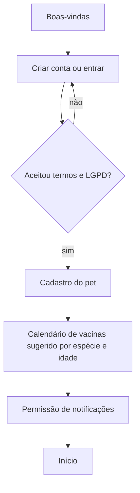
```mermaid
flowchart TD
  A[Boas-vindas] --> B[Criar conta ou entrar]
  B --> C{Aceitou termos e LGPD?}
  C -- não --> B
  C -- sim --> D[Cadastro do pet]
  D --> E[Calendário de vacinas sugerido por espécie e idade]
  E --> F[Permissão de notificações]
  F --> G[Início]
```

### 19.2 Saúde, lembrete e clínica (Fase 1)

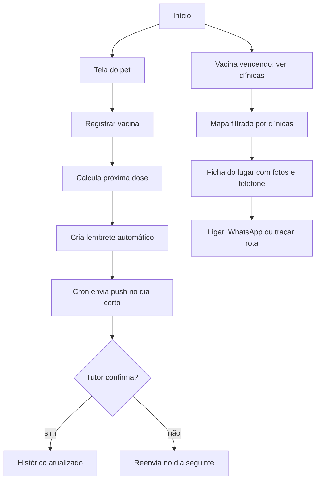
```mermaid
flowchart TD
  I[Início] --> P[Tela do pet]
  P --> V[Registrar vacina]
  V --> N[Calcula próxima dose]
  N --> L[Cria lembrete automático]
  L --> T[Cron envia push no dia certo]
  T --> W{Tutor confirma?}
  W -- sim --> H[Histórico atualizado]
  W -- não --> R[Reenvia no dia seguinte]
  I --> M[Vacina vencendo: ver clínicas]
  M --> Mapa[Mapa filtrado por clínicas]
  Mapa --> Lugar[Ficha do lugar com fotos e telefone]
  Lugar --> S[Ligar, WhatsApp ou traçar rota]
```

### 19.3 Remédio com doses (Fase 1)

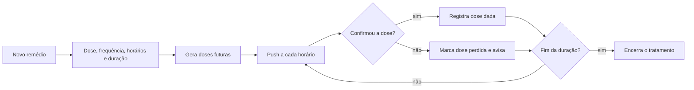
```mermaid
flowchart LR
  A[Novo remédio] --> B[Dose, frequência, horários e duração]
  B --> C[Gera doses futuras]
  C --> D[Push a cada horário]
  D --> E{Confirmou a dose?}
  E -- sim --> F[Registra dose dada]
  E -- não --> G[Marca dose perdida e avisa]
  F --> H{Fim da duração?}
  G --> H
  H -- não --> D
  H -- sim --> I[Encerra o tratamento]
```

### 19.4 Compra de produto (retirada ou entrega) (Fase 3)

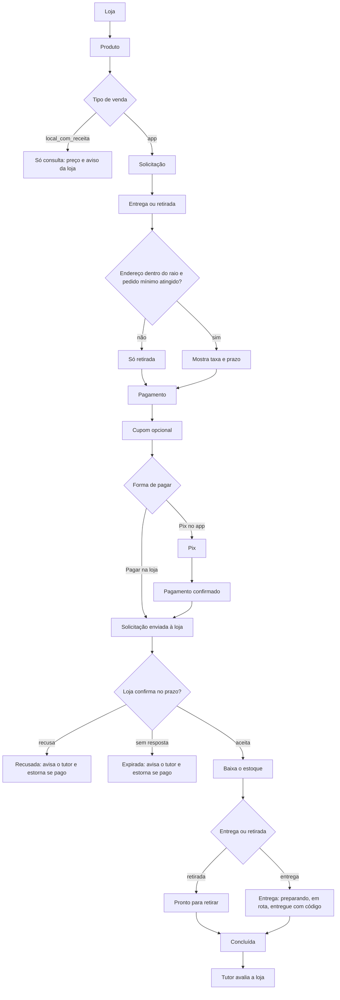
```mermaid
flowchart TD
  L[Loja] --> P[Produto]
  P --> Q{Tipo de venda}
  Q -- local_com_receita --> R[Só consulta: preço e aviso da loja]
  Q -- app --> S[Solicitação]
  S --> E[Entrega ou retirada]
  E --> Z{Endereço dentro do raio e pedido mínimo atingido?}
  Z -- não --> RET[Só retirada]
  Z -- sim --> TX[Mostra taxa e prazo]
  RET --> PG
  TX --> PG[Pagamento]
  PG --> CP[Cupom opcional]
  CP --> M{Forma de pagar}
  M -- Pix no app --> PX[Pix]
  M -- Pagar na loja --> ENV
  PX --> OK[Pagamento confirmado]
  OK --> ENV[Solicitação enviada à loja]
  ENV --> A{Loja confirma no prazo?}
  A -- recusa --> X[Recusada: avisa o tutor e estorna se pago]
  A -- sem resposta --> EXP[Expirada: avisa o tutor e estorna se pago]
  A -- aceita --> BX[Baixa o estoque]
  BX --> K{Entrega ou retirada}
  K -- retirada --> PR[Pronto para retirar]
  K -- entrega --> D[Entrega: preparando, em rota, entregue com código]
  PR --> C[Concluída]
  D --> C
  C --> AV[Tutor avalia a loja]
```

### 19.5 Reserva de serviço (banho e tosa, consulta, vacinação) (Fase 3)

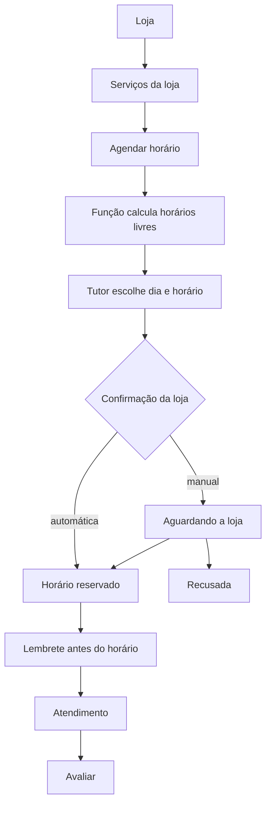
```mermaid
flowchart TD
  L[Loja] --> S[Serviços da loja]
  S --> A[Agendar horário]
  A --> F[Função calcula horários livres]
  F --> E[Tutor escolhe dia e horário]
  E --> C{Confirmação da loja}
  C -- automática --> OK[Horário reservado]
  C -- manual --> W[Aguardando a loja]
  W --> OK
  W --> NO[Recusada]
  OK --> LM[Lembrete antes do horário]
  LM --> D[Atendimento]
  D --> AV[Avaliar]
```

### 19.6 Passeio, creche e hotelzinho (Fase 3)

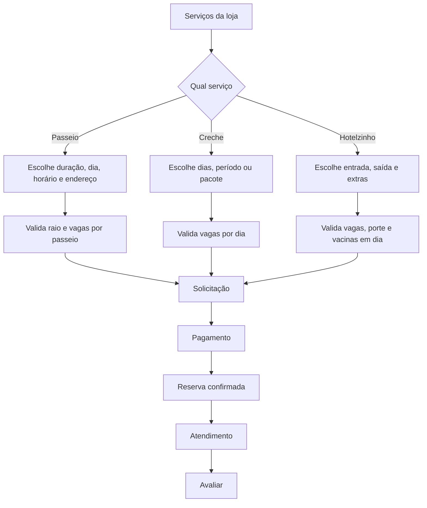
```mermaid
flowchart TD
  S[Serviços da loja] --> T{Qual serviço}
  T -- Passeio --> P[Escolhe duração, dia, horário e endereço]
  T -- Creche --> C[Escolhe dias, período ou pacote]
  T -- Hotelzinho --> H[Escolhe entrada, saída e extras]
  P --> V1[Valida raio e vagas por passeio]
  C --> V2[Valida vagas por dia]
  H --> V3[Valida vagas, porte e vacinas em dia]
  V1 --> R[Solicitação]
  V2 --> R
  V3 --> R
  R --> PG[Pagamento]
  PG --> OK[Reserva confirmada]
  OK --> AT[Atendimento]
  AT --> AV[Avaliar]
```

### 19.7 Passeio ao vivo (Fase 3)

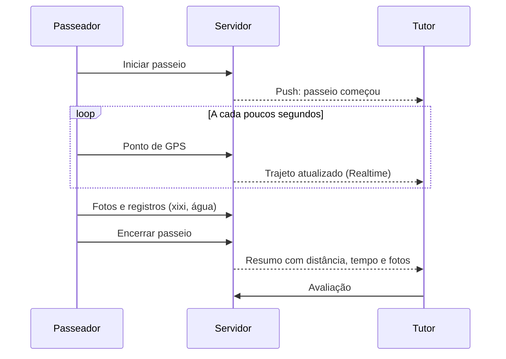
```mermaid
sequenceDiagram
  participant Passeador
  participant Servidor
  participant Tutor
  Passeador->>Servidor: Iniciar passeio
  Servidor-->>Tutor: Push: passeio começou
  loop A cada poucos segundos
    Passeador->>Servidor: Ponto de GPS
    Servidor-->>Tutor: Trajeto atualizado (Realtime)
  end
  Passeador->>Servidor: Fotos e registros (xixi, água)
  Passeador->>Servidor: Encerrar passeio
  Servidor-->>Tutor: Resumo com distância, tempo e fotos
  Tutor->>Servidor: Avaliação
```

### 19.8 Entrega (Fase 3)

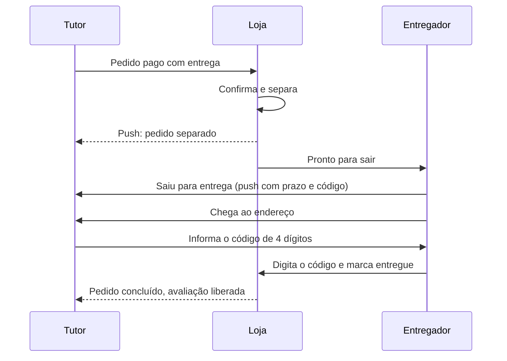
```mermaid
sequenceDiagram
  participant Tutor
  participant Loja
  participant Entregador
  Tutor->>Loja: Pedido pago com entrega
  Loja->>Loja: Confirma e separa
  Loja-->>Tutor: Push: pedido separado
  Loja->>Entregador: Pronto para sair
  Entregador->>Tutor: Saiu para entrega (push com prazo e código)
  Entregador->>Tutor: Chega ao endereço
  Tutor->>Entregador: Informa o código de 4 dígitos
  Entregador->>Loja: Digita o código e marca entregue
  Loja-->>Tutor: Pedido concluído, avaliação liberada
```

### 19.9 Cadastro e publicação da loja (Fase 3)

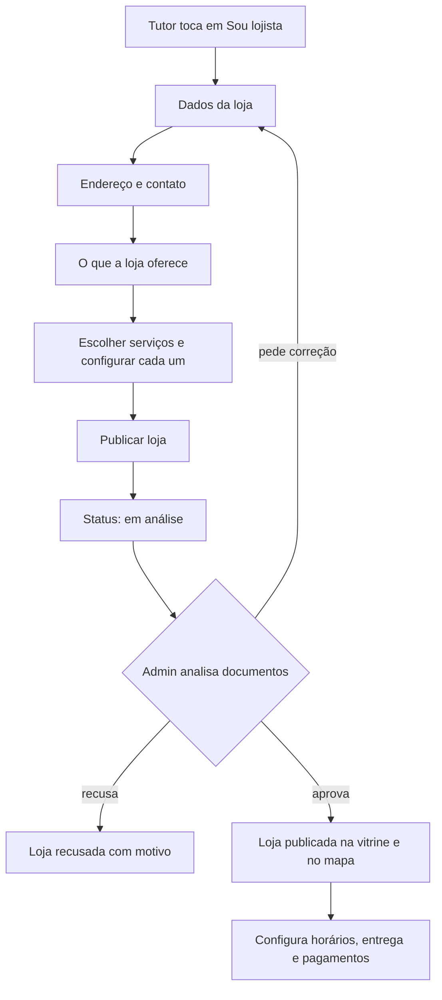
```mermaid
flowchart TD
  A[Tutor toca em Sou lojista] --> B[Dados da loja]
  B --> C[Endereço e contato]
  C --> D[O que a loja oferece]
  D --> E[Escolher serviços e configurar cada um]
  E --> F[Publicar loja]
  F --> G[Status: em análise]
  G --> H{Admin analisa documentos}
  H -- pede correção --> B
  H -- recusa --> X[Loja recusada com motivo]
  H -- aprova --> I[Loja publicada na vitrine e no mapa]
  I --> J[Configura horários, entrega e pagamentos]
```

### 19.10 Dia a dia do lojista (Fase 3)

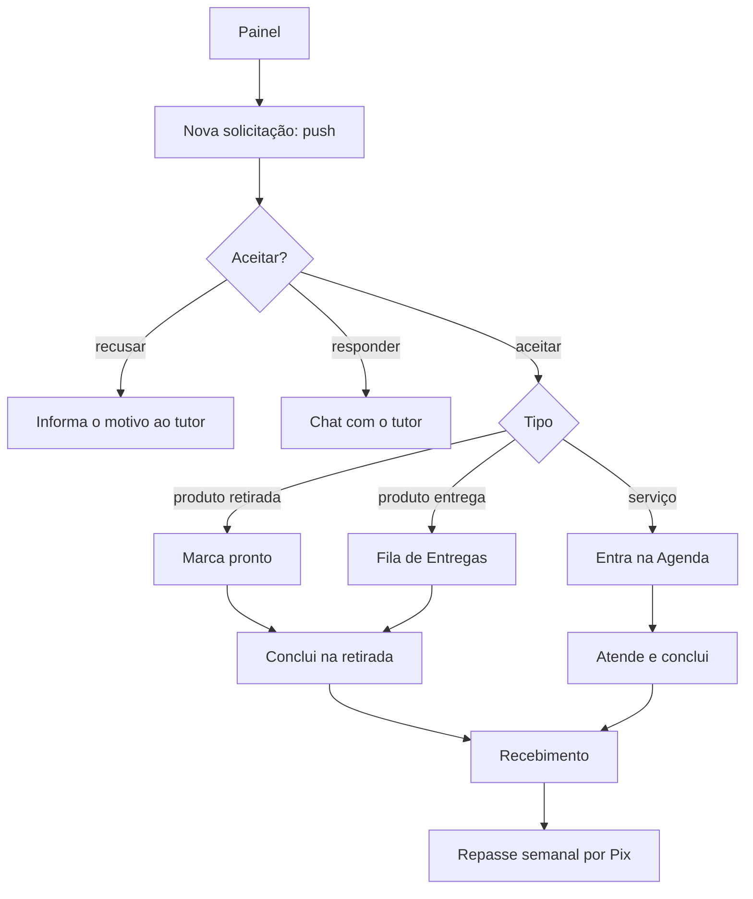
```mermaid
flowchart TD
  P[Painel] --> S[Nova solicitação: push]
  S --> A{Aceitar?}
  A -- recusar --> R[Informa o motivo ao tutor]
  A -- responder --> C[Chat com o tutor]
  A -- aceitar --> E{Tipo}
  E -- produto retirada --> PR[Marca pronto]
  E -- produto entrega --> EN[Fila de Entregas]
  E -- serviço --> AG[Entra na Agenda]
  PR --> CO[Conclui na retirada]
  EN --> CO
  AG --> AT[Atende e conclui]
  CO --> RC[Recebimento]
  AT --> RC
  RC --> RP[Repasse semanal por Pix]
```

### 19.11 Premium (Fase 2)

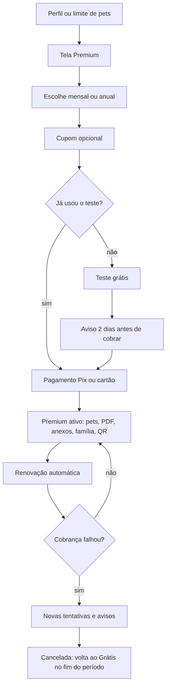
```mermaid
flowchart TD
  P[Perfil ou limite de pets] --> PR[Tela Premium]
  PR --> PL[Escolhe mensal ou anual]
  PL --> CP[Cupom opcional]
  CP --> T{Já usou o teste?}
  T -- não --> TG[Teste grátis]
  T -- sim --> PX[Pagamento Pix ou cartão]
  TG --> AV[Aviso 2 dias antes de cobrar]
  AV --> PX
  PX --> OK[Premium ativo: pets, PDF, anexos, família, QR]
  OK --> RN[Renovação automática]
  RN --> F{Cobrança falhou?}
  F -- sim --> RT[Novas tentativas e avisos]
  RT --> CA[Cancelada: volta ao Grátis no fim do período]
  F -- não --> OK
```

### 19.12 QR da coleira: pet encontrado (Fase 2)

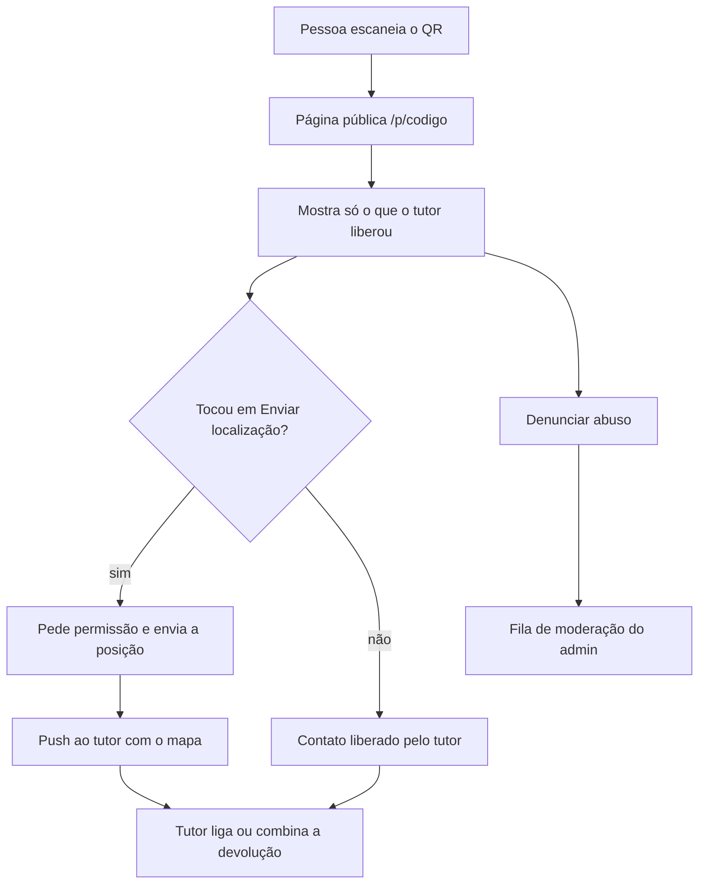
```mermaid
flowchart TD
  A[Pessoa escaneia o QR] --> B[Página pública /p/codigo]
  B --> C[Mostra só o que o tutor liberou]
  C --> D{Tocou em Enviar localização?}
  D -- sim --> E[Pede permissão e envia a posição]
  E --> F[Push ao tutor com o mapa]
  D -- não --> G[Contato liberado pelo tutor]
  F --> H[Tutor liga ou combina a devolução]
  G --> H
  C --> I[Denunciar abuso]
  I --> J[Fila de moderação do admin]
```

### 19.13 Avaliação (Fase 3)

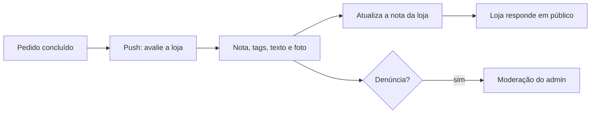
```mermaid
flowchart LR
  A[Pedido concluído] --> B[Push: avalie a loja]
  B --> C[Nota, tags, texto e foto]
  C --> D[Atualiza a nota da loja]
  D --> E[Loja responde em público]
  C --> F{Denúncia?}
  F -- sim --> G[Moderação do admin]
```

### 19.14 Admin: aprovação de loja, disputa e avaliações dos apps (Fases 2 e 3)

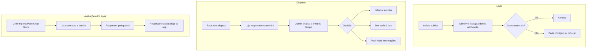
```mermaid
flowchart TD
  subgraph LJ["Lojas"]
    L1[Lojista publica] --> L2[Admin vê fila Aguardando aprovação]
    L2 --> L3{Documentos ok?}
    L3 -- sim --> L4[Aprovar]
    L3 -- não --> L5[Pedir correção ou recusar]
  end
  subgraph DS["Disputas"]
    D1[Tutor abre disputa] --> D2[Loja responde em até 48 h]
    D2 --> D3[Admin analisa a linha do tempo]
    D3 --> D4{Decisão}
    D4 --> D5[Estornar ao tutor]
    D4 --> D6[Dar razão à loja]
    D4 --> D7[Pedir mais informações]
  end
  subgraph AP["Avaliações dos apps"]
    A1[Cron importa Play e App Store] --> A2[Lista com nota e versão]
    A2 --> A3[Responder pelo painel]
    A3 --> A4[Resposta enviada à loja do app]
  end
```

### 19.15 Admin: suporte e privacidade (Fase 2)

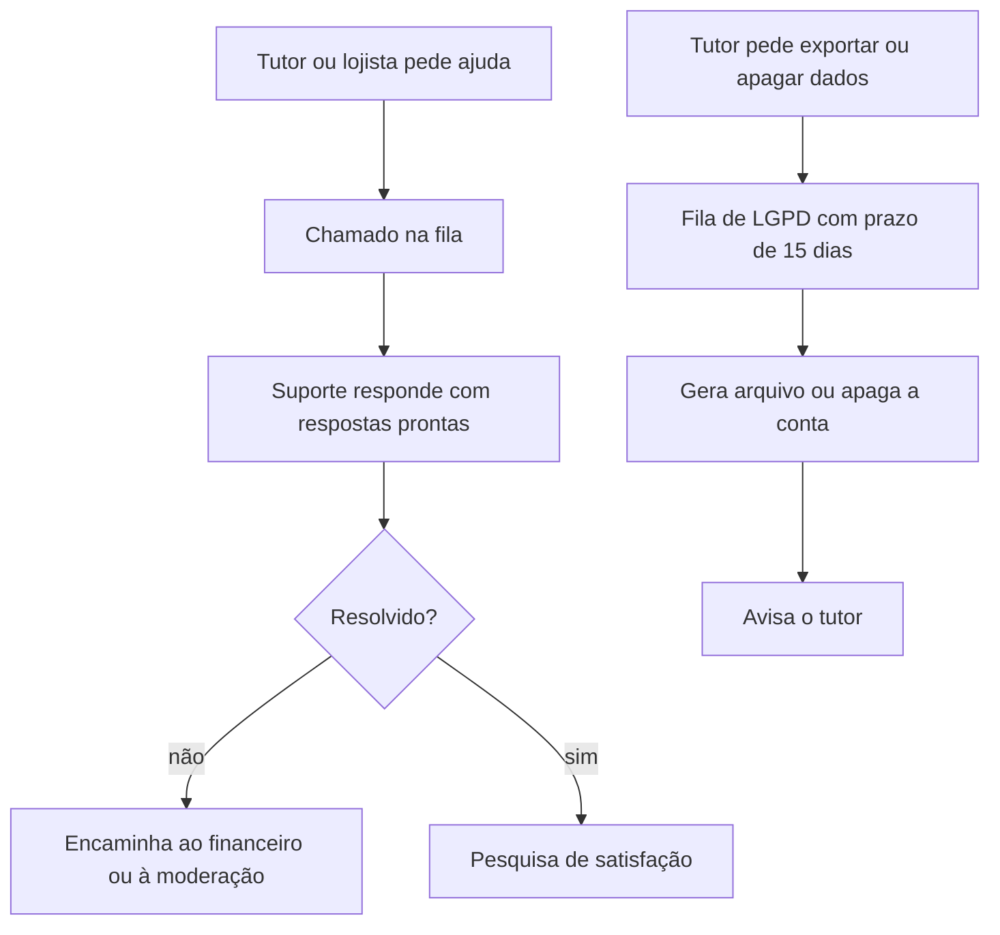
```mermaid
flowchart TD
  T[Tutor ou lojista pede ajuda] --> C[Chamado na fila]
  C --> R[Suporte responde com respostas prontas]
  R --> S{Resolvido?}
  S -- não --> E[Encaminha ao financeiro ou à moderação]
  S -- sim --> F[Pesquisa de satisfação]
  U[Tutor pede exportar ou apagar dados] --> Q[Fila de LGPD com prazo de 15 dias]
  Q --> X[Gera arquivo ou apaga a conta]
  X --> Y[Avisa o tutor]
```

### 19.16 Lugares pet por perto (Fase 1)

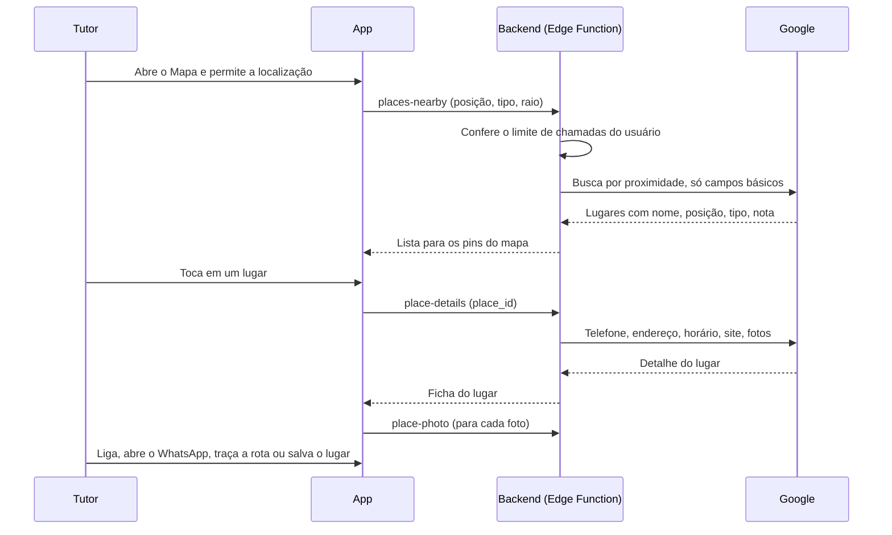
```mermaid
sequenceDiagram
  participant Tutor
  participant App
  participant Backend as Backend (Edge Function)
  participant Google
  Tutor->>App: Abre o Mapa e permite a localização
  App->>Backend: places-nearby (posição, tipo, raio)
  Backend->>Backend: Confere o limite de chamadas do usuário
  Backend->>Google: Busca por proximidade, só campos básicos
  Google-->>Backend: Lugares com nome, posição, tipo, nota
  Backend-->>App: Lista para os pins do mapa
  Tutor->>App: Toca em um lugar
  App->>Backend: place-details (place_id)
  Backend->>Google: Telefone, endereço, horário, site, fotos
  Google-->>Backend: Detalhe do lugar
  Backend-->>App: Ficha do lugar
  App->>Backend: place-photo (para cada foto)
  Tutor->>App: Liga, abre o WhatsApp, traça a rota ou salva o lugar
```

### 19.17 Eventos pet (Fase 2)

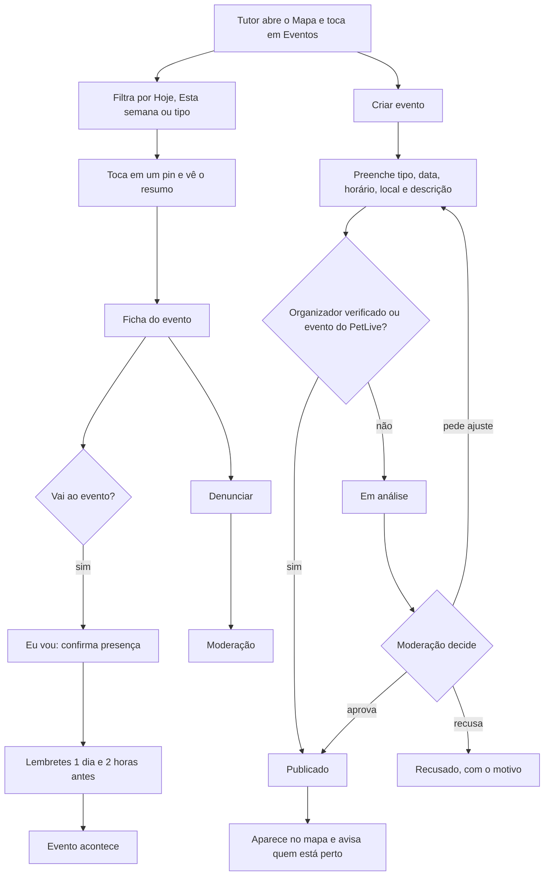
```mermaid
flowchart TD
  A[Tutor abre o Mapa e toca em Eventos] --> B[Filtra por Hoje, Esta semana ou tipo]
  B --> C[Toca em um pin e vê o resumo]
  C --> D[Ficha do evento]
  D --> E{Vai ao evento?}
  E -- sim --> F[Eu vou: confirma presença]
  F --> G[Lembretes 1 dia e 2 horas antes]
  G --> H[Evento acontece]
  D --> I[Denunciar]
  I --> J[Moderação]
  A --> K[Criar evento]
  K --> L[Preenche tipo, data, horário, local e descrição]
  L --> M{Organizador verificado ou evento do PetLive?}
  M -- sim --> N[Publicado]
  M -- não --> O[Em análise]
  O --> P{Moderação decide}
  P -- aprova --> N
  P -- pede ajuste --> L
  P -- recusa --> Q[Recusado, com o motivo]
  N --> R[Aparece no mapa e avisa quem está perto]
```

### 19.18 SOS e emergência (Fase 1)

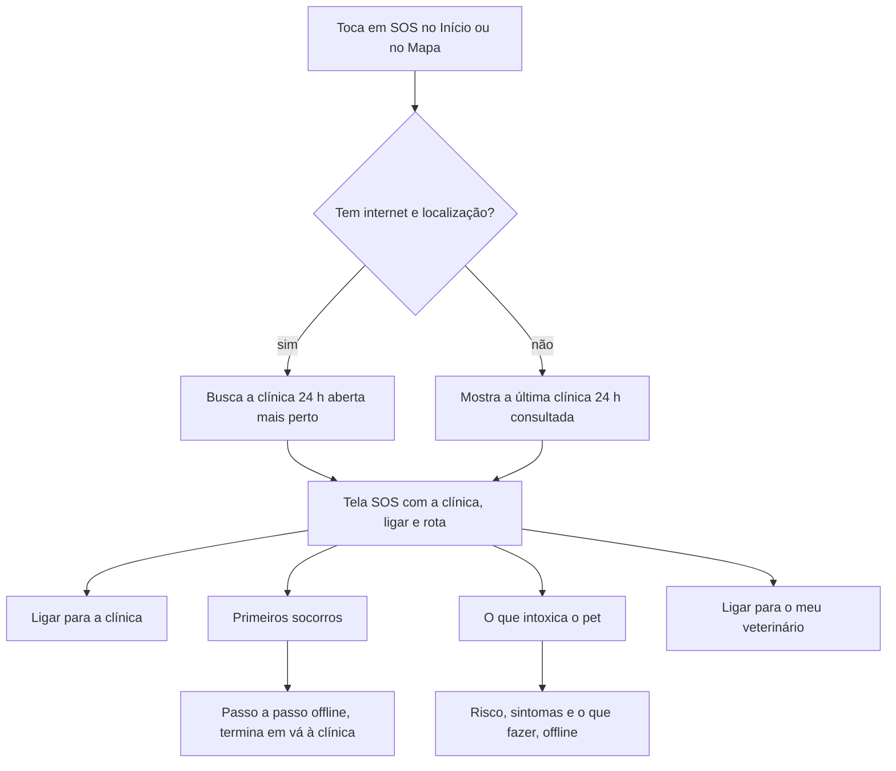
```mermaid
flowchart TD
  A[Toca em SOS no Início ou no Mapa] --> B{Tem internet e localização?}
  B -- sim --> C[Busca a clínica 24 h aberta mais perto]
  B -- não --> D[Mostra a última clínica 24 h consultada]
  C --> E[Tela SOS com a clínica, ligar e rota]
  D --> E
  E --> F[Ligar para a clínica]
  E --> G[Primeiros socorros]
  E --> H[O que intoxica o pet]
  E --> I[Ligar para o meu veterinário]
  G --> J[Passo a passo offline, termina em vá à clínica]
  H --> K[Risco, sintomas e o que fazer, offline]
```

### 19.19 Ler cartão de vacina por foto (Fase 2)

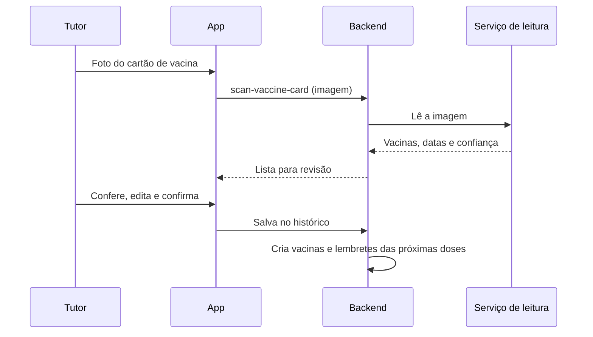
```mermaid
sequenceDiagram
  participant Tutor
  participant App
  participant Backend
  participant Leitura as Serviço de leitura
  Tutor->>App: Foto do cartão de vacina
  App->>Backend: scan-vaccine-card (imagem)
  Backend->>Leitura: Lê a imagem
  Leitura-->>Backend: Vacinas, datas e confiança
  Backend-->>App: Lista para revisão
  Tutor->>App: Confere, edita e confirma
  App->>Backend: Salva no histórico
  Backend->>Backend: Cria vacinas e lembretes das próximas doses
```

### 19.20 Adoção (Fase 2)

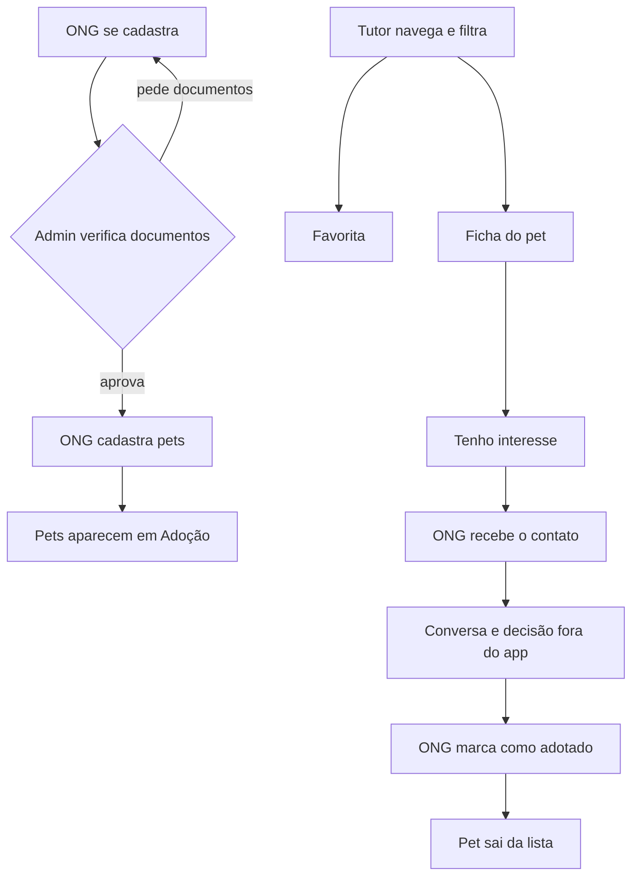
```mermaid
flowchart TD
  O[ONG se cadastra] --> V{Admin verifica documentos}
  V -- aprova --> P[ONG cadastra pets]
  V -- pede documentos --> O
  P --> L[Pets aparecem em Adoção]
  T[Tutor navega e filtra] --> F[Favorita]
  T --> D[Ficha do pet]
  D --> I[Tenho interesse]
  I --> C[ONG recebe o contato]
  C --> M[Conversa e decisão fora do app]
  M --> A[ONG marca como adotado]
  A --> S[Pet sai da lista]
```

### 19.21 Cuidador temporário (Fase 2)

```mermaid
flowchart TD
  A[Tutor cria acesso] --> B[Escolhe pets, período e o que pode ver]
  B --> C[Gera link ou código]
  C --> D[Cuidador abre e vê só o liberado]
  D --> E[Marca dose dada]
  E --> F[Tutor recebe aviso]
  D --> G{Passou do prazo ou foi revogado?}
  G -- sim --> H[Acesso encerrado]
  G -- não --> D
```

### 19.22 Pet perdido (Fase 5), do alerta ao reencontro

```mermaid
flowchart TD
  A[Tutor toca em Meu pet sumiu] --> B[Último local, horário e raio]
  B --> C[Envia o alerta]
  C --> D[Push para quem está no raio e permitiu]
  D --> E[Quem viu abre o alerta]
  E --> F[Contato liberado pelo tutor]
  C --> G[QR da coleira mostra pet procurado]
  E --> V[Toca em Vi este pet e envia a localização]
  G --> V
  V --> W[Tutor recebe o ponto no mapa, sem o telefone de quem viu]
  F --> H[Tutor encerra o alerta]
  W --> H
```

### 19.23 Passeio com GPS (Fase 2)

```mermaid
sequenceDiagram
  participant Tutor
  participant App
  participant Servidor
  Tutor->>App: Iniciar passeio e escolher o pet
  loop Durante o passeio
    App->>App: Grava pontos de GPS no aparelho
  end
  Tutor->>App: Pausar, retomar ou tirar foto
  Tutor->>App: Finalizar
  App->>Tutor: Resumo com distância, tempo e trajeto
  Tutor->>App: Confere e salva
  App->>Servidor: Sincroniza o passeio (quando houver internet)
  Servidor->>Servidor: Atualiza histórico e recalcula selos
```

### 19.24 Fogos e trovão (Fase 2)

```mermaid
flowchart TD
  A[Admin cadastra datas com fogos] --> B[Job avisa 3 dias antes e no dia]
  B --> C[Tutor abre Fogos e trovão]
  C --> D[Lê as dicas e marca o checklist]
  C --> E[Confere QR e contato da coleira]
  C --> F[Ativa o modo calmo da noite]
  F --> G[Avisos não urgentes ficam em silêncio]
  B --> H[Lembrete à noite: pet em casa, janela fechada]
```

### 19.25 Dose pela notificação e pelo widget (Fases 1 e 2)

```mermaid
flowchart LR
  A[Hora da dose] --> B[Notificação com Feito e Adiar]
  B -- Feito --> C[Registra a dose e recalcula a próxima]
  B -- Adiar 15 min --> D[Nova notificação em 15 min]
  B -- sem resposta --> E[Repete no dia seguinte e marca dose perdida]
  F[Widget na tela inicial] -- Feito --> C
```

### 19.26 Consulta na clínica (Fase 3)

```mermaid
flowchart TD
  A[Ficha do lugar no mapa] --> B{Clínica está no PetLive?}
  B -- não --> C[Ligar ou traçar rota]
  B -- sim --> D[Agendar pelo PetLive]
  D --> E[Escolhe tipo, pet, dia e horário livre]
  E --> F{Confirmação da clínica}
  F -- automática --> G[Horário reservado]
  F -- manual --> H[Aguardando a clínica] --> G
  G --> I[Lembretes antes da consulta]
  I --> J[Consulta concluída]
  J --> K[Entra no histórico do pet e pede anexo de exame]
```

### 19.27 Ficha de emergência por link (Fase 2)

```mermaid
flowchart TD
  A[Tutor abre SOS ou o pet] --> B[Ficha de emergência]
  B --> C[Escolhe o que incluir e a validade]
  C --> D[Gera link e QR temporários]
  D --> E[Envia por WhatsApp ou mostra o QR]
  E --> F[Clínica abre a ficha sem login]
  F --> G[Tutor é avisado de que a ficha foi aberta]
  D --> H{Passou a validade ou o tutor cancelou?}
  H -- sim --> I[Link deixa de funcionar]
```

### 19.28 SOS com pré-chegada (Fase 3)

```mermaid
sequenceDiagram
  participant Tutor
  participant App
  participant Clinica as Clínica 24 h (painel)
  Tutor->>App: SOS e escolhe a clínica no PetLive
  Tutor->>App: Estou a caminho (consente o envio)
  App->>Clinica: Ficha do pet, ETA e telefone
  Clinica-->>App: Viu a ficha
  alt Pode atender
    Clinica-->>App: Equipe pronta
  else Não pode
    Clinica-->>App: Não posso atender
    App-->>Tutor: Sugere a próxima clínica
  end
  App->>Clinica: ETA atualizado durante o trajeto
  Tutor->>App: Cheguei
  Clinica->>Clinica: Atende com a ficha em mãos
  Clinica-->>App: Concluído (vira consulta, com permissão do tutor)
```

### 19.29 Achei um pet: reconhecimento por foto (Fase 5)

```mermaid
flowchart TD
  A[Pessoa acha um pet] --> B[Toca em Achei um pet]
  B --> C[Fotografa rosto ou focinho]
  C --> D[Backend compara só com alertas ativos por perto]
  D --> E[Lista de candidatos com semelhança em palavras]
  E --> F[Pessoa abre o alerta de um candidato]
  F --> G[Vi este pet: envia localização e mensagem]
  G --> H[Tutor recebe o ponto no mapa e decide]
  C --> I[Foto apagada em 24 h se não enviar o Vi este pet]
```

### 19.30 Modo memorial (Fase 2)

```mermaid
flowchart TD
  A[Menu do pet: Registrar a partida] --> B[Data e mensagem opcional]
  B --> C[Explica o que muda e pede confirmação]
  C --> D[Pausa lembretes e avisos do pet]
  D --> E[Desativa QR e encerra alertas]
  E --> F[Tela Em memória]
  F --> G[Baixar álbum de lembranças]
  F --> H[Recursos de apoio ao luto]
  F --> I[Reativar, se foi engano]
```

### 19.31 Pet sênior e qualidade de vida (Fase 2)

```mermaid
flowchart TD
  A[Pet passa da idade sênior] --> B[Aviso: agora é sênior]
  B --> C[Rotina adaptada: consulta a cada 6 meses, pesagem mensal, exames]
  C --> D[Tutor faz a escala de qualidade de vida quando quiser]
  D --> E[Pontuação e histórico]
  E --> F[Resumo em PDF para o veterinário]
  F --> G[Conversa com o veterinário, sem decisão pelo app]
```

### 19.32 Álbum impresso (Fase 3)

```mermaid
flowchart TD
  A[Linha do tempo do pet] --> B[Escolhe pet e ano]
  B --> C[App seleciona fotos e marcos]
  C --> D[Tutor ajusta capa, ordem e legendas]
  D --> E[Prévia em PDF]
  E --> F[Tamanho, páginas, endereço e frete]
  F --> G[Paga por Pix]
  G --> H[Gráfica parceira imprime]
  H --> I[Enviado com rastreio]
  I --> J[Entregue]
```

### 19.33 Enviar a ficha para a clínica pelo mapa (Fase 2)

```mermaid
flowchart TD
  A[Mapa: toca em uma clínica] --> B[Ficha da clínica]
  B --> C[Enviar a ficha do pet para esta clínica]
  C --> D[Mostra o número do Google, a mensagem e o que a ficha inclui]
  D --> E{Número é de celular?}
  E -- sim --> F[Abre o WhatsApp da clínica com a mensagem e o link]
  E -- não --> G[Copiar link, mostrar QR ou ligar]
  F --> H[Tutor toca em enviar no WhatsApp]
  G --> H
  H --> I[Clínica abre o link da ficha]
  I --> J[Tutor é avisado de que a ficha foi aberta]
```

### 19.34 Guarda compartilhada (Fase 2)

```mermaid
flowchart TD
  A[Perfil ou pet: Guarda compartilhada] --> B[Convidar pessoa]
  B --> C[Escolhe um ou mais pets e informa o e-mail]
  C --> D{Premium ativo e menos de 4 pessoas no pet?}
  D -- não --> E[Mostra o limite ou o convite do Premium]
  D -- sim --> F[Convite enviado: app, push e e-mail]
  F --> G{Pessoa aceita em até 7 dias?}
  G -- recusa ou expira --> H[Titular é avisado]
  G -- aceita --> I[Escolhe os pets que aceita]
  I --> J[Os dois cuidam do pet]
  J --> K[Um registra vacina, dose ou peso]
  K --> L[Outros veem na hora e recebem aviso]
  J --> M{Sai ou é removido?}
  M -- sim --> N[Acesso acaba na hora, histórico fica]
```

---

## 20. Máquinas de estado

Cada mudança de estado grava uma linha em `request_events` (ou na tabela de eventos equivalente), com quem mudou, quando e o motivo. Estados em `snake_case` no banco, com texto em português na tela.

### 20.1 Solicitação (`requests`), Fase 3

```mermaid
stateDiagram-v2
  [*] --> enviada
  enviada --> confirmada: loja aceita
  enviada --> recusada: loja recusa
  enviada --> expirada: sem resposta no prazo
  enviada --> cancelada: tutor cancela
  confirmada --> pronta: produto separado
  confirmada --> em_andamento: serviço começou
  confirmada --> cancelada: tutor ou loja cancela dentro da regra
  confirmada --> nao_compareceu: tutor não apareceu
  pronta --> em_entrega: sai para entrega
  pronta --> concluida: retirada feita
  em_entrega --> concluida: entregue com código
  em_andamento --> concluida: serviço encerrado
  concluida --> [*]
  recusada --> [*]
  expirada --> [*]
  cancelada --> [*]
  nao_compareceu --> [*]
```

### 20.2 Pagamento (`payments`), Fase 3

`pendente` → `pago` → (`estornado` | `repassado`). Se o Pix passar da validade, `pendente` vira `expirado`. Pagar na loja não cria `payments` no app. Pedido recusado, expirado ou cancelado com pagamento `pago` gera estorno automático.

### 20.3 Entrega (`deliveries`), Fase 3

```mermaid
stateDiagram-v2
  [*] --> preparando
  preparando --> pronta_para_sair: pedido separado
  pronta_para_sair --> em_rota: entregador sai
  em_rota --> entregue: código de 4 dígitos confere
  em_rota --> falhou: ninguém recebeu
  falhou --> em_rota: nova tentativa
  falhou --> devolvida: volta para a loja
  entregue --> [*]
  devolvida --> [*]
```

### 20.4 Assinatura Premium (`subscriptions`), Fase 2

```mermaid
stateDiagram-v2
  [*] --> em_teste
  em_teste --> ativa: primeira cobrança paga
  em_teste --> cancelada: tutor cancela
  ativa --> pagamento_falhou: cobrança recusada
  pagamento_falhou --> ativa: nova tentativa paga
  pagamento_falhou --> expirada: tentativas esgotadas
  ativa --> cancelando: tutor cancela, vale até o fim do período
  cancelando --> cancelada: fim do período
  cancelada --> [*]
  expirada --> [*]
```

### 20.5 Loja (`stores.status`), Fase 3

`rascunho` → `em_analise` → (`aprovada` | `correcao_pedida` | `recusada`). `correcao_pedida` volta para `em_analise` quando o lojista reenvia. `aprovada` pode ficar `suspensa` por ação do admin e voltar. Além do status, a loja tem o interruptor **aberta ou fechada**, que o próprio lojista liga e desliga e só afeta pedidos novos.

### 20.6 Disputa (`disputes`), Fase 3

`aberta` → `resposta_da_loja` → `em_analise` → `resolvida`, com o resultado `estorno`, `a_favor_da_loja` ou `acordo`. Se a loja não responde no prazo, vai direto para `em_analise`.

### 20.7 Passeio (`walks`), Fase 3

`agendado` → `iniciado` → `em_andamento` (recebe pontos de GPS) → `encerrado` → `avaliado`. Um passeio `agendado` que ninguém inicia até `[30]` minutos depois do horário vira `perdido` e avisa a loja e o tutor.

### 20.8 Cupom (`coupons`), Fase 3

`agendado` → `ativo` → (`esgotado` | `encerrado`). O banco confere limite de usos e validade na hora de aplicar, nunca só o app.

### 20.9 Chamado de suporte (`support_tickets`), Fase 2

`aberto` → `em_atendimento` → `aguardando_usuario` → `resolvido`. O tutor responder reabre o chamado.

### 20.10 Pedido de privacidade (`lgpd_requests`), Fase 2

`novo` → `aguardando_confirmacao` (apagar conta exige confirmar por e-mail) → `em_andamento` → `concluido`. O campo `due_at` guarda o prazo de 15 dias.

### 20.11 Evento (`events`), Fase 2

```mermaid
stateDiagram-v2
  [*] --> rascunho
  rascunho --> em_analise: usuário envia
  rascunho --> publicado: evento do PetLive ou organizador verificado
  em_analise --> publicado: moderação aprova
  em_analise --> ajuste_pedido: moderação pede ajuste
  ajuste_pedido --> em_analise: organizador reenvia
  em_analise --> recusado: moderação recusa
  publicado --> em_analise: mudou data, horário ou local
  publicado --> oculto: denúncias acima do limite
  oculto --> publicado: moderação mantém
  oculto --> recusado: moderação remove
  publicado --> cancelado: organizador cancela
  publicado --> encerrado: passou o horário de fim
  encerrado --> [*]
  cancelado --> [*]
  recusado --> [*]
```

### 20.12 Passeio do tutor (`pet_walks`), Fase 2

```mermaid
stateDiagram-v2
  [*] --> gravando
  gravando --> pausado: tutor pausa
  pausado --> gravando: tutor retoma
  gravando --> revisando: tutor finaliza
  pausado --> revisando: tutor finaliza
  gravando --> encerrado_auto: aberto por mais de 3 h
  encerrado_auto --> revisando: tutor decide salvar
  revisando --> salvo: tutor salva
  revisando --> descartado: tutor descarta ou passeio curto demais
  salvo --> [*]
  descartado --> [*]
```

### 20.13 Ficha de emergência (`emergency_cards`), Fase 2

```mermaid
stateDiagram-v2
  [*] --> ativa
  ativa --> expirada: passou a validade
  ativa --> cancelada: tutor cancela
  expirada --> [*]
  cancelada --> [*]
```

### 20.14 Chegada de emergência (`emergency_arrivals`), Fase 3

```mermaid
stateDiagram-v2
  [*] --> enviada
  enviada --> vista: clínica abre a ficha
  vista --> equipe_pronta: clínica prepara
  vista --> recusada: clínica não pode atender
  enviada --> recusada: clínica não pode atender
  recusada --> redirecionada: tutor escolhe outra clínica
  equipe_pronta --> chegou: tutor toca em Cheguei
  vista --> chegou: tutor toca em Cheguei
  chegou --> em_atendimento
  em_atendimento --> concluida
  enviada --> cancelada: tutor desiste
  concluida --> [*]
  cancelada --> [*]
  redirecionada --> [*]
```

### 20.15 Pedido do álbum (`album_orders`), Fase 3

```mermaid
stateDiagram-v2
  [*] --> rascunho
  rascunho --> previa: tutor revisa
  previa --> aguardando_pagamento
  aguardando_pagamento --> pago: Pix confirmado
  aguardando_pagamento --> expirado: Pix venceu
  pago --> em_producao: enviado à gráfica
  em_producao --> enviado
  enviado --> entregue
  em_producao --> reimpressao: defeito
  reimpressao --> enviado
  pago --> cancelado: antes da produção
  entregue --> [*]
```

### 20.16 Situação do pet (`pets.status`), Fase 2

`ativo` → `em_memoria` quando o tutor registra a partida, e de volta a `ativo` se reativar. A condição **sênior** é uma marca calculada pela idade, não um estado.

---

## 21. Modelo de dados completo

Convenções: `id uuid` em todas as tabelas, `created_at` e `updated_at`, soft delete (`deleted_at`) onde houver histórico. Valores em reais ficam em centavos (`*_cents integer`). Datas em UTC, exibidas no fuso de São Paulo.

### 21.1 Tutor, pets e saúde (Fase 1; QR na Fase 2)

| Tabela | Campos principais |
| --- | --- |
| `profiles` | `user_id`, `name`, `phone`, `whatsapp`, `city`, `avatar_url` (caminho no armazenamento privado `perfis`), `plan` (`free`/`premium`), `onboarded_at`, `terms_version`, `terms_accepted_at` |
| `pets` | `owner_id`, `name`, `species` (`dog`/`cat`), `breed_id`, `birth_date`, `sex`, `weight_kg`, `photo_url`, `allergies` |
| `pet_members` | `pet_id`, `user_id`, `role` (`owner`/`guardian`; `family` na primeira versão), `invited_by`, `accepted_at`, usado pela guarda compartilhada |
| `pet_invites` | `owner_id`, `email`, `pet_ids[]`, `token_hash`, `status` (`enviado`/`aceito`/`recusado`/`cancelado`/`expirado`), `expires_at` |
| `pet_activity` | `pet_id`, `actor_id`, `kind` (`vacina`/`dose`/`remedio`/`peso`/`consulta`/`pet`/...), `ref_table`, `ref_id`, `summary`, `created_at`; as tabelas de saúde ganham `created_by` e `updated_by` |
| `vaccinations` | `pet_id`, `vaccine_id`, `applied_at`, `next_due_at`, `vet_name`, `batch`, `attachment_url` |
| `dewormings` | `pet_id`, `product`, `applied_at`, `next_due_at` |
| `weights` | `pet_id`, `kg`, `measured_at` |
| `visits` | `pet_id`, `date`, `reason`, `vet_name`, `notes`, `attachments` |
| `medications` | `pet_id`, `name`, `dose`, `every_hours`, `times[]`, `starts_at`, `ends_at`, `active` |
| `medication_doses` | `medication_id`, `scheduled_at`, `status` (`pendente`/`dada`/`perdida`), `confirmed_at` |
| `reminders` | `pet_id`, `type`, `title`, `due_at`, `repeat_rule`, `status`, `source` (`manual`/`vacina`/`remedio`/`reserva`) |
| `consents` | `user_id`, `type` (`termos`/`privacidade`/`localizacao`/`dicas`), `version`, `granted`, `at` |
| `push_tokens` | `user_id`, `token`, `platform`, `last_seen_at` |
| `notification_log` | `user_id`, `pet_id` (opcional), `type`, `title`, `body`, `deep_link`, `sent_at`, `read_at` |
| `hotel_reports` (F3) | `request_id`, `store_id`, `pet_id`, `kind` (`chegada`/`refeicao`/`remedio`/`passeio`/`soneca`/`foto`), `note`, `photo_url`, `by_user_id`, `at` |
| `notification_prefs` | `user_id`, `type`, `enabled`, `quiet_from`, `quiet_to` |
| `pet_qr_settings` | `pet_id`, `code` (único, curto), `show_photo`, `show_phone`, `show_allergies`, `active` |
| `qr_scans` | `pet_id`, `scanned_at`, `lat`, `lng` (só se a pessoa enviou), `ip_hash` |

### 21.2 Lugares e conteúdo mestre (Fase 1)

| Tabela | Campos principais |
| --- | --- |
| `saved_places` | `user_id`, `google_place_id`, `label` (opcional), `saved_at`. Só o `place_id` do Google é guardado |
| `places_usage` | `user_id`, `day`, `nearby_calls`, `detail_calls`, `photo_calls`, para o limite diário por usuário |
| `content_vaccines` | `name`, `species`, `first_dose_days`, `booster_rule`, `mandatory`, `text`, `version` |
| `content_breeds` | `species`, `name` |
| `content_categories` | `name`, `parent_id`, `sort` |
| `content_versions` | `version`, `published_at`, `published_by` |

### 21.2b Eventos (Fase 2)

| Tabela | Campos principais |
| --- | --- |
| `events` | `organizer_id`, `official` (do PetLive), `type` (`adocao`/`vacinacao`/`passeio`/`encontro`/`palestra`/`outro`), `title`, `description`, `photo_url`, `starts_at`, `ends_at`, `google_place_id` ou `geom` (ponto no mapa), `address_text`, `price_type` (`gratis`/`pago`), `price_text`, `external_url`, `capacity`, `status`, `reject_reason`, `reports_count`, `published_at` |
| `event_rsvps` | `event_id`, `user_id`, `remind`, `created_at`. Um por usuário por evento |
| `event_reports` | `event_id`, `reporter_id`, `reason`, `status`, `handled_by` |
| `organizers` | `user_id`, `verified`, `verified_by`, `events_approved`, `events_refused` |

Regras do banco: um usuário só confirma presença uma vez; não passa do limite de eventos enviados por mês; evento com `status` diferente de `publicado` só é visível ao organizador e à moderação; a contagem de confirmados é pública e a lista, não.

### 21.2c Emergência, ferramentas e rotina (Fase 1)

| Tabela | Campos principais |
| --- | --- |
| `emergency_content` | `kind` (`primeiros_socorros`/`toxico`), `slug`, `title`, `severity` (`perigoso`/`cuidado`), `species`, `steps[]`, `symptoms`, `what_to_do`, `reviewed_by`, `reviewed_at`, `version`. Entregue ao app como pacote offline |
| `calc_tables` | `kind` (`idade_humana`/`porcao`/`peso_ideal`), `species`, `breed_id` ou `size`, `data` (jsonb), `version` |
| `routine_settings` | `pet_id`, `kind` (`antipulgas`/`vermifugo`/`banho`/`dentes`/`aniversario`), `enabled`, `every`, `day_of_month`, `time` |
| `last_emergency_clinic` | `user_id`, `google_place_id`, `name_cache` curto, `checked_at`. Só no aparelho, sem copiar dados do Google para o banco |

### 21.2d Cuidados, adoção e selos (Fase 2)

| Tabela | Campos principais |
| --- | --- |
| `vaccine_card_scans` | `pet_id`, `image_url` (opcional), `status`, `result` (jsonb com confiança), `reviewed_at`, `saved_count` |
| `ngos` | `user_id`, `name`, `cnpj`, `status` (`em_analise`/`aprovada`/`recusada`), `verified_at`, `city` |
| `adoption_pets` | `ngo_id`, `name`, `species`, `age_text`, `size`, `sex`, `neutered`, `vaccinated`, `dewormed`, `description`, `photos[]`, `status` (`disponivel`/`em_conversa`/`adotado`/`oculto`), `geom`, `updated_at` |
| `adoption_favorites` | `user_id`, `adoption_pet_id` |
| `adoption_contacts` | `user_id`, `adoption_pet_id`, `ngo_id`, `message`, `status` |
| `caregiver_access` | `pet_id`, `owner_id`, `caregiver_user_id` (opcional), `store_id` e `request_id` (quando o acesso é do hotel, tipo `hotel`), `code`, `can_vaccines`, `can_medications`, `can_contacts`, `starts_at`, `ends_at`, `revoked_at` |
| `caregiver_access_log` | `access_id`, `action` (`viu`/`marcou_dose`), `at` |
| `timeline_entries` | `pet_id`, `type`, `title`, `note`, `happened_on`, `photo_url`, `auto` |
| `travel_checklists` | `pet_id`, `mode` (`carro`/`aviao`), `destination`, `travel_date`, `items` (jsonb) |
| `badges` e `pet_badges` | `badges`: `code`, `name`, `rule`. `pet_badges`: `pet_id`, `badge_code`, `earned_at` |

Regras do banco: o cuidador só lê o que `can_*` permite e só até `ends_at`; `vaccine_card_scans` nunca grava em `vaccinations` sem a confirmação do tutor; só ONG `aprovada` cadastra `adoption_pets`.

### 21.2e Passeios, despesas, fogos e consulta (Fases 2 e 3)

| Tabela | Campos principais |
| --- | --- |
| `pet_walks` | `user_id`, `pet_ids[]`, `started_at`, `ended_at`, `distance_m`, `duration_s`, `route_polyline`, `photo_url`, `note`, `status` (`salvo`/`descartado`), `source` (`app`). Diferente de `walks` (passeio do passeador, Fase 3) |
| `pet_walk_points` | `walk_id`, `geom`, `at` (opcional: pode ficar só a polilinha) |
| `walk_goals` | `user_id`, `pet_id`, `walks_per_week` |
| `expenses` | `user_id`, `pet_id` (nulo = todos), `category` (`racao`/`veterinario`/`banho_tosa`/`remedios`/`acessorios`/`hotel_creche`/`outros`), `amount_cents`, `spent_on`, `note`, `receipt_url`, `source` (`manual`/`pedido`) |
| `content_fireworks` | `name`, `starts_on`, `ends_on`, `region`, `tip_ids[]`, `version` |
| `calm_mode` | `user_id`, `from`, `until`, `quiet_non_urgent` |
| `dose_actions` | `dose_id`, `action` (`dei`/`adiar`), `source` (`notificacao`/`widget`/`app`), `at` |

Regras do banco: `pet_walks` e `expenses` só são lidos pelo dono (e pela família, no Premium, se liberar); `dose_actions` registram a origem do toque. Para a consulta da Fase 3 vale o modelo de `requests` por horário (seção 21.4).

### 21.2g Ficha, memorial, sênior, álbum e reconhecimento (Fases 2, 3 e 5)

| Tabela | Campos principais |
| --- | --- |
| `emergency_cards` (F2) | `pet_id`, `owner_id`, `token`, `includes` (jsonb com o que enviar), `created_at`, `expires_at`, `revoked_at`, `views` |
| `emergency_card_views` (F2) | `card_id`, `at`, `ip_hash` |
| `emergency_card_shares` (F2) | `card_id`, `google_place_id`, `channel` (`whatsapp`/`link`/`qr`), `sent_at`. Não guarda o número da clínica |
| `pets.status` e `pets.passed_on` (F2) | `ativo` ou `em_memoria`, e a data da partida |
| `memorial_settings` (F2) | `pet_id`, `message`, `created_at`, `reactivated_at` |
| `quality_of_life_logs` (F2) | `pet_id`, `date`, `scores` (jsonb com os 7 itens), `total`, `note` |
| `calc_tables`, tipo `idade_senior` (F2) | Idade sênior por espécie e porte, no conteúdo mestre |
| `emergency_arrivals` (F3) | `card_id`, `pet_id`, `clinic_store_id`, `user_id`, `status`, `eta_at`, `sent_at`, `seen_at`, `ready_at`, `arrived_at`, `completed_at`, `reason_refused` |
| `album_orders` (F3) | `user_id`, `pet_id`, `year`, `photos[]`, `cover`, `pages`, `size`, `price_cents`, `shipping_cents`, `status`, `address_id`, `print_vendor_ref`, `tracking`, `payment_id` |
| `achei_buscas` (F5) | `user_id`, região aproximada (`lat`, `lng` com 3 casas), `status`, `candidatos` (alerta e nível em palavras), `criado_em`. Apagada em 24 h. `lost_alerts.reconhecimento` guarda o aceite do tutor |
| `find_searches` (F5) | `user_id`, `photo_hash`, `results`, `at`. A foto é apagada em 24 h |

Regras do banco: o link da ficha só devolve os campos de `includes` e só antes de `expires_at`; a clínica só lê `emergency_arrivals` dela; embeddings são apagados quando o alerta encerra; a busca por foto só enxerga alertas ativos dentro do raio.

### 21.2f Fases 4 e 5

- **Fase 4:** `pet_public_profiles`, `posts`, `comments`, `likes`, `follows`.
- **Fase 5:** `lost_alerts` (`pet_id`, `owner_id`, `last_seen_geom`, `radius_km`, `status`, `message`, `show_phone`, `created_at`, `closed_at`), `lost_alert_sightings` (`alert_id`, `user_id`, `geom`, `seen_at`, `message`, `photo_url`, `has_pet`), `lost_alert_receipts` (quem recebeu, para não repetir), `insurance_partners` (`name`, `benefits`, `price_text`, `url`, `active`) e `insurance_clicks`.

### 21.3 Lojas e catálogo (Fase 3)

| Tabela | Campos principais |
| --- | --- |
| `stores` | `name`, `kind`, `oferece` (`produtos`/`servicos`/`ambos`), `status`, `is_open`, `address`, `geom`, `phone`, `cnpj`, `pix_key`, `response_deadline_min`, `auto_confirm`, `cancel_until_min`, `rating_avg`, `rating_count`, `pickup_enabled`, `pickup_prepare_min`, `pickup_hours`, `delivery_enabled`, `delivery_mode` (`fixa`/`bairro`/`distancia`), `delivery_fee_cents`, `delivery_radius_km`, `delivery_min_order_cents`, `delivery_free_over_cents`, `delivery_eta_min`, `delivery_eta_max`, `delivery_hours` |
| `store_members` | `store_id`, `user_id`, `role` (`owner`/`manager`/`staff`), `function` (`atendente`/`tosador`/`passeador`), `active` |
| `store_documents` | `store_id`, `type`, `file_url`, `status` |
| `store_hours` | `store_id`, `weekday`, `opens`, `closes` |
| `time_off` | `store_id`, `starts_at`, `ends_at`, `reason` |
| `delivery_zones` | `store_id`, `neighborhood`, `fee_cents`, `eta_min`, `eta_max`, `active` |
| `delivery_bands` | `store_id`, `from_km`, `to_km`, `fee_cents` (modo por distância) |
| `products` | `store_id`, `name`, `category_id`, `price_cents`, `photo_url`, `barcode`, `venda` (`app`/`local_com_receita`/`oculto`), `receita_msg`, `stock`, `stock_min`, `hide_when_zero`, `active` |
| `services` | `store_id`, `name`, `modelo` (`horario`/`passeio`/`dia`/`diarias`), `duration_min`, `capacity`, `buffer_min`, `price_cents`, `active` |
| `lodging_rates` | `service_id`, `size` (`pequeno`/`medio`/`grande`), `night_cents`, `extras` (jsonb), `requires_vaccines` |
| `daycare_plans` | `service_id`, `period` (`dia`/`meio`), `price_cents`, `package_days`, `package_cents` |
| `walk_rules` | `service_id`, `price_30_cents`, `price_60_cents`, `radius_km`, `max_pets`, `weekdays`, `window` |

### 21.4 Pedidos, entrega, pagamento e relacionamento (Fase 3)

| Tabela | Campos principais |
| --- | --- |
| `requests` | `user_id`, `store_id`, `kind` (`produto`/`servico`), `status`, `fulfillment` (`retirada`/`entrega`), `starts_at`, `ends_at`, `checkin`, `checkout`, `pet_id`, `subtotal_cents`, `delivery_fee_cents`, `discount_cents`, `total_cents`, `coupon_id`, `pay_method` (`pix_app`/`na_loja`), `message`, `responded_at`, `address_id` |
| `request_items` | `request_id`, `product_id` ou `service_id`, `qty`, `unit_cents` |
| `request_events` | `request_id`, `from_status`, `to_status`, `actor_id`, `reason`, `at` |
| `addresses` | `user_id`, `label`, `street`, `number`, `complement`, `neighborhood`, `city`, `geom`, `note` |
| `deliveries` | `request_id`, `status`, `courier_id`, `code`, `eta_at`, `left_at`, `delivered_at`, `fail_reason` |
| `payments` | `request_id` ou `subscription_id`, `provider_id`, `method`, `amount_cents`, `status`, `paid_at`, `expires_at`, `pix_payload`, `commission_cents` |
| `payouts` | `store_id`, `period_from`, `period_to`, `amount_cents`, `status` (`agendado`/`pago`/`falhou`), `paid_at` |
| `coupons` | `scope` (`loja`/`plataforma`), `store_id`, `code`, `type` (`percentual`/`valor`/`dias_premium`), `value`, `applies_to`, `min_cents`, `max_uses`, `used`, `starts_at`, `ends_at`, `status` |
| `coupon_uses` | `coupon_id`, `user_id`, `request_id` ou `subscription_id`, `at` |
| `reviews` | `request_id` (único), `store_id`, `user_id`, `rating`, `tags[]`, `text`, `photo_url`, `reply_text`, `replied_at`, `hidden` |
| `conversations` | `request_id` (único), `store_id`, `user_id`, `closed_at` |
| `messages` | `conversation_id`, `sender_id`, `body`, `read_at`, `at` |
| `walks` | `request_id`, `walker_id`, `status`, `started_at`, `ended_at`, `distance_m`, `summary` |
| `walk_points` | `walk_id`, `geom`, `at` |
| `walk_events` | `walk_id`, `type` (`foto`/`xixi`/`coco`/`agua`), `media_url`, `at` |

### 21.5 Plataforma e admin (Fase 2; `disputes`, `reports` de lojas e `payouts`, Fase 3)

| Tabela | Campos principais |
| --- | --- |
| `plans` | `code`, `name`, `price_cents`, `period` (`mensal`/`anual`), `trial_days`, `active` |
| `subscriptions` | `user_id`, `plan_id`, `status`, `started_at`, `renews_at`, `cancel_at`, `cancel_reason`, `trial_ends_at`, `retry_count` |
| `disputes` | `request_id`, `opened_by`, `reason`, `status`, `store_reply`, `decision`, `decided_by`, `decided_at` |
| `reports` | `kind` (`avaliacao`/`anuncio`/`pet_encontrado`), `target_id`, `reporter_id`, `reason`, `priority`, `status`, `handled_by` |
| `support_tickets` | `requester_id`, `requester_type`, `subject`, `priority`, `status`, `assignee_id`, `app_version`, `platform` |
| `support_messages` | `ticket_id`, `sender_id`, `body`, `at` |
| `canned_replies` | `title`, `body` |
| `campaigns` | `title`, `body`, `audience` (jsonb), `channel`, `send_at`, `status`, `sent`, `opened`, `clicked` |
| `lgpd_requests` | `user_id`, `type` (`exportar`/`apagar`/`corrigir`), `status`, `due_at`, `done_at` |
| `admin_members` | `user_id`, `role`, `active`, `last_seen_at` |
| `audit_log` | `actor_id`, `action`, `target_type`, `target_id`, `meta`, `at` |
| `app_reviews` | `platform` (`play`/`app_store`), `external_id`, `rating`, `author`, `text`, `app_version`, `at`, `reply_text`, `replied_at` |
| `integrations` | `provider`, `status`, `last_sync_at`, `expires_at`, `config` (criptografado) |
| `app_versions` | `platform`, `version`, `min_supported`, `released_at` |
| `feature_flags` | `key`, `enabled`, `rollout_pct` |

### 21.6 Regras de acesso (RLS) por tabela

Na Fase 1 só valem as linhas do tutor e do anônimo. As de loja entram na Fase 3 e as de admin, na Fase 2.

| Quem | Pode |
| --- | --- |
| Tutor | Ler e escrever os próprios `pets`, saúde, lembretes, `addresses`, `requests`, `reviews`, `messages` e `subscriptions`. Ler `stores` e `products` publicados |
| Guarda compartilhada (`guardian`) | Ler e escrever nos pets em que consta em `pet_members`, sem apagar o pet, convidar pessoas nem ver pagamentos |
| Lojista | Ler e escrever dados da própria loja e `requests`, `deliveries`, `conversations` e `reviews` dela, conforme a função em `store_members` |
| Anônimo | Nada direto. A página `/p/[codigo]` chama uma função pública que devolve só os campos liberados |
| Admin | Acesso por função em `admin_members`, via funções seguras. Toda leitura de dado de saúde exige autorização do tutor e grava `audit_log` |

Regras que o banco precisa garantir, não só o app:
- `requests` de produto `local_com_receita` são rejeitadas.
- `reviews` só para `requests` com status `concluida` do próprio usuário, uma por pedido.
- `coupon_uses` respeita limite de usos e validade em uma única transação.
- Estoque nunca fica negativo.
- Um horário nunca passa do limite de vagas do serviço.

---

## 22. Notificações

Na **Fase 1** valem só os eventos de saúde: vacina, vermífugo, remédio e dose perdida. Premium e QR entram na Fase 2. Pedidos, entrega, chat, repasse, loja e disputa são da Fase 3.

Canal: **push** (P), **e-mail** (E) ou **na tela de Avisos** (A). O tutor controla tipo e horário em Avisos. Mensagens de segurança e de pagamento ignoram o Não perturbe.

| Evento | Quem recebe | Canal |
| --- | --- | --- |
| Vacina ou vermífugo vencendo (7 e 1 dia) | Tutor | P, A |
| Hora do remédio | Tutor | P |
| Dose perdida | Tutor | P, A |
| Convite de guarda compartilhada *(Fase 2)* | Pessoa convidada | P, E, A |
| Convite aceito, recusado ou expirado *(Fase 2)* | Titular | P, A |
| Outra pessoa registrou vacina, dose, remédio, peso ou consulta *(Fase 2)* | Quem divide a guarda | A (P opcional) |
| Guarda suspensa porque o Premium acabou *(Fase 2)* | Titular e quem divide a guarda | A, E |
| Nova solicitação | Lojista e equipe com permissão | P |
| Solicitação confirmada, recusada ou expirada | Tutor | P, A |
| Pedido pronto para retirar | Tutor | P |
| Saiu para entrega, com prazo e código | Tutor | P |
| Entrega concluída e pedido de avaliação | Tutor | P |
| Mensagem nova no chat | Tutor ou loja | P |
| Lembrete de reserva (24 h e 2 h antes) | Tutor e loja | P |
| Passeio iniciado e encerrado | Tutor | P |
| Pagamento confirmado, falhou ou expirou | Tutor e loja | P, E |
| Estorno feito | Tutor e loja | P, E |
| Repasse enviado ou com falha | Loja | E |
| Premium: teste acabando, renovação, falha | Tutor | P, E |
| Pet encontrado: localização enviada | Tutor | P |
| Loja aprovada, correção pedida ou recusada | Lojista | P, E |
| Disputa aberta e decisão | Tutor e loja | P, E |
| Avaliação nova | Loja | P |
| Nota baixa de app sem resposta | Equipe admin | A no painel |
| Pedido de exportar ou apagar dados | Equipe admin | A no painel |
| Campanha | Público escolhido | P, E |
| Antipulgas, vermífugo, banho, dentes e aniversário (Fase 1) | Tutor | P, A |
| Dose ou lembrete com as ações Feito e Adiar (Fase 1) | Tutor | P |
| Cartão de vacina lido, pronto para revisar (Fase 2) | Tutor | P |
| Acesso do cuidador expira em 1 dia, e dose marcada pelo cuidador (Fase 2) | Tutor | P |
| ONG aprovada ou com documentos pendentes (Fase 2) | ONG | P, E |
| Interesse em um pet para adoção (Fase 2) | ONG | P |
| Fogos: 3 dias antes e no dia (Fase 2) | Tutor | P |
| Lembrete de pet em casa e janela fechada, à noite (Fase 2) | Tutor | P |
| Passeio ainda gravando há 3 horas (Fase 2) | Tutor | P |
| Meta semanal de passeios atingida (Fase 2) | Tutor | P |
| Resumo mensal de despesas, opcional (Fase 2) | Tutor | P |
| A clínica abriu a ficha de emergência (Fase 2) | Tutor | P |
| Emergência a caminho (Fase 3) | Clínica 24 h | P e som no painel |
| Clínica pronta, não pode atender ou mudou o tempo (Fase 3) | Tutor | P |
| O Rex agora é sênior e lembrete de consulta a cada 6 meses (Fase 2) | Tutor | P, A |
| Status do pedido do álbum (Fase 3) | Tutor | P, E |
| Pet perdido por perto (Fase 5) | Quem está no raio e permitiu | P |
| Alguém viu o pet perdido (Fase 5) | Tutor | P |
| Evento aprovado, recusado ou com ajuste pedido (Fase 2) | Organizador | P, A |
| Evento perto de você (Fase 2) | Quem permitiu, dentro do raio | P |
| Lembrete de evento (1 dia e 2 horas) (Fase 2) | Quem confirmou presença | P |
| Evento mudou ou foi cancelado (Fase 2) | Quem confirmou presença | P |
| Evento denunciado ou novo em análise (Fase 2) | Equipe de moderação | A no painel |

---

## 23. Backend: funções, jobs e integrações

### 23.1 Edge Functions

**Fase 1:** `places-nearby`, `place-details` e `place-photo`. **Fase 2:** `create-pix-charge` e `pix-webhook` para o Premium, `public-qr`, `qr-location`, `export-pet-card`, `lgpd-*`, `send-campaign` e `reply-app-review`. **Fase 3:** as demais, ligadas a pedidos, entrega, cupons e repasse.

Todas as funções de pagamento (`create-pix-charge`, `pix-webhook`, `refund` e o repasse semanal) falam com o Asaas por **uma camada única** (`payments/provider`), com a mesma interface para qualquer provedor. Nenhuma tela nem outra função chama o Asaas direto.

| Função | O que faz |
| --- | --- |
| `places-nearby` | Busca lugares pet por proximidade no Google, só campos básicos, com limite por usuário |
| `place-details` | Devolve telefone, endereço, horário, site, nota e referências de fotos de um `place_id` |
| `place-photo` | Entrega uma foto do Google ao app, sob demanda |
| `nearest-emergency` | Devolve a clínica 24 h aberta mais perto, usando a busca de lugares (Fase 1) |
| `content-pack` | Entrega o pacote offline de primeiros socorros, tóxicos e tabelas das calculadoras, com versão (Fase 1) |
| `scan-vaccine-card` | Lê a foto do cartão de vacina e devolve a lista para revisão (Fase 2, Premium) |
| `adoption-search` e `adoption-contact` | Lista pets para adoção e envia o interesse à ONG (Fase 2) |
| `create-caregiver-access` e `caregiver-view` | Cria o acesso com prazo e entrega só o que foi liberado (Fase 2) |
| `send-lost-alert` | Envia o alerta de pet perdido para quem está no raio (Fase 5) |
| `create-emergency-card` e `emergency-card-view` | Cria o link temporário e entrega só os campos escolhidos, sem login e com limite de acessos (Fase 2) |
| `send-arrival`, `update-eta` e `respond-arrival` | SOS com pré-chegada: envia a ficha à clínica, atualiza o tempo e recebe a resposta (Fase 3) |
| `memorial-start` | Registra a partida, pausa lembretes, desativa o QR e encerra alertas (Fase 2) |
| `memorial-reactivate` | Volta o pet para `ativo`, religa lembretes e QR e preenche `reactivated_at`; aplica o limite do plano grátis (Fase 2) |
| `album-build`, `album-order` e `album-webhook` | Monta o álbum, cria o pedido e recebe o status da gráfica (Fase 3) |
| `match-found-pet` | Compara a foto com os alertas ativos por perto e devolve candidatos (Fase 5) |
| `report-sighting` | Recebe o "Vi este pet" e avisa o tutor, sem expor o telefone de quem viu (Fase 5) |
| `events-nearby` | Lista eventos publicados por proximidade, data e tipo (Fase 2) |
| `create-event` | Valida o limite mensal e decide se vai para análise ou publica direto (Fase 2) |
| `rsvp-event` | Confirma ou cancela presença e atualiza a contagem (Fase 2) |
| `free-slots` | Calcula horários livres de um serviço em um dia |
| `quote-delivery` | Valida endereço no raio e devolve taxa, prazo e motivo de bloqueio |
| `create-request` | Cria a solicitação checando estoque, mínimo, horário e cupom em uma transação |
| `apply-coupon` | Valida e reserva o uso do cupom |
| `create-pix-charge` | Gera a cobrança Pix de pedido ou assinatura |
| `pix-webhook` | Recebe a confirmação, marca `pago` e avisa as partes |
| `refund` | Estorna um pagamento e ajusta o repasse |
| `public-qr` | Devolve os campos liberados do pet, com limite de acessos por IP |
| `qr-location` | Recebe a localização e avisa o tutor |
| `export-pet-card` | Gera o PDF da carteira de saúde |
| `lgpd-export` e `lgpd-delete` | Geram o arquivo do tutor e apagam a conta |
| `send-campaign` | Dispara a campanha por push e e-mail |
| `reply-app-review` | Responde avaliação nas lojas de apps |

### 23.2 Cron e jobs

| Job | Frequência | O que faz |
| --- | --- | --- |
| `send-reminders` | A cada minuto | Envia push de lembretes e doses vencendo |
| `mark-missed-doses` | Hora em hora | Marca doses perdidas |
| `expire-requests` | A cada 5 min | Expira solicitações sem resposta e estorna se pago |
| `expire-pix` | A cada 5 min | Expira Pix vencido |
| `close-chats` | Diário | Fecha conversas 7 dias após a conclusão (Fase 3) |
| `birthday-reminders` | Diário | Avisa o aniversário do pet 1 dia antes (Fase 1) |
| `fireworks-alerts` | Diário | Avisa 3 dias antes e no dia das datas com fogos (Fase 2) |
| `walk-autoclose` | A cada hora | Encerra passeio de tutor aberto por mais de 3 horas e pergunta se quer salvar (Fase 2) |
| `monthly-expense-summary` | Mensal | Envia o resumo de despesas a quem ligou (Fase 2) |
| `badges-recalc` | Diário | Recalcula os selos de cuidado (Fase 2) |
| `caregiver-expire` | A cada hora | Encerra acessos de cuidador vencidos e avisa o tutor (Fase 2) |
| `adoption-stale` | Diário | Oculta pets sem atualização da ONG por 60 dias (Fase 2) |
| `expire-emergency-cards` | A cada hora | Encerra fichas de emergência vencidas (Fase 2) |
| `senior-check` | Diário | Marca o pet como sênior pela idade e cria a rotina adaptada (Fase 2) |
| `purge-found-photos` | A cada hora | Apaga fotos de busca com mais de 24 h e embeddings de alertas encerrados (Fase 5) |
| `event-reminders` | A cada 15 min | Envia lembretes de 1 dia e 2 horas antes do evento (Fase 2) |
| `close-events` | A cada hora | Marca como encerrado o evento que passou do fim e tira do mapa (Fase 2) |
| `subscription-billing` | Diário | Avisa renovação, cobra e faz novas tentativas |
| `weekly-payout` | Semanal | Calcula e envia o repasse por Pix |
| `sync-app-reviews` | A cada hora | Importa avaliações do Play e da App Store |
| `cleanup` | Diário | Remove tokens inválidos e arquivos soltos |

### 23.3 Tempo real (Supabase Realtime)

Chat (`messages`), status da entrega (`deliveries`), trajeto do passeio (`walk_points`) e status da solicitação (`requests`). Cada canal respeita a mesma RLS das tabelas.

### 23.4 Integrações externas

| Integração | Uso | Observação |
| --- | --- | --- |
| Asaas | Cobrança por Pix e cartão, assinatura do Premium, webhook, split e subcontas das lojas, repasse e estorno | Obrigatório antes da etapa 2. Contas e chaves de teste (sandbox) no desenvolvimento |
| Google Play Developer API | Importar e responder avaliações (Fase 2) | Credencial guardada em `integrations` |
| App Store Connect API | Importar e responder avaliações | Chave tem validade: o admin avisa antes de expirar |
| FCM e APNs | Push | Via expo-notifications |
| Google Maps Platform | Mapa, busca de lugares, detalhe e fotos (Places API New) | Fase 1. Chave restrita, chamadas só pelo backend, orçamento com alerta, termos e preços a conferir |
| Sentry | Erros dos apps e painéis | |
| Serviço de leitura de imagem `[a definir]` | Ler o cartão de vacina por foto (Fase 2) | Apagar a imagem após o processamento e não usar para treinar modelos |
| Gráfica parceira `[a definir]` | Impressão e envio do álbum (Fase 3) | Arquivo por link com validade, apagado em 30 dias |
| Reconhecimento de imagem: Claude (Anthropic) | Comparar a foto de quem achou com as fotos dos alertas (Fase 5) | Só de alertas ativos com aceite do tutor; a foto de quem buscou não é guardada |
| Provedor de e-mail `[a definir]` | Recibos, recuperação de senha, campanhas | |

---

## 24. Critérios de pronto por módulo

Um módulo só é considerado pronto quando cumpre todos os itens abaixo.

- Telas iguais ao protótipo em textos, estados vazios e de erro.
- Regras da seção 5 aplicadas **no banco ou na função**, não só na tela.
- RLS testada com ao menos um usuário de cada papel e um usuário sem permissão.
- Notificações do módulo enviadas conforme a seção 22.
- Estados da seção 20 respeitados e registrados em eventos.
- Funciona sem rede quando for leitura de saúde do pet (cache local) e mostra erro claro quando for escrita.
- Acessível: texto com contraste, alvos de toque de 44 px e rótulos em ícones.
- Sentry ligado e eventos de uso medindo as métricas da seção 14.
- Teste automatizado do fluxo principal (E2E) e dos cálculos (horários livres, taxa de entrega, cupom, comissão, calculadoras, selos).
- **Conteúdo de saúde** (primeiros socorros, tóxicos, fogos, viagem): revisão veterinária registrada, com data, antes de publicar.
- **Offline:** SOS, primeiros socorros, intoxicação e calculadoras abrem sem internet. Passeio grava sem internet e sincroniza depois.
- **Custo do Google:** teste que garante campos mínimos, limite por usuário e nenhuma chamada direta do app.
- **Privacidade:** teste de que cuidador, família e pessoa anônima só veem o que foram autorizados a ver, e de que o cartão do pet não vaza dados.
- **Telas de emergência** testadas com uma mão, em tela pequena e com fonte grande.

---

## 25. Ordem de construção

Cada bloco depende dos anteriores. **Só a Fase 1 está em desenvolvimento agora.**

| Bloco | O que entrega | Depende de | Fase | Prioridade |
| --- | --- | --- | --- | --- |
| 0. Base | Repositório, Expo, Supabase, tema, autenticação, RLS base, Sentry, EAS | Nada | 1 | P0 |
| 1. Pets e saúde | Cadastro do pet, vacinas, peso, consultas, calendário sugerido | 0 | 1 | P0 e P1 |
| 2. Lembretes e remédios | Lembretes, doses, push com ação Feito e Adiar, tela de Avisos | 1 | 1 | P0 e P1 |
| 3. Lugares por perto | Projeto Google Cloud e chave, funções de lugares, mapa do Google, filtros, ficha com telefone e fotos, ligar, WhatsApp, rota, favoritos, controle de custo | 0 | 1 | P1 |
| 3b. SOS e primeiros socorros | Botão SOS, clínica 24 h mais perto, pacote offline de primeiros socorros e tóxicos | 3 | 1 | P1 |
| 3c. Pet friendly | Categorias e filtro pet friendly no mapa | 3 | 1 | P1 |
| 4. Início e perfil | Início com próximas vacinas e lugares, perfil, termos, excluir conta | 1, 2, 3 | 1 | P0 e P1 |
| 4b. Calculadoras e rotina | Calculadoras offline e lembretes de rotina | 1, 2 | 1 | P1 |
| **Gate 1** | Fase 1 no ar para teste com tutores reais e retenção medida | 4 | | |
| 5. Premium | Assinatura, PDF, anexos, família, QR da coleira | Gate 1, pagamento | 2 | P2 |
| 6. Página do QR e site | Página pública `/p/[codigo]` e site | 5 | 2 | P2 |
| 7. Admin básico | Login com 2FA, visão geral, usuários, assinaturas, planos, conteúdo mestre, avaliações dos apps, suporte, campanhas, integrações, sistema, LGPD, equipe | 0, 5 | 2 | P2 |
| 8. Eventos no mapa | Aba Eventos, ficha, criar evento, Eu vou, lembretes, denúncia e análise no admin | 3, 7 | 2 | P2 |
| 9. Cuidados e memórias | Cartão de vacina por foto, cuidador temporário, linha do tempo, checklist de viagem e selos | 5 | 2 | P2 |
| 9b. Ficha de emergência, memorial e pet sênior | Ficha por link e QR, modo memorial, pet sênior e escala de qualidade de vida | 1, 3b | 2 | P2 |
| 10. Passeios, despesas, fogos, widget e cartão do pet | Passeios com GPS, despesas, modo fogos e trovão, widget e atalhos, cartão do pet | 5 | 2 | P2 |
| 11. Adoção | ONGs, pets, favoritos, interesse e aprovação no admin | 7, 8 | 2 | P2 |
| 12. Marketplace, etapa 1 | Cadastro e aprovação de lojas, catálogo, vitrine, solicitação, agenda, retirada, entrega, chat, estoque, cupons, avaliações, consulta na clínica | Gate 1, 7 | 3 | P3 |
| 13. Marketplace, etapa 2 | Pix no app, repasse, estorno, disputas, financeiro e pedidos no admin, passeio ao vivo | 12 | 3 | P3 |
| 14. Serviços avançados | Creche e hotelzinho com reserva | 12, 13 | 3 | P3 |
| 14b. Estou a caminho e álbum impresso | SOS com pré-chegada na clínica 24 h e álbum impresso do pet | 9b, 12, 13 | 3 | P3 |
| 15. Painel do lojista | Todas as telas do computador | 12 | 3 | P3 |
| 16. Operação das lojas no admin | Lojistas, moderação das lojas | 7, 12 | 3 | P3 |
| 17. Rede social | Comunidade, perfil público do pet, posts, seguir e feed | Retenção provada | 4 | Fora do board |
| 18. Pet perdido e parceiros | Alerta por perto, QR integrado, plano e seguro pet | 17 | 5 | Fora do board |
| 18b. Reconhecer o pet por foto | Achei um pet, comparação com alertas ativos e candidatos | 18 | 5 | Fora do board |

Regras práticas:
- **Nenhum bloco da Fase 3 começa antes de o Gate 1 passar.** O marketplace é uma parte separada e só entra depois de validar retenção com tutores reais.
- Os blocos 9, 10 e 11 podem andar em paralelo depois do Premium, porque não dependem entre si.
- Dentro da Fase 1, se o prazo apertar, o corte recomendado é: **calculadoras e rotina (4b)** e **pet friendly (3c)** saem primeiro. SOS e lugares ficam.

---

## 26. Contas de teste e dados de exemplo

Para desenvolver e testar sem dados reais:
- **Fase 1:** seed com 1 tutor com 2 pets (cão e gato), vacinas e lembretes de exemplo, e lugares favoritos. Para lugares, usar a chave de **desenvolvimento** do Google com orçamento baixo.
- **Fase 2:** 1 tutor Premium com família, 1 cuidador com acesso ativo e outro expirado, 1 ONG aprovada com 6 pets e outra em análise, eventos em todos os estados (em análise, publicado, encerrado, recusado), passeios e despesas de 3 meses, datas com fogos e 1 usuário de cada função do admin.
- **Fase 3:** 1 loja de produtos, 1 loja de serviços, 1 loja com os dois e 1 passeador.
- **Conteúdo de emergência de teste** (não publicar): trechos curtos marcados como "exemplo", até a revisão veterinária real.
- Conteúdo mestre com o calendário de vacinas de cães e gatos e 20 raças.
- Cupons de exemplo (percentual, valor fixo e Premium grátis).
- Lojas de teste com entrega por bairro, por distância e só retirada.
- Asaas em modo de teste (sandbox). Nenhuma cobrança real em desenvolvimento.

---

## 27. Perguntas que a equipe de desenvolvimento deve resolver cedo

**Para a Fase 1 (agora):**

1. Criar o projeto no Google Cloud, ativar a Places API (New) e o Maps SDK, restringir as chaves por app e definir o **orçamento mensal com alerta**.
2. Definir o limite diário de chamadas por usuário e quantas fotos mostrar por lugar.
3. Conferir os termos e os preços atuais do Google Maps Platform, principalmente o que pode ser guardado e como exibir a atribuição.
4. Definir os termos de busca para creches, hotelzinhos e banho e tosa.
5. Escolher o veterinário revisor do conteúdo de emergência e combinar a frequência de revisão.
6. Decidir o banco local do aparelho (pacote offline e fila de sincronização) e o formato do pacote.
7. Decidir idiomas e modo escuro desde o início (só português do Brasil no lançamento, mas com textos preparados para tradução).

**Para as Fases 2 e 3 (depois):**

1. Provedor de e-mail (afeta os blocos 5 e 8). O de pagamento já está escolhido: Asaas.
2. App do lojista como PWA ou nativo (Fase 3; afeta os blocos 8 e 11 e o passeio ao vivo, que precisa de GPS em segundo plano).
3. Framework web dos painéis e do site (um só projeto web com áreas separadas ou projetos distintos).
4. Como o entregador usa o sistema: acesso próprio com função `staff` ou só a equipe da loja digitando o código.
5. Política da Apple e do Google para o Premium: pode-se cobrar pelo Asaas dentro do app ou é preciso usar a compra da loja do app? Isso muda o preço e o bloco 5 (Premium).
6. Onde ficam os arquivos de saúde e como serão criptografados.
7. Serviço de leitura de imagem do cartão de vacina, limite mensal e regras de apagar a imagem.
8. Widgets no Expo: módulo nativo ou plugin, e o que o widget pode mostrar na tela bloqueada.
9. Gravação de passeio em segundo plano: pedir ou não a permissão, e o impacto na bateria.

---

## 28. Índice de funcionalidades por fase

Uma tabela para consultar de uma vez: cada funcionalidade com a fase, a regra, as telas (número no protótipo), os dados e as funções ou jobs. Os números das telas seguem o canvas e a seção 18.

### Fase 1: pet, lugares e emergência (agora)

| Funcionalidade | Regra | Telas | Dados | Funções e jobs |
| --- | --- | --- | --- | --- |
| Conta, termos, permissões e privacidade | 5.7, 12 | 1, 2, 18, 97 a 99 | `profiles`, `consents`, `lgpd_requests` | Autenticação, `lgpd-export`, `lgpd-delete` |
| Perfil do tutor e Editar perfil (foto, cidade, senha) | 5.44 | 18 | `profiles`, armazenamento `perfis` | Autenticação (troca de senha) |
| Pets e saúde (vacinas, peso, consultas) | 4.1 | 3, 5 a 9 | `pets`, `vaccinations`, `weights`, `visits` | Calendário sugerido |
| Lembretes e remédios | 5.21 | 10 a 15 | `reminders`, `medications`, `medication_doses` | `send-reminders`, `mark-missed-doses` |
| Início | 4.1 | 4 | Próximas vacinas e doses | Consultas agregadas |
| Lugares por perto (Google) | 5.15 | 16, 17 | `saved_places`, `places_usage` | `places-nearby`, `place-details`, `place-photo` |
| Pet friendly | 5.19 | 49 | Dados do Google | `places-nearby` |
| SOS e clínica 24 h | 5.17 | 46 | `last_emergency_clinic` (no aparelho) | `nearest-emergency` |
| Primeiros socorros e intoxicação (offline) | 5.18 | 47, 48 | `emergency_content` | `content-pack` |
| Calculadoras | 5.20 | 50 | `calc_tables` | `content-pack` |
| Rotina de cuidados | 5.21 | 51 | `routine_settings` | `birthday-reminders` |
| Botão Feito na notificação | 5.34 | Notificação | `dose_actions` | Registro da dose |

### Fase 2: Premium, cuidados, eventos e operação

| Funcionalidade | Regra | Telas | Dados | Funções e jobs |
| --- | --- | --- | --- | --- |
| Premium e assinatura | 5.13, 10 | 19, 100 | `subscriptions`, `plans` | `create-pix-charge`, `pix-webhook`, `subscription-billing` |
| Carteira em PDF | 4.1 | 20 | Dados do pet | `export-pet-card` |
| QR da coleira e página do QR | 5.6 | 21, página do QR | `pet_qr_settings`, `qr_scans` | `public-qr`, `qr-location` |
| Eventos pet | 5.16 | 43 a 45, 96, admin Eventos | `events`, `event_rsvps`, `event_reports` | `events-nearby`, `create-event`, `rsvp-event`, `event-reminders`, `close-events` |
| Cartão de vacina por foto | 5.22 | 52, 53 | `vaccine_card_scans` | `scan-vaccine-card` |
| Adoção e modo ONG | 5.23 | 54, 55, 93 a 95, admin Adoção | `ngos`, `adoption_pets`, `adoption_favorites`, `adoption_contacts` | `adoption-search`, `adoption-contact`, `adoption-stale` |
| Cuidador temporário | 5.24 | 56, 92 | `caregiver_access`, `caregiver_access_log` | `create-caregiver-access`, `caregiver-view`, `caregiver-expire` |
| Guarda compartilhada | 5.45 | 101 a 104 | `pet_members`, `pet_invites`, `pet_activity` | `guardian-invite`, `guardian-accept`, `guardian-leave`, `pet-activity-notify`, `expire-guardian-invites` |
| Início, caixa de avisos, estados do app e cadastro | 5.43 | 4, 15, 16, 20, 52 | `notification_log` | `notification-log` |
| Hóspedes do hotelzinho e boletim | 5.42 | 33 e painel do lojista | `caregiver_access`, `hotel_reports` | `create-caregiver-access`, `hotel-report` |
| Linha do tempo | 5.25 | 57 | `timeline_entries` | Marcos automáticos |
| Checklist de viagem | 5.26 | 58 | `travel_checklists` | Conteúdo mestre |
| Selos de cuidado | 5.27 | 59 | `badges`, `pet_badges` | `badges-recalc` |
| Passeios com GPS | 5.31 | 68 a 70 | `pet_walks`, `pet_walk_points`, `walk_goals` | `walk-autoclose` |
| Despesas | 5.32 | 71, 72 | `expenses` | `monthly-expense-summary` |
| Fogos e trovão | 5.33 | 73 | `content_fireworks`, `calm_mode` | `fireworks-alerts` |
| Widget e atalhos | 5.34 | 74 | Configuração do aparelho | Atualização do widget |
| Cartão do pet | 5.35 | 75 | `pets`, `pet_badges` | Imagem gerada no aparelho |
| Ficha de emergência por link, página do link e envio à clínica pelo mapa | 5.37 | 77, 78, 88 a 91 | `emergency_cards`, `emergency_card_views` | `create-emergency-card`, `emergency-card-view`, `expire-emergency-cards` |
| Modo memorial | 5.39 | 82, 83 | `pets.status`, `memorial_settings` | `memorial-start` |
| Pet sênior e qualidade de vida | 5.40 | 84, 85 | `quality_of_life_logs`, `calc_tables` | `senior-check` |
| Painel admin básico | 4.4, 17.3 | 19 telas do admin | `admin_members`, `audit_log`, `content_*` | Vários |
| Site e página para lojistas | 4.5 | Site | Estático | Formulário de interesse |

### Fase 3: marketplace (futuro, não é para agora)

| Funcionalidade | Regra | Telas | Dados | Funções e jobs |
| --- | --- | --- | --- | --- |
| Lojas, catálogo e vitrine | 5.1, 5.2 | 22, 23, 29, app e painel do lojista | `stores`, `products`, `services` | Aprovação da loja |
| Solicitação, pagamento e cupom | 5.3, 5.4, 5.9 | 24, 25, 30 a 32, 39 | `requests`, `payments`, `coupons` | `create-request`, `apply-coupon`, `create-pix-charge`, `pix-webhook` |
| Entrega e retirada | 5.8 | 41, 42, telas de entrega do lojista | `deliveries`, `delivery_zones` | `quote-delivery` |
| Serviços com agenda | 5.5, 6 | 26 a 28, 33 a 35, 76 | `requests`, `lodging_rates`, `daycare_plans`, `walk_rules` | `free-slots` |
| Passeio ao vivo | 6 | 36, 37 | `walks`, `walk_points` | Tempo real |
| Chat, estoque e avaliações | 5.10 a 5.12 | 38, 40, painel do lojista | `conversations`, `messages`, `reviews` | `close-chats` |
| Disputas, estorno e financeiro | 5.14 | Admin: Pedidos e Financeiro | `disputes`, `payouts` | `refund`, `weekly-payout` |
| Consulta na clínica | 5.36 | 76 | `requests` | `free-slots` |
| SOS com pré-chegada | 5.37 | 79, painel Emergências | `emergency_arrivals` | `send-arrival`, `update-eta`, `respond-arrival` |
| Álbum impresso do pet | 5.41 | 86, 87 | `album_orders` | `album-build`, `album-order`, `album-webhook` |

### Fase 4: rede social (futuro)

| Funcionalidade | Regra | Telas | Dados |
| --- | --- | --- | --- |
| Comunidade e perfil público do pet | 5.28 | 62, 63 | `posts`, `follows`, `pet_public_profiles` |

### Fase 5: social e mapa (futuro)

| Funcionalidade | Regra | Telas | Dados | Funções |
| --- | --- | --- | --- | --- |
| Pet perdido e como o alerta chega às pessoas | 5.29 | 60, 64 a 67 | `lost_alerts`, `lost_alert_sightings` | `send-lost-alert`, `report-sighting` |
| Plano e seguro pet | 5.30 | 61 | `insurance_partners` | Link para o parceiro |
| Reconhecer o pet por foto | 5.38 | 80, 81 | `pet_photo_embeddings`, `find_searches` | `match-found-pet`, `purge-found-photos` |
